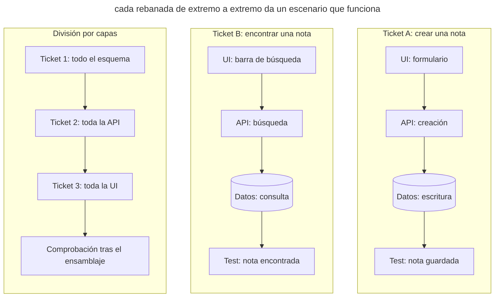
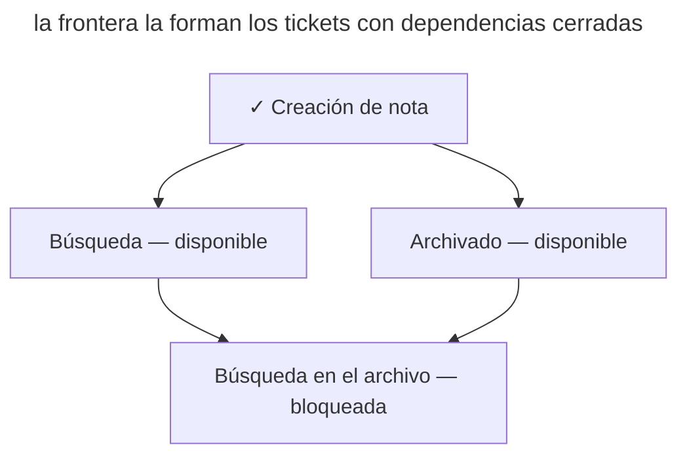

# Tickets trazadores

## Propósito

Dividir la especificación en tickets pequeños con un comportamiento comprobable de extremo a extremo. Cada ticket atraviesa las capas del sistema que necesita, cabe en una sesión de trabajo e indica explícitamente sus dependencias.

## También conocido como

Tracer-bullet tickets, rebanadas verticales, trazadores; `/to-tickets` en los skills de Matt Pocock.

## Problema

Una especificación grande puede no caber en una sola pasada. Dividirla por capas técnicas, además, aplaza la comprobación del comportamiento.

Por ejemplo, después de crear todo el esquema y la API, el usuario aún no puede configurar una exportación. Un desajuste entre interfaces solo aparecerá cuando la UI esté lista. Un escenario estrecho de crear una sola programación permite comprobar antes cómo interactúan las capas. Para el siguiente escenario hay que indicar explícitamente la dependencia de la creación de programaciones, que ya funciona.

## Solución

Delimita los **tickets trazadores** por resultado para el usuario. La primera rebanada pasa por los cambios mínimos de esquema, API, UI y tests necesarios para un escenario. Las siguientes rebanadas amplían el camino que ya funciona.

Comprueba cada ticket con las siguientes condiciones.

- Abarca todas las capas necesarias para el comportamiento elegido.
- El resultado se puede comprobar al terminar el ticket.
- En la sesión queda sitio para la implementación y para corregir errores.
- La preparación necesaria del código va en un primer ticket aparte con su propia comprobación.

En cada ticket indica los **bloqueos**. El conjunto de tickets abiertos con las dependencias cerradas forma la frontera, de la que se puede elegir trabajo.

El agente te muestra los títulos, las dependencias y los resultados comprobables. Después de que precises el tamaño y los bloqueos, publica los tickets acordados en el tracker.

Para un cambio masivo de interfaz usa **expand–contract**. Primero añade la forma nueva conservando la vieja, luego migra a los consumidores en tandas separadas. El último ticket elimina la forma vieja cuando han terminado todas las migraciones.

## Estructura

Un ticket de extremo a extremo atraviesa todas las capas necesarias para un escenario. En el diagrama, cada columna termina con su propia comprobación del comportamiento.

```mermaid
---
title: cada rebanada de extremo a extremo da un escenario que funciona
---
flowchart TB
  subgraph create["Ticket A: crear una nota"]
    direction TB
    a_ui["UI: formulario"] --> a_api["API: creación"]
    a_api --> a_db[("Datos: escritura")]
    a_db --> a_test["Test: nota guardada"]:::accent
  end
  subgraph search["Ticket B: encontrar una nota"]
    direction TB
    b_ui["UI: barra de búsqueda"] --> b_api["API: búsqueda"]
    b_api --> b_db[("Datos: consulta")]
    b_db --> b_test["Test: nota encontrada"]:::accent
  end
  subgraph horizontal["División por capas"]
    direction TB
    h_db["Ticket 1: todo el esquema"] --> h_api["Ticket 2: toda la API"]
    h_api --> h_ui["Ticket 3: toda la UI"]
    h_ui --> h_test["Comprobación tras el ensamblaje"]:::warn
  end
```

Las flechas dentro de las columnas muestran el contenido del ticket y el límite de su comprobación. El orden de trabajo entre tickets lo fija un grafo de dependencias aparte.

```mermaid
---
title: la frontera la forman los tickets con dependencias cerradas
---
flowchart TB
  create["✓ Creación de nota"]:::muted
  search["Búsqueda — disponible"]:::accent
  archive["Archivado — disponible"]:::accent
  filter["Búsqueda en el archivo — bloqueada"]:::warn
  create --> search
  create --> archive
  search --> filter
  archive --> filter
```

En este ejemplo, la búsqueda y el archivado dependen de la creación de notas ya terminada y forman la frontera. La búsqueda en el archivo se puede tomar cuando terminen ambas ramas. El agente elige un ticket disponible y lo comprueba entero.

## Participantes / Componentes

- **Especificación** fija el comportamiento esperado.
- **Ticket** describe el escenario de extremo a extremo, los criterios y las dependencias.
- **Bloqueos** determinan el orden de trabajo admisible.
- **Desarrollador** acuerda el tamaño de los tickets y las dependencias.
- **Agente** lleva el ticket disponible elegido hasta un resultado comprobado.

## Cuándo aplicarlo

- La especificación o el plan aprobados ocupan varias sesiones.
- Las rebanadas independientes pueden ejecutarse en paralelo.
- En [SDD](spec-driven-development.md) hace falta un orden explícito de ejecución de las tareas.

Para una sola sesión suele bastar un plan. Si aún no se conoce la forma de resolver el problema, usa primero el [mapa de investigación](wayfinder.md).

## Consecuencias y compromisos

- ➕ Cada rebanada comprueba la interacción de las capas necesarias antes de terminar toda la funcionalidad.
- ➕ Un ticket pequeño deja más contexto para la comprobación y las correcciones.
- ➕ Las dependencias explícitas ayudan a elegir el trabajo disponible y a coordinar a los ejecutores.
- ➖ Los tickets demasiado grandes no caben en una sesión, y los diminutos aumentan el coste de coordinación.
- ➖ Una refactorización masiva necesita un orden aparte, expand–contract.
- ➖ Los tickets, sus estados y los bloqueos requieren mantenimiento.

## Implementación

1. Estudia la especificación y el código. Averigua si hace falta un cambio preparatorio antes de añadir el comportamiento.
2. Delimita los escenarios de usuario, por ejemplo crear una programación que aparezca en la lista.
3. Anota las dependencias de cada ticket.
4. Acuerda con el agente el tamaño de las rebanadas y el orden de trabajo.
5. Publica los tickets con criterios de aceptación y bloqueos. Incluye detalles de implementación solo donde conserven una decisión importante, por ejemplo el resultado de un [prototipo](prototype-to-answer.md).
6. Para una refactorización amplia, define las etapas de ampliar la interfaz, migrar a los consumidores y eliminar la forma vieja.
7. Ejecuta la frontera a [un ticket por pasada](one-feature-at-a-time.md), limpiando el contexto entre tickets.

## Ejemplo

Tras aprobarse la exportación del [capítulo sobre SDD](spec-driven-development.md), el agente propone tickets de extremo a extremo.

1. **Crear una programación.** El usuario guarda una programación y la ve en la lista. El ticket incluye los cambios necesarios de esquema, API y UI. Sin dependencias.
2. **Enviar el informe.** A la hora fijada, el usuario recibe un correo con el informe. El ticket depende de crear una programación.
3. **Aviso de fallo.** Si falla la generación, los destinatarios reciben un correo con la causa del fallo. El ticket depende de enviar el informe.
4. **Eliminar un informe.** La eliminación desactiva las programaciones asociadas. El ticket depende de su creación.

Confirmas que la primera rebanada es lo bastante pequeña y se puede comprobar desde la UI. Tras ella quedan disponibles el envío del informe y la desactivación de programaciones. Se pueden hacer por separado con un contrato acordado. Tras el segundo ticket, el equipo ya puede enseñar el correo con el informe, aunque el tratamiento de fallos aún está por llegar.

## Antipatrones y errores comunes

- **División por capas.** Un esquema completo sin un escenario que funcione aplaza la comprobación de integración.
- **Ticket épico.** Un punto demasiado grande vuelve a crear varias partes sin terminar.
- **Dependencias sin anotar.** El ejecutor puede empezar a trabajar antes de que esté listo el contrato necesario.
- **Detalle excesivo.** Las rutas obsoletas y los fragmentos de código estorban al elegir la implementación actual. Conserva ante todo el comportamiento y las restricciones.
- **Refactorización masiva como funcionalidad.** Usa expand–contract para cambiar por etapas una interfaz compartida.

## Usos conocidos

- **Los skills de Matt Pocock** usan `/to-tickets` para la división de extremo a extremo e `/implement` para ejecutar los tickets.
- **The Pragmatic Programmer** describe una implementación trazadora que comprueba un camino a través del sistema y sigue evolucionando.
- **Los toolkits de SDD**, incluido [Superpowers](superpowers.md), dividen los planes en pasos ejecutables. Los tickets trazadores fijan además un resultado de extremo a extremo y las dependencias.

## Patrones relacionados

- [Desarrollo orientado a especificaciones](spec-driven-development.md) aporta la especificación que se divide.
- [Una funcionalidad a la vez](one-feature-at-a-time.md) limita la ejecución a un ticket por pasada.
- [Mapa de investigación](wayfinder.md) aclara las decisiones antes de preparar la cola de implementación.
- [Prototipo desechable](prototype-to-answer.md) da decisiones comprobadas para los requisitos del ticket.
- [One-shotting](one-shotting.md) vuelve cuando un ticket no cabe en la ventana y el agente intenta de nuevo hacerlo todo de una pasada.
