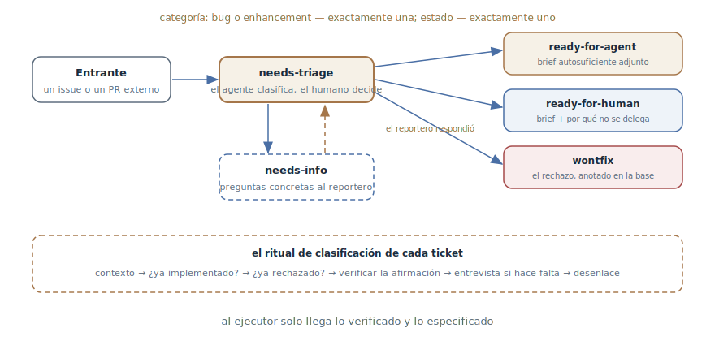

# Triaje de tareas

## Propósito

Hacer pasar las tareas entrantes por una máquina de estados de
etiquetas-roles — de «necesita clasificación» a un brief listo para el
agente o a la marca «para un humano» — de modo que, al llegar a la
ejecución, cada ticket esté categorizado, verificado y especificado. La
clasificación la conduce el agente; el destino lo decide el mantenedor.

## También conocido como

Triage state machine, máquina de estados de triaje; `/triage` en los skills
de Matt Pocock.

## Problema

La bandeja de entrada del tracker es materia prima, no tareas: reportes de
bugs sin pasos de reproducción, deseos, duplicados de lo ya existente,
peticiones repetidas de lo ya rechazado, pull requests externos de calidad
desconocida. Los dos destinatarios habituales manejan mal ese flujo:

- Entregar un ticket crudo al agente — y este completa servicialmente lo
  que falta: «arregla» un bug no reproducido, implementa lo que ya existe
  en la base con otro nombre o reabre una discusión cerrada hace medio año.
- Que el mantenedor lo clasifique todo a mano — y su tiempo se va no a
  decisiones sino a arqueología: reproducir, cazar duplicados, sonsacar
  detalles a los reporteros.
- Sin estados fijos no se sabe dónde está nada: qué tickets están
  clasificados, cuáles esperan, cuáles se pueden tomar.

## Solución

Una pequeña máquina de estados de etiquetas y un agente que lleva cada
ticket a través de ella.

**Los roles.** Cada ticket clasificado lleva exactamente una categoría —
`bug` o `enhancement` — y exactamente un estado:

- `needs-triage` — espera clasificación;
- `needs-info` — espera al reportero; vuelve a `needs-triage` cuando llega
  la respuesta;
- `ready-for-agent` — totalmente especificado, con brief adjunto; un agente
  autónomo puede tomar el trabajo;
- `ready-for-human` — necesita a una persona; la misma estructura de brief
  más la razón explícita de por qué no se delega: juicios, accesos
  externos, pruebas manuales;
- `wontfix` — no se hará; la razón queda anotada.

Un pull request externo es un ticket con código adjunto: los mismos roles,
la misma máquina.

**El ritual de clasificación.** El agente reúne el contexto (el cuerpo, los
comentarios, la base de código — mediante el
[vocabulario del dominio](domain-context-file.md) y los ADR) y hace dos
comprobaciones antes que nada: *¿ya está implementado?* — buscando por
conceptos del dominio, no por las palabras de la petición — y *¿ya fue
rechazado?* — cotejando la base de rechazos. Después recomienda categoría y
estado — y espera la decisión del mantenedor. Luego, la verificación de la
afirmación: el bug se reproduce con los pasos del reportero, el diff del
pull request se pasa por los tests. Si la petición necesita maduración —
una entrevista con el mantenedor, pregunta a pregunta. El desenlace se
aplica con etiquetas, un brief o un cierre.

**La memoria de los rechazos.** Los deseos rechazados se anotan en una base
de conocimiento del repositorio (`.out-of-scope/`): la siguiente petición
parecida se corta con un enlace, no con otra discusión.

Todo lo que el agente publica en un tracker público empieza con la nota
«generado por IA durante el triaje» — la transparencia no se negocia.

## Estructura

El ticket entrante cae en `needs-triage` — el único estado donde ocurre el
trabajo de clasificación. De él salen cuatro salidas: el brief para un
agente, el brief para un humano con la razón de la no-delegación, preguntas
concretas al reportero con retorno tras la respuesta — y el rechazo, que se
asienta en la base de conocimiento. Abajo, el ritual que el agente ejecuta
para cada ticket antes de elegir la salida; la decisión de la salida queda
en manos del mantenedor.

## Participantes / Componentes

- **La máquina de etiquetas** — las categorías y los estados; exactamente
  uno de cada por ticket.
- **El agente de triaje** — reúne contexto, comprueba, reproduce,
  recomienda, da forma al desenlace.
- **El mantenedor** — el árbitro: acepta recomendaciones, decide destinos,
  puede mover cualquier ticket a cualquier estado directamente.
- **El reportero** — la fuente de los detalles; recibe preguntas concretas,
  no «aclare, por favor».
- **El brief** — el artefacto del desenlace: un planteamiento
  autosuficiente con el que el agente trabaja sin el autor del ticket.
- **La base de rechazos** — negativas anotadas con sus razones; el filtro
  de las peticiones repetidas.

## Cuándo aplicarlo

- Un proyecto abierto o de equipo con flujo entrante: bugs, deseos, pull
  requests externos.
- Agentes autónomos toman trabajo del tracker: `ready-for-agent` es su
  cola, y la calidad de los briefs determina la calidad de los resultados.
- El tiempo del mantenedor es el cuello de botella: la clasificación se
  delega al agente y al humano le quedan solo las decisiones.

Para un proyecto personal con tres tickets al mes la máquina sobra — bastan
la cabeza y una etiqueta.

## Consecuencias y compromisos

- ➕ Al ejecutor llega solo lo verificado y lo especificado: el agente
  recibe un brief, no conjeturas.
- ➕ Los duplicados y las repeticiones se cortan mecánicamente: la
  comprobación «¿ya implementado?» y la base de rechazos actúan antes de la
  discusión, no después.
- ➕ El estado del flujo se ve en las etiquetas: qué está clasificado, qué
  espera, qué está listo — sin leer los tickets.
- ➕ Verificación antes del brief: un bug irreproducible no llegará a la
  ejecución.
- ➖ Montaje: las etiquetas, su mapeo, las plantillas de briefs, la base de
  rechazos — infraestructura que hay que crear y mantener.
- ➖ Los comentarios del agente en un tracker público son cuestión de
  tacto: la nota de IA es obligatoria, y el tono también es responsabilidad
  del mantenedor.
- ➖ La máquina no toma decisiones: sin árbitro degenera en cuello de
  botella o en el autogobierno del agente.

## Implementación

1. Define los roles: dos categorías, cinco estados, la regla «exactamente
   una + exactamente uno». Mapea todo a las etiquetas de tu tracker.
2. Fija las transiciones: ticket nuevo → `needs-triage`; de ahí — a uno de
   los cuatro desenlaces; `needs-info` vuelve a `needs-triage` tras la
   respuesta.
3. Establece el ritual: contexto → «¿ya implementado?» → «¿ya rechazado?» →
   recomendación al mantenedor → verificación de la afirmación → entrevista
   si hace falta → desenlace.
4. Exige la verificación antes del brief: un bug reproducido con su ruta de
   código da al brief base firme; uno irreproducible es una señal fuerte de
   `needs-info`.
5. Plantillas de los desenlaces: el brief — autosuficiente (reproducción,
   contexto, criterio de listo); las notas de triaje — «qué hemos
   establecido» más preguntas concretas; el rechazo de un deseo — un
   registro en `.out-of-scope/` enlazado desde un comentario.
6. La nota «generado por IA durante el triaje» — al inicio de cada
   comentario del agente.
7. Cierra la tubería sobre la ejecución: `ready-for-agent` es la cola de
   las sesiones autónomas, un ticket por pasada.

## Ejemplo

Llega al tracker: «la búsqueda no funciona». El agente clasifica: sin
duplicados, nada parecido en la base de rechazos; no logra reproducirlo con
la descripción — faltan detalles. Recomendación: `bug` + `needs-info`. Tras
la decisión del mantenedor, en el ticket aparece un comentario con la nota
de IA: qué se ha establecido (la búsqueda exacta funciona, la de subcadena
también) y dos preguntas concretas: qué cadena de búsqueda y qué locale.

El reportero responde: locale turco, una consulta con la «İ» mayúscula. El
ticket vuelve a `needs-triage`; el agente reproduce el bug — la
normalización Unicode del indexador — y da forma a `ready-for-agent` con un
brief: pasos de reproducción, ruta de código, criterio de listo (el test
fallido de la reproducción pasa). La sesión autónoma nocturna toma el ticket
por el brief — ya no necesita al autor del ticket.

Un deseo paralelo, «modo oscuro en las notificaciones por correo», se
cierra en un minuto: en `.out-of-scope/` está el rechazo del año pasado a la
personalización de correos con sus razones — `wontfix` con enlace, sin
discusión nueva.

## Antipatrones y errores comunes

- **El ticket crudo directo al agente.** Saltarse el triaje significa que
  el agente completará lo que falta: la forma más cara de descubrir que el
  bug no se reproduce.
- **El agente decide destinos.** Una máquina sin árbitro: categorías y
  estados son recomendaciones, decide el mantenedor. Sobre todo en
  `wontfix`.
- **«Aclare, por favor».** Un `needs-info` vago es un «déjeme en paz»
  educado: las preguntas deben poder responderse.
- **Rechazo sin registro.** `wontfix` sin base de conocimiento garantiza
  que la misma petición vuelva en un mes y la discusión se repita.
- **El brief hueco.** La etiqueta `ready-for-agent` sin brief
  autosuficiente es el mismo planteamiento crudo, solo que con pegatina
  verde.
- **IA oculta.** Comentarios del agente sin la nota socavan la confianza en
  el tracker; la transparencia es más barata que el descubrimiento.

## Usos conocidos

- **Skills de Matt Pocock** — `/triage`: la fuente primaria — los roles y
  la máquina, el orden «verifica y luego entrevista», los briefs de agente,
  la base `.out-of-scope/` y el triaje de pull requests como «tickets con
  código».
- **El triaje de bugs clásico** — el linaje pre-agente: los procesos de
  Mozilla y Debian con el rol dedicado de triador y el ciclo de vida de
  estados; el patrón entrega la parte rutinaria de ese rol al agente.
- **Las automatizaciones de triaje de GitHub** — bots de etiquetado y
  autocierre como la forma débil: categorización sin verificación ni
  briefs.

## Patrones relacionados

- [Mapa de investigación](wayfinder.md) — el vecino del tracker con otro
  objeto: el mapa conduce una gran investigación a su destino, el triaje
  muele el flujo de entrantes pequeños.
- [Bucle de retroalimentación](give-agent-a-way-to-verify.md) — el paso de
  verificación es exactamente eso: reproducir el bug y ejecutar el diff
  antes de creer la afirmación.
- [Vocabulario del dominio](domain-context-file.md) — la clasificación caza
  duplicados por conceptos del dominio, no por las palabras de la petición;
  sin lenguaje canónico la comprobación «¿ya implementado?» está ciega.
- [Una funcionalidad a la vez](one-feature-at-a-time.md) — la regla de
  ejecución de la cola `ready-for-agent`: un ticket por pasada.
