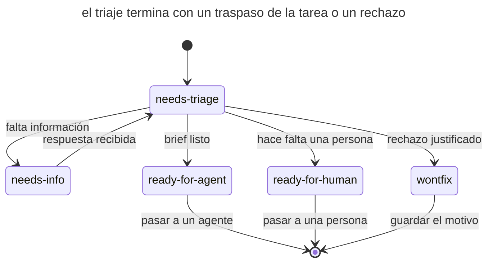

# Triaje de tareas

## Propósito

Preparar las tareas entrantes para su ejecución mediante estados de triaje explícitos. El agente comprueba la solicitud y redacta un brief, y el mantenedor decide si pasar la tarea a un agente, a una persona o rechazarla.

## También conocido como

Triage state machine, máquina de estados de triaje; `/triage` en los skills de Matt Pocock.

## Problema

Un informe de bug entrante puede contener solo la frase «la búsqueda no funciona». El ejecutor no conoce ni la consulta, ni el locale, ni el resultado esperado.

Si encargas el arreglo al agente de inmediato, empezará a elegir el problema a base de conjeturas. Ni siquiera los tests en verde de ese arreglo confirmarán que el fallo original ha desaparecido. El mantenedor necesita reunir la información que falta y reproducir el problema. Esa parte del trabajo se puede delegar en el agente. Los estados explícitos muestran qué solicitud ya está comprobada y cuál sigue esperando respuesta.

## Solución

Define un conjunto pequeño de estados y el orden en que se comprueba cada ticket.

En esta variante del proceso, un ticket clasificado tiene una categoría (`bug` o `enhancement`) y un estado.

- `needs-triage` significa que espera clasificación.
- `needs-info` significa que espera información concreta del autor. Tras la respuesta, el ticket vuelve a `needs-triage`.
- `ready-for-agent` significa que hay un brief comprobado para el trabajo autónomo.
- `ready-for-human` indica que hace falta una persona y conserva el motivo de esa decisión.
- `wontfix` registra un rechazo con su justificación.

Un pull request externo pasa por la misma clasificación, con una comprobación adicional del código adjunto.

El agente lee la descripción, los comentarios y el código, apoyándose en el [vocabulario del dominio](domain-context-file.md) y los ADR. Busca una implementación existente y decisiones anteriores sobre solicitudes parecidas. Después comprueba la afirmación, por ejemplo reproduciendo el bug, y recomienda un estado. El mantenedor aprueba el resultado; si falta información, el agente prepara preguntas concretas.

Guarda los motivos de las solicitudes rechazadas en _.out-of-scope/_. Ante una solicitud parecida, el agente podrá mostrar la decisión anterior, y el mantenedor comprobará si sigue siendo aplicable.

En el proceso descrito, los comentarios del agente se marcan como generados por IA durante el triaje. El mantenedor revisa su contenido antes de publicarlos.

## Estructura

El diagrama se limita a la etapa de triaje. Su final significa pasar la tarea preparada a un ejecutor o rechazarla.

```mermaid
---
title: el triaje termina con un traspaso de la tarea o un rechazo
---
stateDiagram-v2
  direction TB
  state "needs-triage" as triage
  state "needs-info" as info
  state "ready-for-agent" as agent
  state "ready-for-human" as human
  state "wontfix" as wontfix
  class agent accent
  class wontfix warn
  [*] --> triage
  triage --> info: falta información
  info --> triage: respuesta recibida
  triage --> agent: brief listo
  triage --> human: hace falta una persona
  triage --> wontfix: rechazo justificado
  agent --> [*]: pasar a un agente
  human --> [*]: pasar a una persona
  wontfix --> [*]: guardar el motivo
```

El mantenedor aprueba la transición después de comprobar la afirmación, precisar el contexto y preparar el brief. Si falta información, el ticket espera respuesta y vuelve a pasar por la clasificación. La categoría de la tarea se guarda aparte del estado mostrado aquí; estar lista para pasar a un ejecutor todavía no significa que la tarea misma esté terminada.

## Participantes / Componentes

- **Los estados** muestran si el ticket está listo para la siguiente acción.
- **El agente** reúne información, comprueba la afirmación y prepara una recomendación.
- **El mantenedor** aprueba la decisión sobre la tarea.
- **El autor de la solicitud** aporta los detalles que faltan.
- **El brief** da un planteamiento autosuficiente y un criterio de terminado.
- **La base de rechazos** conserva los motivos de las decisiones anteriores.

## Cuándo aplicarlo

- Al proyecto llegan con regularidad bugs, propuestas y PR externos.
- Los agentes autónomos eligen trabajo del tracker.
- El mantenedor dedica mucho tiempo a reunir información antes de decidir.

Con unos pocos tickets al mes, el conjunto completo de estados puede sobrar.

## Consecuencias y compromisos

- ➕ El ejecutor recibe un planteamiento comprobado.
- ➕ Las decisiones anteriores ayudan a clasificar las solicitudes repetidas.
- ➕ Las etiquetas muestran qué tarea espera aclaraciones y cuál está lista para trabajar.
- ➕ La reproducción da la base para el criterio del arreglo.
- ➖ Las etiquetas, las plantillas y la base de decisiones requieren mantenimiento.
- ➖ Los comentarios públicos exigen revisar su contenido y su tono.
- ➖ El proceso depende de que el mantenedor decida a tiempo.

## Implementación

1. Haz corresponder las categorías y los estados con las etiquetas del tracker.
2. Describe las transiciones, incluido el regreso desde `needs-info` tras la respuesta.
3. Fija el orden para reunir el contexto, buscar decisiones anteriores y comprobar la afirmación.
4. Confirma el bug reproduciéndolo antes de preparar el brief del arreglo.
5. Prepara plantillas para el brief, las preguntas concretas y el registro de un rechazo.
6. Indica el origen del comentario del agente antes de publicarlo.
7. Usa `ready-for-agent` como cola, un ticket por pasada.

## Ejemplo

Ante el informe «la búsqueda no funciona», el agente prueba la búsqueda normal y no encuentra ningún fallo. Recomienda `bug` y `needs-info`. El mantenedor aprueba pedir la cadena de búsqueda y el locale; el comentario también indica qué casos ya se han comprobado.

El autor indica el locale turco y una consulta con «İ». El agente reproduce un fallo de normalización Unicode y prepara un brief con los datos de entrada, el lugar donde se procesan y el resultado esperado. Tras revisarlo, el mantenedor pasa el ticket a `ready-for-agent`.

Ante una solicitud repetida sobre la personalización de los correos, el agente encuentra el rechazo anterior en _.out-of-scope/_. El mantenedor comprueba si los motivos han cambiado y, si se confirman, cierra la solicitud con un enlace a la decisión.

## Antipatrones y errores comunes

- **Arreglo sin comprobación.** El agente puede resolver un problema inventado si la afirmación original no se reprodujo.
- **Decisión sin el mantenedor.** La recomendación del agente necesita aprobación, sobre todo en un rechazo.
- **Petición genérica de aclaraciones.** Indica la información concreta necesaria para la comprobación.
- **Rechazo sin motivo.** La siguiente solicitud parecida volverá a necesitar una discusión completa.
- **Listo sin brief.** La etiqueta por sí sola no le da requisitos al ejecutor.
- **Comentario público sin revisar.** El mantenedor responde de la exactitud y la claridad del texto publicado.

## Usos conocidos

- **Los skills de Matt Pocock** implementan los estados, los briefs y la base de rechazos mediante `/triage`.
- **El bug triage clásico** usa un rol dedicado a preparar los bugs entrantes para el trabajo.
- **Las automatizaciones de GitHub** ayudan a etiquetar el flujo, pero necesitan comprobaciones adicionales para preparar un brief completo.

## Patrones relacionados

- [Mapa de investigación](wayfinder.md) organiza las preguntas de una iniciativa grande.
- [Bucle de retroalimentación](give-agent-a-way-to-verify.md) ayuda a comprobar la afirmación antes de la ejecución.
- [Vocabulario del dominio](domain-context-file.md) permite buscar duplicados por el sentido de los conceptos.
- [Una funcionalidad a la vez](one-feature-at-a-time.md) limita el trabajo sobre la cola lista.
