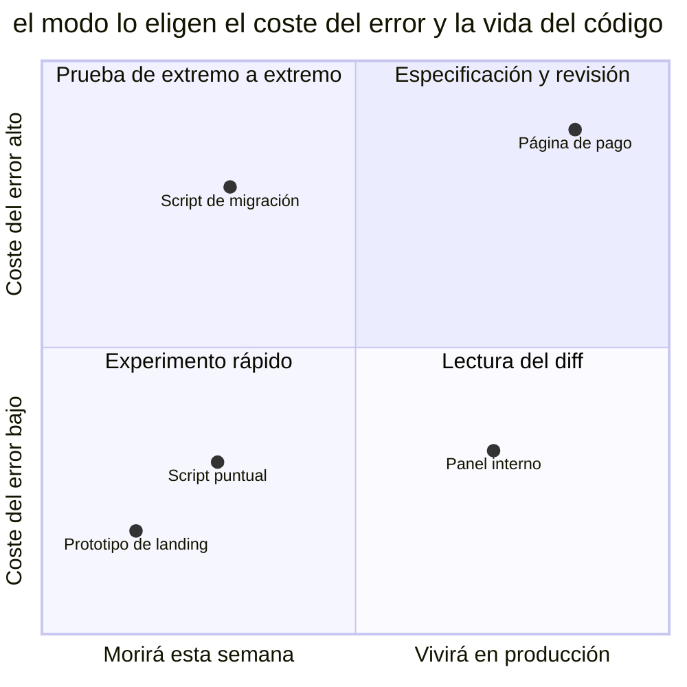

# Vibe coding

## También conocido como

Vibe coding, el término de Andrej Karpathy para el desarrollo a base de peticiones al modelo sin prestar atención al código generado.

## Contexto

Describes el objetivo, el agente genera código y aceptas un resultado que se ejecuta y parece funcionar. Reenvías los errores al chat sin leer el diff. El hábito de un experimento rápido pasa a un proyecto de producción.

## Problema

En la base de código aparece un comportamiento que nadie ha contrastado con los requisitos. En el siguiente cambio, al equipo le cuesta determinar qué hay que conservar y qué fue un resultado casual de la generación.

## Por qué se hace

- Un primer resultado rápido quita las ganas de dedicar tiempo a la revisión.
- En un experimento donde un error cuesta poco, este método permite comprobar una idea rápidamente.
- Un diff generado grande exige esfuerzo para leerlo.
- El conocimiento que el agente tiene del framework se toma como prueba de que el resultado es correcto.

## Consecuencias

- ➖ Al equipo le cuesta corregir y evolucionar un código cuyo funcionamiento no entiende.
- ➖ Sin requisitos, no se puede reconstruir la intención original.
- ➖ Los casos límite sin comprobar pueden aparecer ante los usuarios.
- ➖ Los cambios nuevos se apoyan en un volumen cada vez mayor de comportamiento sin verificar.

## Señales

- Un diff se fusiona sin leerlo.
- Los participantes no saben explicar cómo funciona el código aceptado.
- Los requisitos se reconstruyen leyendo el código, porque no están en ningún otro sitio.
- La calidad se justifica solo con una ejecución exitosa.

## Cómo hacerlo mejor

Elige la profundidad de la verificación según el coste de un error y la vida del código. Para un [prototipo desechable](prototype-to-answer.md) basta con comprobar su pregunta concreta. Para el código de producción, fija los requisitos en una [especificación](spec-driven-development.md) o en un [plan](explore-plan-code-commit.md), verifica el comportamiento con un [bucle de retroalimentación](give-agent-a-way-to-verify.md) y haz una [revisión](writer-reviewer.md).

El diagrama tiene en cuenta la vida del código y el coste del error. Un prototipo de landing admite una comprobación breve, mientras que una página de pago exige el proceso completo. Un script de migración también necesita una comprobación minuciosa aunque se ejecute una sola vez, porque un error puede afectar a los datos existentes.

## Ejemplo

**Antes**

> Haz la página de pago de la suscripción. Se abrió y parece que funciona, se puede fusionar.

**Después**

> Haz la página de pago de la suscripción; por ella pasarán pagos reales. Haz un pago en modo de prueba desde el navegador

## Patrones y antipatrones relacionados

- [Prototipo desechable](prototype-to-answer.md) limita el experimento a una pregunta concreta.
- [Desarrollo orientado a especificaciones](spec-driven-development.md) conserva los requisitos para verificar la implementación.
- [Éxito prematuro](premature-success.md) describe declarar el trabajo terminado sin una verificación de extremo a extremo.
- [One-shotting](one-shotting.md) describe la expectativa de un producto terminado tras una sola pasada.
