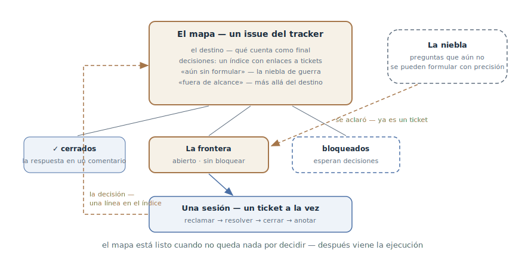

# Mapa de investigación

## Propósito

Planificar un trabajo más grande que una sesión y envuelto en niebla — la
idea existe, el camino no se ve — como un mapa compartido de tickets de
investigación en el tracker. El agente cierra un ticket por sesión, cada
respuesta despeja un trozo de niebla — hasta que el camino al destino queda
claro. El mapa produce decisiones, no código: está listo cuando no queda
nada por decidir.

## También conocido como

Wayfinder, wayfinding; el skill `/wayfinder` del pack de Matt Pocock.

## Problema

Llegó una idea grande y difusa: «migramos a una nueva plataforma de pagos»,
«hacemos la tarifa corporativa». Es claramente más grande que una sesión —
y, peor, no se ve el camino: ni siquiera se sabe qué decisiones habrá que
tomar.

- Escribir la especificación de inmediato es especificación prematura a
  tamaño completo: la mitad de los «requisitos» fijados resultarán
  conjeturas.
- La [lista de funcionalidades](feature-list-harness.md) no encaja: trabaja
  desde un estado final conocido, y aquí no se sabe qué construir
  exactamente.
- Resolverlo en una conversación larga — el conocimiento muere con la
  sesión, y una segunda persona o un segundo agente no puede sumarse en
  paralelo.
- Guardar las preguntas en la cabeza significa recordar cada vez de nuevo
  qué está decidido, qué está bloqueado y qué queda siquiera por hacer.

## Solución

Tres movimientos: nombrar el destino, trazar el mapa, recorrerlo ticket a
ticket.

**El destino.** El primer acto es fijar cómo se ve el final del camino: una
especificación lista para entrar en la tubería; una decisión tomada; un
cambio realizado. El destino fija el alcance — lo que queda más allá no
entra en el mapa.

**El mapa.** Un issue del tracker con la etiqueta del mapa — un índice, no
un almacén:

- *el destino* — una o dos líneas por las que se orienta cada sesión;
- *decisiones* — una línea por ticket cerrado con enlace: la esencia en el
  mapa, el detalle en el ticket;
- *aún sin formular* — la niebla de guerra: preguntas que se intuyen pero
  aún no se pueden formular con precisión;
- *fuera de alcance* — lo recortado a conciencia: la frontera no pasa del
  destino.

**Los tickets.** Issues hijos del mapa, cada uno una pregunta del tamaño de
una sesión. El ticket tiene tipo: *research* — el agente lee documentación
y trae un resumen; *prototype* — un artefacto barato sobre el que discutir
(ver el [prototipo desechable](prototype-to-answer.md)); *grilling* — una
conversación con el desarrollador, pregunta a pregunta; *task* — trabajo
manual sin el cual no se puede decidir (montar un sandbox, dar accesos).
Los bloqueos usan las relaciones nativas del tracker: la **frontera** —
tickets abiertos, sin bloquear y sin reclamar — se ve directamente en la
interfaz del tracker.

**El trabajo.** La sesión carga el mapa en baja resolución, toma el primer
ticket de la frontera, lo reclama (la asignación es el reclamo — las
sesiones paralelas lo saltan), lo resuelve, anota la respuesta como
comentario, lo cierra — y añade una línea a las decisiones. La respuesta
suele despejar niebla: lo que ya se puede formular con precisión se gradúa
en tickets nuevos. Un ticket por sesión — estrictamente.

La regla de disciplina: **decide, no hagas**. El ticket produce una
decisión, no un entregable; las ganas de «hacerlo ya de una vez» son la
señal de que el mapa terminó y toca traspasar el trabajo a la ejecución.

## Estructura

Arriba, el mapa — el índice de todo el viaje: el destino, las decisiones
acumuladas con enlaces, la niebla y lo recortado del alcance. Debajo, los
tickets en tres estados: cerrados con respuestas, la frontera — abiertos y
tomables, y los bloqueados, que esperan decisiones ajenas. La sesión de
abajo toma exactamente un ticket de la frontera; su respuesta va como línea
al índice del mapa, y la niebla despejada a la derecha gradúa tickets
nuevos a la frontera. El ciclo se repite hasta que no quedan tickets.

## Participantes / Componentes

- **El mapa** — el issue-índice: destino, decisiones, niebla, fuera de
  alcance.
- **El destino** — la definición del final del camino; fija el alcance.
- **El ticket** — una pregunta del tamaño de una sesión, con tipo y
  bloqueos; la respuesta vive en él, el mapa solo enlaza.
- **La frontera** — tickets abiertos, sin bloquear, sin reclamar: el borde
  de lo conocido.
- **La niebla** — preguntas que aún no se pueden formular con precisión; la
  incompletitud legalizada del mapa.
- **Agente y desarrollador** — el agente conduce solo los tickets research
  y task; grilling y prototype requieren al humano; las sesiones pueden ir
  en paralelo.

## Cuándo aplicarlo

- El trabajo es más grande que una sesión *y* el camino no se ve: una idea
  difusa con una docena de preguntas sin resolver detrás.
- Varias personas o varias sesiones paralelas trabajan la investigación —
  el mapa y la frontera en el tracker sincronizan a todos.
- Las decisiones importan lo bastante como para conservarlas: cada ticket
  cerrado es una respuesta anotada con enlace, no una réplica en una
  conversación muerta.

No hace falta cuando el camino está claro: si de la idea sale directamente
una especificación con tareas, eso es la
[tubería SDD](spec-driven-development.md) sin investigación. Y sobra cuando
toda la investigación cabe en una sesión.

## Consecuencias y compromisos

- ➕ El conocimiento vive en el tracker: las decisiones, sus motivos y sus
  vínculos sobreviven a cualquier sesión y a cualquier participante.
- ➕ Paralelismo gratis: la frontera se ve en la interfaz del tracker, y
  cualquier sesión puede tomar un ticket libre.
- ➕ La niebla está legalizada: no hay que fingir que se ve todo — lo
  confuso reposa honestamente en «aún sin formular» y madura.
- ➕ El corte es barato: la sesión es un ticket; si muere, se pierde como
  mucho ese.
- ➖ Sobrecarga del tracker: el mapa, los tickets hijos, los bloqueos —
  para una idea de tres preguntas es burocracia.
- ➖ La disciplina «decide, no hagas» es contraintuitiva: el mapa no
  produce producto, y hay que saber parar a tiempo y traspasar a la
  ejecución.
- ➖ La calidad del mapa la limita la calidad de las preguntas: tickets
  difusos dan decisiones difusas.

## Implementación

1. El trazado es una sesión propia. Primero una entrevista hasta el
   destino: qué buscamos exactamente — una spec, una decisión, un cambio.
   Luego una segunda entrevista a lo ancho, no a lo hondo: desplegar todo
   el espacio de preguntas. Si no aflora niebla — el mapa no hace falta, el
   camino ya está claro.
2. Crea el mapa y los tickets que ya se formulan con precisión; los
   bloqueos, en una segunda pasada. Lo no formulado va a la niebla, no a
   tickets: la prueba es «¿puedo enunciar la pregunta con precisión
   ahora?», no «¿puedo responderla?».
3. Sesión de trabajo: cargar el mapa, tomar el primer ticket de la
   frontera, reclamarlo, resolverlo — invocando los skills según el tipo —,
   anotar la respuesta, cerrarlo, añadir la línea a las decisiones.
4. Tras cada respuesta revisa la niebla: gradúa lo madurado en tickets,
   borra lo devaluado, y lo que quedó más allá del destino — a «fuera de
   alcance» con una línea de por qué.
5. Un ticket por sesión — la misma regla que
   [una funcionalidad a la vez](one-feature-at-a-time.md), en el mundo de
   las decisiones.
6. En lo que lea un humano, llama a los tickets por su nombre, no por
   número: un muro de `#42, #47, #51` es ilegible.
7. Cuando no quedan tickets — el camino está claro: traspasa a la
   ejecución, normalmente a la [tubería SDD](spec-driven-development.md),
   con un enlace al mapa como registro de decisiones.

## Ejemplo

La idea: «migramos la facturación a la plataforma de pagos PayFlow». La
sesión de trazado entrevista al desarrollador y fija el destino: *una
especificación de migración aprobada — el modelo de datos elegido y un plan
de transición sin interrumpir los cobros*. Los primeros tickets:

- research: «comparar las API de suscripciones de PayFlow y el proveedor
  actual — qué no se mapea» (el agente solo);
- task: «montar la cuenta sandbox de PayFlow» — bloquea el research;
- grilling: «qué pasa con las suscripciones activas durante la transición»;
- niebla: «el modelo de reembolsos», «la migración de tarjetas guardadas» —
  se intuyen, pero cuelgan de las respuestas de arriba.

Las sesiones cierran los tickets uno a uno. La respuesta sobre la
transición («doble registro y una fachada-pasarela durante un mes») gradúa
de la niebla dos tickets nuevos — el prototipo de la fachada y el research
de los webhooks. El «rediseño de la página de pagos» que afloró de paso se
va a «fuera de alcance» en una línea. Nueve tickets después la frontera
está vacía: todas las decisiones tomadas y anotadas — la especificación se
arma desde el índice del mapa, y el trabajo pasa a la tubería.

## Antipatrones y errores comunes

- **Hacer en vez de decidir.** El ticket terminó en una funcionalidad
  entregada — el mapa se convirtió en backlog de ejecución. El entregable
  es la señal de traspasar, no de ensanchar el mapa.
- **Ticketear la niebla.** Trocear lo no formulado en tickets «para luego»
  da preguntas huecas que habrá que reescribir. La niebla madura en su
  sección.
- **Varios tickets por sesión.** La misma trampa de la anchura: tres
  preguntas «casi decididas» en vez de una cerrada.
- **El mapa-almacén.** Respuestas completas en el cuerpo del mapa en vez de
  enlaces — el mapa engorda, deja de leerse en un minuto y diverge de los
  tickets.
- **Números en vez de nombres.** «`#42` bloquea a `#47`» es ilegible para
  un humano; el nombre con el enlace dentro se lee de un vistazo.
- **Frontera sin bloqueos.** Sin las relaciones puestas, todo está
  «disponible» a la vez — y las sesiones toman preguntas cuyas respuestas
  cuelgan de decisiones aún no tomadas.

## Usos conocidos

- **Skills de Matt Pocock** — `/wayfinder`: la fuente primaria del patrón —
  el mapa etiquetado en el tracker, cuatro tipos de tickets, la niebla de
  guerra, la frontera mediante bloqueos nativos y la regla «decide, no
  hagas».
- **Dual-track agile** — el pariente pre-agente: una pista de discovery que
  corre por delante de la de delivery y produce decisiones, no incrementos
  de producto.
- **Las jerarquías de spikes en XP** — tareas de investigación talladas de
  un gran desconocido; el mapa les añade el índice común y la niebla.

## Patrones relacionados

- [Lista de funcionalidades](feature-list-harness.md) — el vecino espejo:
  la lista conduce a un estado final conocido, el mapa busca el camino
  hacia uno aún desconocido; el mapa suele terminar donde la lista empieza.
- [Una funcionalidad a la vez](one-feature-at-a-time.md) — la misma
  disciplina de pasada: un ticket por sesión, llevado a una decisión
  anotada.
- [Prototipo desechable](prototype-to-answer.md) — un tipo de ticket del
  mapa: la pregunta que responde un artefacto y no una conversación.
- [Desarrollo orientado a especificaciones](spec-driven-development.md) —
  el receptor del resultado: cuando el camino está claro, las decisiones
  del mapa se pliegan en una especificación y entran en la tubería.
- [Traspaso de sesión](handoff.md) — la mecánica de pasar entre sesiones
  del mapa y hacia la ejecución: un extracto para el objetivo en vez de la
  cola de la conversación.
