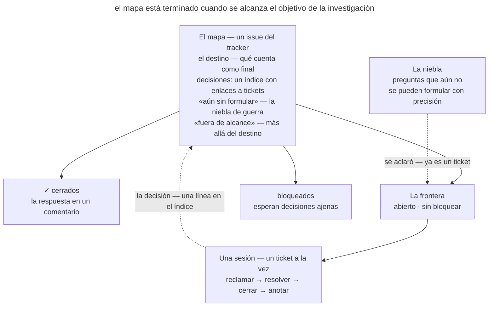

# Mapa de investigación

## Propósito

Organizar un trabajo grande e incierto como un mapa de preguntas de investigación en el tracker. Cada ticket aporta una decisión o información nueva que acerca al equipo a un plan de implementación acordado.

## También conocido como

Wayfinder, wayfinding; el skill `/wayfinder` del paquete de Matt Pocock.

## Problema

El equipo quiere pasar la facturación a una plataforma nueva, pero aún no sabe cómo migrar las suscripciones activas y los métodos de pago guardados. Primero tiene que averiguar las restricciones y tomar varias decisiones relacionadas.

Si escribes enseguida una especificación detallada, los huecos desconocidos se rellenan con suposiciones. La [lista de funcionalidades](feature-list-harness.md) será útil cuando se haya elegido el comportamiento requerido. Ahora el equipo necesita una cola de las preguntas de las que depende ese comportamiento. Una conversación larga dificulta pasar los resultados a otro participante. Un mapa común conserva lo que ya está decidido y qué preguntas siguen disponibles para investigar.

## Solución

Define el objetivo de la investigación, guarda un mapa de las preguntas y resuélvelas de una en una.

**El objetivo** describe la condición de finalización, por ejemplo una especificación de migración acordada. Limita la investigación a las preguntas necesarias para ese resultado.

**El mapa** vive en un issue aparte como un índice breve.

- _Objetivo_ ayuda a cada sesión a mantener el rumbo.
- _Decisiones_ contiene conclusiones cortas y enlaces a los tickets cerrados.
- _Aún sin formular_ conserva las zonas de incertidumbre para las que todavía falta información.
- _Fuera de alcance_ explica qué preguntas quedan excluidas de la investigación.

**El ticket** plantea una pregunta con un tipo de trabajo y dependencias. Research exige leer fuentes, [prototype](prototype-to-answer.md) comprueba la pregunta con un experimento, grilling afina una decisión contigo, y task prepara el acceso o el entorno necesarios. Los tickets abiertos y sin asignar cuyas dependencias están cerradas forman la **frontera** del trabajo disponible.

Una sesión lee el mapa, se asigna un ticket disponible y lo investiga. La respuesta se guarda en el ticket, y una conclusión corta con enlace se añade al mapa. La información nueva puede convertir una zona de incertidumbre en preguntas concretas para los siguientes tickets.

**Termina la investigación con una decisión registrada.** Cuando el trabajo restante se reduce a implementar un enfoque acordado, pásalo a la cola de desarrollo.

## Estructura

En el diagrama, el mapa conecta las decisiones, las preguntas abiertas y los límites de la investigación.

```mermaid
---
title: el mapa está terminado cuando se alcanza el objetivo de la investigación
---
flowchart TB
  map["El mapa — un issue del tracker<br/>el destino — qué cuenta como final<br/>decisiones: un índice con enlaces a tickets<br/>«aún sin formular» — la niebla de guerra<br/>«fuera de alcance» — más allá del destino"]:::accent
  fog["La niebla<br/>preguntas que aún no<br/>se pueden formular con precisión"]:::muted
  closed["✓ cerrados<br/>la respuesta en un comentario"]
  frontier["La frontera<br/>abierto · sin bloquear"]:::accent
  blocked["bloqueados<br/>esperan decisiones ajenas"]:::muted
  session["Una sesión — un ticket a la vez<br/>reclamar → resolver → cerrar → anotar"]
  map --> closed
  map --> frontier
  map --> blocked
  fog -. "se aclaró — ya es un ticket" .-> frontier
  frontier --> session
  session -. "la decisión — una línea en el índice" .-> map
```

La sesión elige un ticket disponible. Su respuesta actualiza el mapa y puede abrir las siguientes preguntas. El ciclo termina cuando se alcanza el objetivo de la investigación.

## Participantes / Componentes

- **El mapa** guarda un estado breve de la investigación y los enlaces.
- **El objetivo** fija la condición de finalización.
- **El ticket** contiene la pregunta, las dependencias y la respuesta detallada.
- **La frontera** muestra los tickets disponibles y sin asignar.
- **Las zonas de incertidumbre** conservan las preguntas que aún no se pueden plantear con precisión.
- **El agente y el desarrollador** investigan la información y toman decisiones según el tipo de ticket.

## Cuándo aplicarlo

- La investigación ocupa varias sesiones, y todavía se desconoce cómo implementarlo.
- Varios participantes necesitan una visión común de las preguntas y las dependencias.
- Los motivos de las decisiones deben seguir accesibles después de que terminen las sesiones.

Si el camino ya está claro, pasa a [SDD](spec-driven-development.md). Para una investigación de una sesión suele bastar una lista breve de preguntas.

## Consecuencias y compromisos

- ➕ Las decisiones y sus motivos están al alcance de todos los participantes a través del tracker.
- ➕ Las preguntas independientes se pueden investigar en paralelo.
- ➕ La incertidumbre queda a la vista de forma explícita, sin detallar antes de tiempo.
- ➕ Un corte de sesión afecta solo a la pregunta actual, y las respuestas anteriores quedan guardadas.
- ➖ El mapa y las dependencias exigen tiempo de mantenimiento.
- ➖ Hay que terminar la investigación a tiempo y pasar a la implementación.
- ➖ Una pregunta difusa dificulta obtener una respuesta verificable.

## Implementación

1. En una sesión aparte, acuerda el objetivo y enumera las zonas de incertidumbre.
2. Crea tickets para las preguntas que ya se pueden plantear con precisión e indica las dependencias.
3. Elige un ticket disponible, asigna un responsable, guarda la respuesta y actualiza el mapa.
4. Tras cada respuesta, revisa las zonas abiertas. Crea preguntas concretas nuevas y elimina las que han perdido sentido.
5. Termina una pregunta por pasada, como en el patrón [Una funcionalidad a la vez](one-feature-at-a-time.md).
6. Pon enlaces con los nombres de los tickets para que el lector vea el sentido de cada dependencia.
7. Cuando se alcance el objetivo, pasa las decisiones al [proceso SDD](spec-driven-development.md) con un enlace al mapa.

## Ejemplo

Para migrar la facturación a PayFlow, el equipo fija el objetivo de obtener una especificación de transición sin interrumpir los cobros. Las primeras preguntas tratan de la compatibilidad de la API y del estado de las suscripciones activas.

- Un ticket de tipo research compara las API de suscripciones de PayFlow y del proveedor actual en una cuenta de pruebas.
- Un ticket de tipo task crea una cuenta sandbox y bloquea esa comparación.
- Un ticket de tipo grilling afina el comportamiento de las suscripciones activas durante el periodo de transición.
- El modelo de reembolsos y la migración de las tarjetas guardadas siguen siendo, por ahora, zonas de incertidumbre.

Al elegir un periodo de transición con doble escritura, aparecen preguntas sobre una fachada de pasarela y los webhooks. El equipo crea un prototipo e investiga la entrega de eventos. El rediseño de la página de pagos queda fuera del alcance. Cuando las preguntas de la migración están resueltas, el equipo reúne la especificación a partir de los enlaces del mapa.

## Antipatrones y errores comunes

- **Implementar dentro de la investigación.** Si la decisión ya está tomada, crea una tarea de desarrollo y cierra el ticket de investigación.
- **Tickets sin una pregunta precisa.** Mantén la zona de incertidumbre en el mapa hasta que haya información para plantearla.
- **Varias preguntas sin terminar.** Lleva el ticket actual hasta una respuesta registrada antes de pasar al siguiente.
- **Mapa-almacén.** Las respuestas completas hinchan el índice y duplican los tickets. Deja conclusiones cortas con enlaces.
- **Solo números.** Añade los nombres para que el sentido de los vínculos se vea sin abrir cada ticket.
- **Sin dependencias.** Un participante puede empezar una pregunta antes de que estén listas las decisiones que necesita.

## Usos conocidos

- **Los skills de Matt Pocock** implementan el mapa, los tipos de preguntas y el orden de trabajo mediante `/wayfinder`.
- **Dual-track agile** separa la exploración de soluciones de la entrega del producto.
- **Las tareas spike de XP** comprueban preguntas técnicas con experimentos cortos.

## Patrones relacionados

- [Lista de funcionalidades](feature-list-harness.md) organiza la ejecución una vez elegido el comportamiento final.
- [Una funcionalidad a la vez](one-feature-at-a-time.md) fija el límite de la pasada actual.
- [Prototipo desechable](prototype-to-answer.md) comprueba preguntas con un experimento.
- [Desarrollo orientado a especificaciones](spec-driven-development.md) usa las decisiones tomadas para la implementación.
- [Traspaso de sesión](handoff.md) conserva el estado para la siguiente etapa de la investigación.
