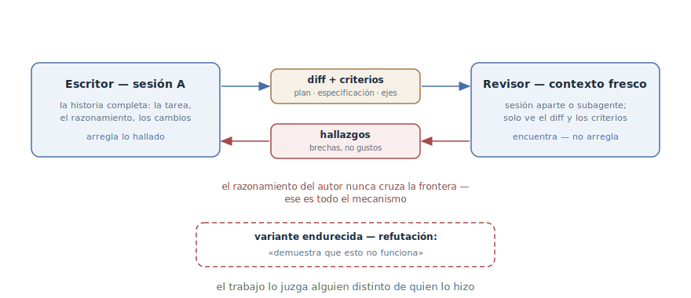

# Escritor y revisor

## Propósito

Entregar el diff para revisión a un agente con contexto fresco — una sesión
aparte o un subagente — para que el trabajo lo juzgue alguien distinto de
quien lo hizo. El revisor ve solo el diff y los criterios, no el
razonamiento que llevó al diff — y por eso evalúa el resultado en lugar de
estar de acuerdo con el hilo de pensamiento.

## También conocido como

Writer/Reviewer, revisión independiente, «ojos frescos»; la variante
endurecida — revisión adversarial.

## Problema

El agente está sesgado hacia el código que acaba de escribir — por la misma
razón que un humano: en su ventana está toda la cadena de razonamiento que
llevó a la solución. Pídele revisar su propio trabajo y revisará el
razonamiento — que, por supuesto, cuadrará.

- La [reflexión](reflection.md) choca con ese techo: un crítico en la misma
  ventana comparte los puntos ciegos del autor. Un caso omitido lo
  encontrará; un fallo en el propio enfoque — no.
- Cuanto más tiempo trabajó el agente de forma autónoma, mayor el precio:
  una serie de decisiones plausibles, cada una «verificada» por su propio
  autor, llega a ti entera.
- El único revisor sin sesgo — el humano — se convierte en el cuello de
  botella: todo lo que un agente produce en un día no cabe por la revisión
  de una persona.

## Solución

Separar los roles por contextos. El escritor es la sesión que hizo el
trabajo, con toda su historia. El revisor es un contexto fresco: una sesión
aparte o un subagente que recibe exactamente dos entradas:

- **el diff** — qué cambió de hecho;
- **los criterios** — contra qué comprobar: el plan, la especificación, los
  ejes de revisión («cada requisito implementado, los casos límite listados
  tienen tests, nada fuera del alcance tocado»).

Lo que el revisor *no* recibe es la historia del razonamiento. Ahí está todo
el mecanismo: sin saber *por qué* el autor decidió así, tiene que evaluar lo
que hay — como un revisor externo que abre un pull request.

Los hallazgos vuelven al escritor, que corrige y reenvía a re-revisión. En
la forma de subagente el ciclo se cierra sin copiar texto entre ventanas:
los hallazgos llegan directos a la sesión del autor.

Para código crítico existe la variante endurecida — la adversarial: la tarea
del revisor no es «valorar» sino **refutar** — «demuestra que esto no
funciona; encuentra una entrada que lo rompa». Un evaluador motivado a
encontrar un contraejemplo es más fuerte que uno motivado a emitir un
veredicto.

Una calibración es obligatoria: un revisor al que pidieron encontrar brechas
siempre encontrará algunas — así es el planteamiento. Pídele separar las
brechas de corrección y las desviaciones de los requisitos de las
preferencias de gusto — y no arregles todo lo que reporte: perseguir cada
hallazgo termina en capas de abstracción de más y tests para casos
imposibles.

## Estructura

Dos contextos, y entre ellos — solo artefactos. A la izquierda, el escritor
con toda la historia de la sesión; hacia la derecha viajan el diff y los
criterios, de vuelta llegan los hallazgos. El razonamiento del autor nunca
cruza la frontera — eso no es una limitación sino el mecanismo mismo del
patrón. Abajo, la variante endurecida: al revisor se le encarga refutar, no
valorar.

## Participantes / Componentes

- **Escritor** — la sesión que hizo el trabajo: historia completa,
  razonamiento, cambios. Arregla lo hallado.
- **Revisor** — un contexto fresco: sesión aparte o subagente. Solo
  encuentra — no arregla.
- **Diff** — el objeto de la revisión: el cambio real, sin la prehistoria.
- **Criterios** — el plan, la especificación, los ejes de revisión; definen
  qué cuenta como hallazgo.
- **Hallazgos** — brechas de corrección y desviaciones de los requisitos;
  los filtra el desarrollador.

## Cuándo aplicarlo

- Un diff serio antes del merge: varios módulos, un contrato público,
  lógica crítica.
- Tras el trabajo autónomo: cuanto más tiempo trabajó el agente sin
  vigilancia, más importa la comprobación independiente antes de dar el
  trabajo por hecho.
- Como control de amaño tras el [TDD](tdd-with-agent.md): ¿está la
  implementación amañada para los tests concretos?
- Como cotejo con el plan: ¿está implementado todo lo prometido, y no se
  hizo nada de más?

Para cambios pequeños basta la [reflexión](reflection.md) — el ciclo
completo con contexto aparte cuesta más que el propio cambio.

## Consecuencias y compromisos

- ➕ El sesgo del autor queda eliminado por construcción: el revisor
  físicamente no ve el razonamiento con el que podría estar de acuerdo.
- ➕ El resultado se comprueba contra criterios — como en una revisión
  externa, al precio de una llamada al agente.
- ➕ La revisión humana recibe mejor entrada: las brechas típicas se cazan
  antes de que una persona abra el diff.
- ➖ Más caro que la reflexión: un segundo contexto, traspaso de artefactos,
  iteraciones.
- ➖ Un revisor sin la historia puede no entender las decisiones
  deliberadas — los compromisos conscientes deben verse en los criterios,
  los ADR o los comentarios, o los «arreglarán».
- ➖ Siempre habrá hallazgos: sin calibración el patrón se convierte en un
  generador de sobreingeniería.

## Implementación

1. Monta un revisor con contexto fresco: un subagente («revisa esto con un
   subagente fresco...») o una sesión aparte que recibe solo el diff.
2. Reúne la entrada: el diff, los criterios (plan, especificación, ejes) y
   lo que explica lo deliberado — ADR, el
   [vocabulario del dominio](domain-context-file.md). No pases la historia
   de la sesión — es la fuente misma del sesgo.
3. Formula qué cuenta como hallazgo: «brechas de corrección y desviaciones
   del plan, no preferencias de estilo».
4. Para código crítico — refutación: «encuentra una entrada que rompa
   esto; demuestra que el requisito X no se cumple».
5. Devuelve los hallazgos al escritor e itera hasta una pasada limpia;
   arregla siempre el autor — un revisor que empieza a arreglar dejó de ser
   revisor.
6. Filtra los hallazgos tú mismo: las brechas de corrección se arreglan, lo
   de gusto es opcional. No conviertas cada hallazgo en un cambio.
7. Empaqueta el ciclo recurrente en un comando: ya hechos están
   `/code-review` en Claude Code y la revisión de dos ejes en los
   [skills de Matt Pocock](matt-pocock-skills.md).

## Ejemplo

La sesión A implementó un limitador de peticiones para la API pública según
el plan aprobado. En vez de «revisa tu trabajo», el desarrollador levanta un
revisor:

> Con un subagente fresco, revisa el diff del limitador contra PLAN.md: cada
> requisito implementado, los casos límite del plan tienen tests, nada fuera
> del alcance de la tarea cambiado. Reporta brechas, no estilo.

El revisor, sin saber cómo llegó el autor a la solución, devuelve tres
hallazgos: con dos workers rellenando tokens a la vez es posible una
carrera — el límite se supera brevemente; el plan promete la cabecera
`Retry-After` y no hay test para ella; de paso se renombró un middleware
vecino — fuera de alcance.

El autor arregla la carrera y añade el test; el renombrado lo revierte. La
re-revisión sale limpia. Fíjate: la carrera no la habría encontrado la
reflexión — en el razonamiento del autor el relleno de tokens es
«obviamente atómico», y un crítico en la misma ventana habría heredado esa
obviedad.

## Antipatrones y errores comunes

- **«Revisa tu código» en la misma ventana.** Eso es la
  [reflexión](reflection.md) — un instrumento útil pero distinto: el sesgo
  del autor sigue ahí.
- **Un revisor con la historia.** Darle al revisor toda la sesión «como
  contexto» es devolverle el razonamiento del autor y, con él, el sesgo. El
  contexto del revisor son el diff y los criterios.
- **Revisión sin criterios.** Sin plan ni ejes el revisor produce gustos —
  muchas palabras, pocos hallazgos.
- **Confianza ciega en los hallazgos.** Arreglar todo lo hallado es el
  camino directo a la sobreingeniería: el revisor *siempre* encontrará
  algo; el filtro es tarea del desarrollador.
- **El revisor arregla por su cuenta.** Mezclar los roles devuelve el
  problema original: ahora son *sus* cambios los que nadie comprobó de
  forma independiente.

## Usos conocidos

- **Claude Code best practices** — la fuente primaria: la tabla
  Writer/Reviewer de dos sesiones, el paso de revisión adversarial con un
  subagente («el revisor ve solo el diff y los criterios, no el
  razonamiento») y la advertencia sobre la sobreingeniería por hallazgos.
- **`/code-review` de Claude Code** — el skill incluido: revisión del diff
  actual por un subagente fresco con los hallazgos devueltos a la sesión.
- **Skills de Matt Pocock** — `/code-review` por dos ejes: adherencia a los
  estándares de la base de código y adherencia a la especificación; el
  final obligatorio de `/implement`.
- **Superpowers** — `requesting-code-review`: cotejar el resultado con la
  especificación como punto de control obligatorio antes de cerrar la rama.
- **La variante «escritor de tests — escritor de código»** — los mismos
  roles con otro material: una sesión escribe los tests, otra el código que
  los pasa.

## Patrones relacionados

- [Reflexión](reflection.md) — el peldaño barato de abajo: autocrítica en
  la misma ventana; un filtro antes de la revisión real, no su sustituto.
- [Bucle de retroalimentación](give-agent-a-way-to-verify.md) — el
  escritor-revisor es la «segunda opinión», el peldaño superior de la
  escalera de comprobaciones — para lo que no se reduce a un oráculo
  binario.
- [TDD con agente](tdd-with-agent.md) — le da al revisor una pregunta ya
  hecha: ¿está la implementación amañada para los tests congelados?
- [Desarrollo orientado a especificaciones](spec-driven-development.md) —
  le da al revisor los criterios: la especificación y el plan convierten el
  «mira el código» en una comprobación contra una lista.
