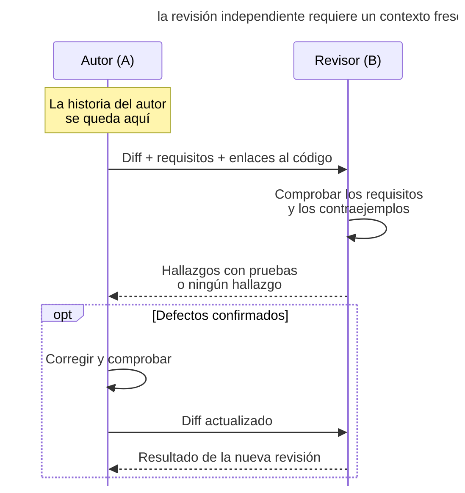

# Escritor y revisor

## Propósito

Entregar el diff a un agente con contexto fresco junto con los criterios de revisión. Un revisor aparte evalúa el resultado según los requisitos y devuelve los hallazgos al autor para que los corrija.

## También conocido como

Writer/Reviewer, revisión independiente, «ojos frescos», revisión adversarial.

## Problema

Al revisar su propio código, el agente puede repetir la suposición sobre la que construyó la implementación. Por ejemplo, da por hecho que la actualización del contador es atómica y pasa por alto la carrera en ambas pasadas.

La [reflexión](reflection.md) ayuda a buscar omisiones, pero conserva el mismo contexto de razonamiento. Tras un trabajo autónomo largo pueden acumularse varias suposiciones así sin comprobar. Un revisor aparte ayuda a preparar el diff para la revisión humana, aunque sus conclusiones también requieren confirmación.

## Solución

Separa los roles entre sesiones. El autor conserva la historia del trabajo, y el revisor recibe los materiales que debe comprobar.

- **El diff** muestra el cambio real.
- **Los criterios** fijan los requisitos, las restricciones y las comprobaciones esperadas.

Dale al revisor acceso al código necesario, a la especificación y a los ADR, pero deja la historia de razonamiento del autor en su sesión. Así el revisor podrá contrastar por su cuenta el cambio con los requisitos.

El autor recibe los hallazgos, corrige los defectos confirmados y entrega el resultado para una nueva revisión.

Para la lógica crítica, pide que busque contraejemplos. Una entrada en la que se incumple un requisito da una base comprobable para la corrección.

No exijas un número fijo de hallazgos. El revisor debe justificar los defectos y puede terminar la revisión sin hallazgos. Trata las preferencias de estilo por separado de los errores de comportamiento.

## Estructura

El autor y el revisor trabajan en contextos distintos. Entre ellos solo pasan los artefactos de la revisión y los hallazgos.

```mermaid
---
title: la revisión independiente requiere un contexto fresco
config:
  sequence:
    mirrorActors: false
    width: 130
    height: 45
    actorMargin: 35
    messageMargin: 28
---
sequenceDiagram
  participant W as Autor (A)
  participant R as Revisor (B)
  Note over W: La historia del autor<br/>se queda aquí
  W->>R: Diff + requisitos + enlaces al código
  R->>R: Comprobar los requisitos<br/>y los contraejemplos
  R-->>W: Hallazgos con pruebas<br/>o ningún hallazgo
  opt Defectos confirmados
    W->>W: Corregir y comprobar
    W->>R: Diff actualizado
    R-->>W: Resultado de la nueva revisión
  end
```

La sesión B empieza con un contexto fresco: el razonamiento del autor no se traslada a ella. El revisor lee el código que necesita e informa de los hallazgos. Las correcciones quedan en manos del autor y pasan por una nueva evaluación.

## Participantes / Componentes

- **El autor** implementa el cambio y corrige los hallazgos confirmados.
- **El revisor** comprueba el resultado en un contexto fresco.
- **El diff** fija el alcance de la revisión.
- **Los criterios** definen el comportamiento requerido y las restricciones.
- **Los hallazgos** describen el defecto, las condiciones en que se manifiesta y las pruebas.

## Cuándo aplicarlo

- El cambio afecta a varios módulos o a un contrato público.
- El agente trabajó mucho tiempo de forma autónoma antes de la revisión.
- Tras el [TDD](tdd-with-agent.md) hace falta comprobar si la implementación está amañada para los tests.
- Hay que cotejar la completitud del resultado con el plan.

Para un cambio pequeño puedes empezar por la [reflexión](reflection.md) y las comprobaciones automáticas.

## Consecuencias y compromisos

- ➕ El revisor reconstruye por su cuenta la solución a partir del código y los requisitos.
- ➕ Los criterios hacen que los hallazgos sean concretos y comprobables.
- ➕ Parte de los defectos puede corregirse antes de la revisión humana.
- ➖ El segundo contexto y las pasadas repetidas aumentan el coste.
- ➖ Sin restricciones escritas, el revisor puede tomar un compromiso deliberado por un error.
- ➖ Los hallazgos sin comprobar pueden llevar a cambios innecesarios.

## Implementación

1. Crea una sesión aparte o un subagente con contexto fresco. Para mayor independencia, encarga la revisión a un agente con otro modelo.
2. Entrega el diff, el plan y la especificación. Añade enlaces a los ADR y al [vocabulario del dominio](domain-context-file.md) que explican las restricciones.
3. Pide que informe de defectos comprobables y de incumplimientos de los requisitos.
4. Para el comportamiento crítico, pide contraejemplos.
5. Pasa los hallazgos confirmados al autor y vuelve a revisar las correcciones.
6. Rechaza los hallazgos que no se sostienen en el código ni en los requisitos.
7. Guarda el proceso recurrente en un comando o usa `/code-review` de los [skills de Matt Pocock](matt-pocock-skills.md).

## Ejemplo

La sesión A implementó un limitador de peticiones. Entregas el resultado para una revisión independiente.

> Haz la revisión del diff del limitador según PLAN.md

El revisor encuentra una carrera al rellenar tokens desde dos workers. Muestra la secuencia de operaciones en la que ambos leen el contador antiguo y permiten superar el límite. Además, advierte que falta la comprobación de `Retry-After` y que se renombró un middleware vecino fuera de la tarea.

El autor corrige la carrera, añade un test de la cabecera y quita el renombrado ajeno. La nueva revisión comprueba estos cambios. El contexto fresco ayudó a poner en duda la suposición de que el contador es atómico.

## Antipatrones y errores comunes

- **Revisión en la misma ventana.** Eso es la [reflexión](reflection.md), que puede conservar las suposiciones iniciales del autor.
- **Toda la historia al revisor.** La conversación completa puede encaminar la revisión por el hilo de pensamiento ya elegido. Entrega los requisitos y las pruebas de las decisiones.
- **Sin criterios.** Sin requisitos, los hallazgos pueden reducirse a preferencias de estilo.
- **Cada hallazgo se convierte en un cambio.** Primero confirma el defecto y valora si hace falta corregirlo.
- **El revisor cambia el código.** Sus cambios también requerirán una revisión independiente.

## Usos conocidos

- **Claude Code best practices** describen la separación Writer/Reviewer y la búsqueda de contraejemplos en una sesión aparte.
- **El plugin [codex-plugin-cc](https://github.com/openai/codex-plugin-cc)** de OpenAI ejecuta Codex dentro de Claude Code. El comando `/codex:review` revisa los cambios sin commit o una rama, y `/codex:adversarial-review` cuestiona las decisiones de implementación y de diseño. El revisor no solo tiene un contexto fresco, sino también otro modelo.
- **Codex** revisa una rama, los cambios sin commit o un commit concreto con el comando `/review`.
- **Los skills de revisión** automatizan la entrega del diff y la devolución de los hallazgos al autor.
- **Los skills de Matt Pocock** comprueban los estándares del proyecto y la especificación con `/code-review`.
- **Superpowers** usa `requesting-code-review` antes de cerrar una rama.
- **Autores separados de tests y de código** aplican un principio parecido a los criterios y a la implementación.

## Patrones relacionados

- [Reflexión](reflection.md) ayuda a preparar el resultado en la sesión actual.
- [Bucle de retroalimentación](give-agent-a-way-to-verify.md) complementa la revisión con comprobaciones reproducibles.
- [TDD con agente](tdd-with-agent.md) da criterios para detectar una implementación amañada para los tests.
- [Desarrollo orientado a especificaciones](spec-driven-development.md) conserva los requisitos para un revisor independiente.
