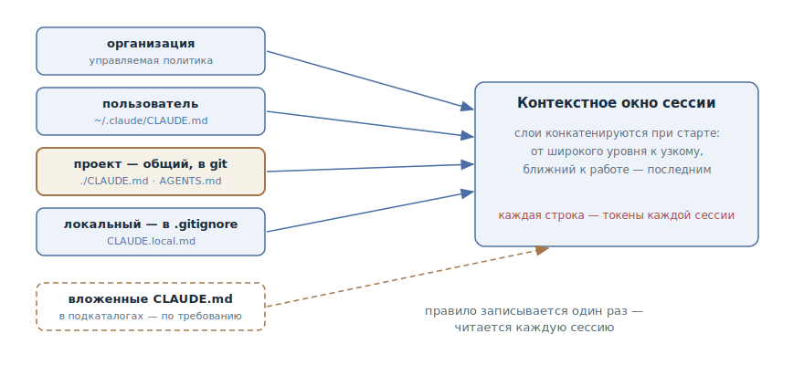

# Память проекта

## Назначение

Завести в репозитории постоянный файл с правилами проекта — команды,
соглашения, ограничения, — который агент автоматически читает в начале каждой
сессии. Правило записывается один раз — и действует в каждом новом контекстном
окне, вместо того чтобы пересказываться в каждой переписке.

## Также известен как

CLAUDE.md, AGENTS.md, memory file, файл памяти; в других инструментах —
project rules, custom instructions.

## Проблема

Каждая сессия агента начинается с чистого контекстного окна. Агент не знает,
как собирается проект, чем гоняются тесты, какие в команде соглашения и чего
здесь делать нельзя. Разработчик объясняет это в переписке — и объяснение
умирает вместе с сессией:

- Одни и те же уточнения печатаются заново каждую сессию: «у нас pnpm, не
  npm», «тесты через make test», «эту папку не трогаем».
- Агент делает одну и ту же ошибку вторую неделю подряд — ему никто не может
  сказать об этом *насовсем*.
- Знание живёт в голове одного разработчика. Коллега за соседним столом
  объясняет своему агенту то же самое — другими словами и с другим успехом.

Держать эти правила в спецификации задачи тоже не выход: они не про задачу,
они про проект — и нужны в каждой задаче.

## Решение

Файл в корне репозитория, который агент загружает при старте каждой сессии.
В него записывается то, что иначе пришлось бы объяснять заново: команды сборки
и тестов, соглашения по коду и коммитам, границы («всегда X», «никогда Y»),
неочевидные особенности проекта.

Пополняется файл по простым триггерам:

- агент совершил одну и ту же ошибку второй раз;
- ревью поймало то, что агент обязан был знать об этой кодовой базе;
- вы печатаете уточнение, которое уже печатали в прошлой сессии;
- новому коллеге для продуктивной работы понадобился бы тот же контекст.

Файл лежит в системе контроля версий, поэтому правила общие для всей команды
и проходят обычное ревью. Правишь текст — меняешь поведение всех агентов
проекта со следующей сессии.

Важная граница: это контекст, а не конфигурация. Файл памяти *направляет*
поведение агента, но не гарантирует его. Запреты, которые должны выполняться
всегда — «не пушить в main», «не трогать прод», — дублируются механикой:
хуками, правами доступа, настройками инструмента.

## Структура



Память многослойна: уровень организации (управляемая политика), личный
уровень пользователя, уровень проекта и локальный файл с личными настройками
под конкретный репозиторий. При старте сессии слои конкатенируются в окно —
от широкого к узкому, так что правила проекта читаются после личных, а
локальные — последними. Командный слой — файл проекта в git — и есть предмет
паттерна; остальные уровни дополняют его, не подменяя. Вложенные файлы памяти
в подкаталогах загружаются не при старте, а по требованию — когда агент
начинает работать с файлами рядом с ними.

## Участники / Компоненты

- **Файл памяти проекта** (`./CLAUDE.md`, `./AGENTS.md`) — командные правила;
  живёт в git, проходит ревью.
- **Личный файл пользователя** (`~/.claude/CLAUDE.md`) — предпочтения
  разработчика для всех его проектов.
- **Локальный файл** (`CLAUDE.local.md` в `.gitignore`) — личное для этого
  проекта: адреса стендов, тестовые данные.
- **Разработчик и команда** — пополняют файл по триггерам и регулярно чистят.
- **Агент** — читает слои при старте; по просьбе сам дописывает новые правила.

## Когда применять

- В любом репозитории, где агент работает регулярно, — это первый файл,
  который стоит завести.
- Особенно окупается, когда соглашения проекта расходятся с дефолтами
  инструментов: нестандартные команды, свой стиль, жёсткие границы модулей.
- Когда с одной кодовой базой работают несколько человек и несколько агентов —
  файл выравнивает правила для всех.

## Последствия и компромиссы

- ➕ Правила переживают сессию: «объясни один раз» вместо «объясняй каждый
  раз».
- ➕ Знание становится командным: правила лежат в git, а не в чьей-то голове,
  и у всех агентов проекта одна картина мира.
- ➕ Правки дёшевы: это markdown под ревью — изменение правила стоит одну
  строку диффа.
- ➖ Файл конкурирует за контекстное окно: каждая строка — токены в каждой
  сессии каждого разработчика (см. [инженерию контекста](context-engineering.md)).
- ➖ Без ухода деградирует в свалку: правила дублируются, противоречат друг
  другу, и агент начинает игнорировать половину.
- ➖ Не является механизмом принуждения: критичные запреты, записанные только
  в память, однажды будут нарушены.

## Реализация

1. Сгенерируйте стартовый файл — в Claude Code это `/init`: агент сам изучит
   кодовую базу и найдёт команды и соглашения. Вычистите из результата всё,
   что агент может вывести из кода сам (структуру каталогов, списки
   зависимостей): это токены без сигнала. Оставьте то, чего в коде не видно.
2. Пишите проверяемые формулировки: «отступ — два пробела», «перед коммитом —
   `make test`», а не «форматируй аккуратно» и «тестируй изменения».
3. Держите файл коротким — ориентир порядка двухсот строк. Что длиннее, то
   хуже соблюдается: правила тонут друг в друге.
4. Растущие инструкции дробите по месту: правила, нужные только части кодовой
   базы, выносите в модульные файлы с привязкой к путям (в Claude Code —
   `.claude/rules/` с полем `paths`), чтобы они загружались только когда агент
   работает с соответствующими файлами.
5. Разделяйте уровни: командное — в файл проекта под git, личное для всех
   проектов — на уровень пользователя, личное для этого проекта — в локальный
   файл под `.gitignore`.
6. Пополняйте по триггеру «объясняю второй раз» — и прямо просите агента:
   «добавь это правило в CLAUDE.md». Чистите регулярно: устаревшее правило
   хуже отсутствующего.

### AGENTS.md: одна память для всех агентов

Конвенция [AGENTS.md](https://agents.md/) выносит те же правила в файл со
стандартным именем, который читают десятки инструментов — Codex, Cursor,
Copilot, Gemini CLI и другие; формат курирует Agentic AI Foundation при Linux
Foundation, его используют более 60 тысяч открытых репозиториев. В монорепо
файлы вкладываются: агент берёт ближайший к редактируемому коду.

Claude Code читает `CLAUDE.md`, поэтому команде с AGENTS.md достаточно
симлинка `ln -s AGENTS.md CLAUDE.md` — или импорта `@AGENTS.md` первой
строкой CLAUDE.md, если нужно дописать специфичные для Claude инструкции.
Одна память, никакого дублирования.

### В тулкитах спеко-ориентированной разработки

У SDD-фреймворков есть свои воплощения того же паттерна — постоянный файл,
который агент сверяет на каждой фазе:

- **GitHub Spec Kit** — «конституция» (`/speckit.constitution`): неизменяемые
  принципы проекта, против которых проверяются спецификация и план.
- **OpenSpec** — `openspec/project.md`: стек, соглашения и контекст проекта,
  общие для всех изменений.
- **Kiro** — steering-файлы (product, tech, structure), подключаемые к каждой
  спек-сессии.
- **Скилы Мэтта Покока** — пак ставится поверх AGENTS.md и принципиально
  держит его тонким: процедуры уходят в скилы, в памяти остаются только
  правила.

## Пример

Фрагмент файла памяти небольшого сервиса — коротко, конкретно, только то,
чего не видно из кода:

```markdown
# Проект: billing-service

## Команды
- Сборка и тесты: `make test` (не `npm test` — нужны контейнеры)
- Локальный запуск: `make up`, стенд на :8080

## Соглашения
- Пакетный менеджер — pnpm; lock-файл коммитим
- Коммиты — Conventional Commits, на английском
- Миграции не редактируются задним числом — только новая миграция

## Границы
- Домены общаются только через события; прямые импорты между
  `src/domains/*` запрещены
- В тестах запрещён sleep — только явные ожидания
```

Агент получает задачу «добавь в биллинг уведомление о неудачном списании» и
тянется импортировать модуль нотификаций напрямую — но правило про границы
доменов уже в окне, и он строит взаимодействие через событие. В переписке об
этом не сказано ни слова.

Через неделю ревью ловит агентский коммит с `npm install` вместо pnpm.
Разработчик закрывает дыру насовсем:

> Добавь в CLAUDE.md: зависимости ставим только через pnpm, package-lock.json
> в репозитории появляться не должен.

Со следующей сессии это правило знают все агенты проекта.

## Анти-паттерны и частые ошибки

- **Раздутая память.** Сотни строк, дубли и противоречия — агент игнорирует
  половину, потому что важное неотличимо от шума. Настолько частая ошибка,
  что разобрана отдельной главой в разделе анти-паттернов.
- **Свалка производного.** Структура каталогов, списки зависимостей, обзор
  архитектуры — всё это агент видит в коде сам. В памяти этому не место:
  токены расходуются, сигнала нет.
- **Ожидание принуждения.** «Никогда не пушить в main» в файле памяти — это
  пожелание, а не запрет. Жёсткие границы дублируйте хуками и правами.
- **Личное в командном файле.** Адреса ваших стендов и вкусовые предпочтения —
  на личный и локальный уровни, а не в общий файл под git.
- **Написал и забыл.** Правила устаревают, а агент продолжает уверенно их
  исполнять. Чистка памяти — такая же регулярная работа, как обновление
  зависимостей.

## Известные применения

- **Claude Code** — `CLAUDE.md` с иерархией уровней (организация →
  пользователь → проект → локальный), генерация через `/init`, модульные
  правила `.claude/rules/` с привязкой к путям; рядом — auto memory, заметки,
  которые агент ведёт о проекте сам.
- **AGENTS.md** — межинструментная конвенция: 60k+ репозиториев, в том числе
  Apache Airflow и Temporal; в монорепо OpenAI — 88 вложенных файлов.
- **Правила редакторов** — `.cursor/rules` в Cursor, custom instructions в
  GitHub Copilot: та же идея в форматах конкретных инструментов.
- **SDD-тулкиты** — конституция в [Spec Kit](spec-kit.md), `project.md` в
  [OpenSpec](openspec.md), steering-файлы в [Kiro](kiro.md).

## Связанные паттерны

- [Инженерия контекста](context-engineering.md) — файл памяти и есть
  постоянный слой контекста: загружается каждую сессию и конкурирует за
  бюджет внимания.
- [Словарь домена](domain-context-file.md) — другая ось постоянного слоя:
  «что значат слова», а не «как мы работаем».
- [Спеко-ориентированная разработка](spec-driven-development.md) — соглашения
  проекта служат постоянным входом конвейера SDD; в тулкитах паттерн
  воплощён конституцией, project.md и steering-файлами.
