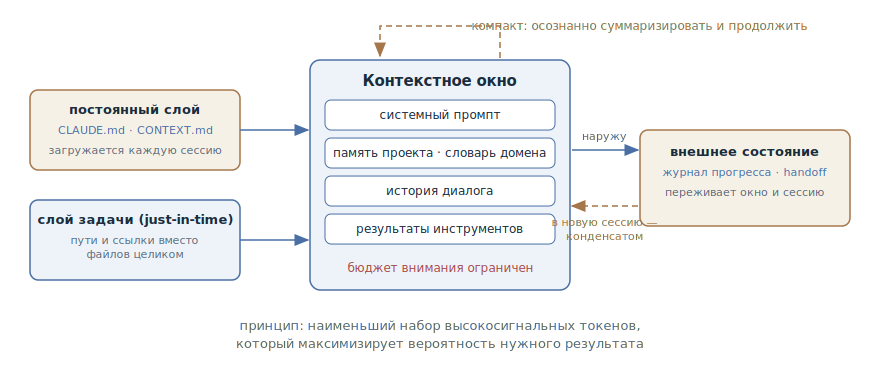

# Инженерия контекста

## Назначение

Относиться к контекстному окну агента как к ограниченному ресурсу: осознанно
подбирать наименьший набор токенов с максимумом сигнала вместо того, чтобы
сваливать в сессию всё, что может пригодиться. Это обзорная глава раздела: она
задаёт словарь — окно, бюджет внимания, слои контекста, — на который опираются
остальные паттерны работы с контекстом.

## Также известен как

Context engineering, контекст-инжиниринг.

## Проблема

Интуиция подсказывает: чем больше агент знает, тем лучше он работает. Отсюда
привычка вставлять в промпт файлы целиком, логи от начала до конца и инструкции
на все случаи жизни. Но контекстное окно — не жёсткий диск, а рабочая память,
и ведёт она себя контринтуитивно:

- **Деградация контекста (context rot).** С ростом числа токенов в окне падает
  способность модели точно вспомнить то, что в нём лежит. Эффект воспроизводится
  на всех моделях — различается только степень.
- **Бюджет внимания.** Трансформер поддерживает попарные связи между всеми
  токенами окна, и обучен он в основном на коротких последовательностях. Чем
  длиннее контекст, тем тоньше внимание размазано по нему: каждый лишний токен
  расходует бюджет, которого не хватит важному.
- **Контекст накапливается сам.** Агент работает в цикле: каждый вызов
  инструмента добавляет в окно результаты — листинги, диффы, логи. К концу
  длинной сессии окно заполнено отработанным шумом, а правило, сказанное в
  начале, вытеснено на обочину внимания.

Промпт-инжиниринг здесь не помогает: он оптимизирует формулировку одной
инструкции, а проблема — в том, *какой набор информации* оказывается в окне на
каждом следующем шаге цикла и что из него там остаётся.

## Решение

Сменить вопрос с «как сформулировать промпт» на «что модель увидит в этот
момент и почему именно это». Ориентир дисциплины — принцип из статьи Anthropic:
*наименьший набор высокосигнальных токенов, который максимизирует вероятность
нужного результата.*

Контекст складывается из слоёв, и у каждого — свой приём управления:

1. **Постоянный слой** — то, что агент должен знать в каждой сессии: правила
   проекта и язык домена. Живёт в файлах репозитория и загружается
   автоматически, а не пересказывается в переписке.
2. **Слой задачи** — код и данные конкретной задачи. Не предзагружать всё
   подряд: дать агенту пути и ссылки и позволить подтянуть нужное самому
   (just-in-time). Имена файлов, структура каталогов и таймстемпы — сами по
   себе сигнал.
3. **Слой состояния** — то, что накапливается по ходу работы: решения,
   прогресс, отброшенные гипотезы. Его выносят из окна наружу — в заметки,
   журнал прогресса, передаточный документ — и возвращают по мере надобности.
4. **Инструкции и примеры** — правила на нужной «высоте»: не жёсткая каскадная
   логика на каждый случай и не расплывчатое «пиши хорошо», а сильные
   эвристики; вместо перечисления всех граничных случаев — несколько
   канонических примеров.

Минимальный не значит короткий: если для устойчивого поведения нужна страница
правил — значит, нужна страница. Лишнее — это то, что не меняет поведение
агента, а внимание расходует.

## Структура

В центре — контекстное окно с его бюджетом внимания. Слева то, что в окно
*входит*: постоянный слой (память проекта и словарь домена) загружается каждую
сессию, слой задачи агент подтягивает по требованию — по путям и ссылкам, а не
предзагрузкой. Справа то, что из окна *выносится*: состояние долгой работы
оседает в журнале прогресса и передаточном документе и возвращается в новую
сессию уже конденсированным. Пунктирная петля сверху — компакт: когда окно
подходит к пределу, его содержимое осознанно суммаризируется, и цикл
продолжается.

## Участники / Компоненты

- **Разработчик** — куратор контекста: решает, что живёт в постоянном слое,
  что подтягивается по требованию, что выносится из окна.
- **Агент** — наполняет окно сам: читает файлы по путям, пишет заметки,
  обновляет внешнее состояние.
- **Контекстное окно** — ограниченный ресурс: токены конкурируют за бюджет
  внимания модели.
- **Постоянные файлы контекста** — память проекта и словарь домена; читаются
  каждую сессию.
- **Внешнее состояние** — журнал прогресса и передаточные документы; переживают
  окно и сессию.

## Когда применять

- Всегда как фоновая дисциплина — вопрос лишь в том, сколько усилий она
  оправдывает на вашем масштабе задач.
- Остро — когда сессии длинные и к концу агент заметно «глупеет»: забывает
  правила, повторяет пройденное, предлагает уже отброшенное.
- Когда работа больше одного контекстного окна и состояние приходится
  передавать между сессиями.
- Когда одни и те же объяснения — соглашения, термины, команды — повторяются
  из сессии в сессию.

## Последствия и компромиссы

- ➕ Агент дольше остаётся точным: важное не тонет в отработанном шуме.
- ➕ Дешевле и быстрее: меньше токенов на каждый вызов модели.
- ➕ Знания проекта переиспользуются: новая сессия, другой агент и новый
  коллега стартуют с одного постоянного слоя, а не с пересказа.
- ➖ Курирование — постоянная работа: слои контекста надо пополнять и чистить,
  сами себя они не поддержат.
- ➖ Устаревший постоянный слой хуже его отсутствия: агент выполняет вчерашние
  правила с сегодняшней уверенностью.
- ➖ Пере-экономия бьёт по качеству: убрать из окна то, от чего зависит
  поведение, проще, чем кажется, — недостающее агент дорисует догадками.

## Реализация

1. Начните с минимума: сильная модель и короткие инструкции. Правила
   добавляйте по наблюдаемым сбоям, а не впрок.
2. Постоянные правила проекта — соглашения, команды, ограничения — вынесите в
   файл памяти и держите его коротким.
3. Язык домена — термины и принятые архитектурные решения — в отдельный
   доменный файл: это другая ось, чем «как мы работаем».
4. Не вставляйте в промпт файлы и логи целиком: дайте пути и ссылки — агент
   прочитает нужное сам, а окно не заполнится низкосигнальными токенами.
5. Долгую работу выносите из окна: журнал прогресса по ходу, передаточный
   документ на границе сессии.
6. Компактьте осознанно, а не по автопорогу: сохранить решения, текущее
   состояние и открытые вопросы; выбросить отработанные результаты
   инструментов.

Каждому приёму из этого списка посвящена отдельная глава раздела:

- [Память проекта](claude-md-memory.md) — постоянный слой «как мы работаем»:
  правила, соглашения, команды в файле, который агент читает каждую сессию.
- [Словарь домена](domain-context-file.md) — постоянный слой «что значат
  слова»: глоссарий и архитектурные решения как канонический язык проекта.
- [Журнал прогресса](progress-file.md) — запись состояния по ходу долгой
  работы, по которой агент со свежим окном восстанавливает картину.
- [Передача сессии](handoff.md) — осознанная упаковка сессии в документ на её
  границе, вместо доверия автосуммаризации.

## Пример

Задача: разобраться, почему флачит интеграционный тест платёжного шлюза.

**Наивный заход.** Разработчик вставляет в промпт лог CI целиком — три тысячи
строк — и три файла теста «для контекста», а правило проекта проговаривает по
ходу: «у нас запрещены sleep в тестах». Агент начинает уверенно, но окно уже
наполовину занято логом. Через десяток обменов правило вытеснено шумом — агент
предлагает «стабилизировать тест» через `sleep(5)`.

**Инженерный заход.** Правило про sleep лежит в файле памяти проекта — его не
нужно проговаривать. Промпт вместо вставки файлов даёт координаты:

> Разберись, почему флачит `tests/integration/payment_gateway_test.py`.
> Упавшие прогоны — в джобе integration-tests, посмотри последние три.

Агент сам вытаскивает из логов только упавшие куски, читает тест и смежный код
по путям и находит гонку между вебхуком и поллингом статуса. Починить в этой
сессии не успели — разработчик закрывает её передаточным документом:

> Заканчиваем. Собери handoff: что выяснили про причину, какие гипотезы
> отпали, с чего начать следующую сессию.

Следующая сессия стартует с двух экранов конденсированного текста — а не с
трёх тысяч строк лога и восстановления по памяти.

## Анти-паттерны и частые ошибки

- **Раздутый файл памяти.** Постоянный слой превращается в свалку из сотен
  правил — и агент игнорирует половину, потому что важное неотличимо от шума.
  Настолько частая ошибка, что разобрана отдельной главой в разделе
  анти-паттернов.
- **«Вставлю целиком, чтобы точно хватило».** Файлы и логи целиком вместо путей
  и ссылок: окно занято низкосигнальными токенами ещё до начала работы.
- **Молчаливый автокомпакт.** Доверить суммаризацию важных решений автопорогу —
  вместе с шумом выкидываются и решения. Компакт — осознанный ход разработчика,
  а на границе сессии — полноценный handoff.
- **Экономия на необходимом.** Минимальный не значит короткий: если убрать из
  контекста то, от чего зависит поведение, агент восполнит пробел догадками —
  уверенными и неверными.

## Известные применения

- **Claude Code** — постоянный слой в `CLAUDE.md`, осознанный компакт командой
  `/compact`, сабагенты с чистыми окнами для изолированных подзадач.
- **Memory tool Anthropic** — структурированные заметки агента во внешней
  памяти: база знаний накапливается между сессиями, не занимая окно.
- **Мультиагентная исследовательская система Anthropic** — сабагенты копают
  глубоко, а наверх возвращают конденсированную сводку на 1–2 тысячи токенов:
  разделение труда как способ беречь окно координатора.
- **AGENTS.md и правила редакторов** — тот же постоянный слой в других
  инструментах: `.cursor/rules` в Cursor, custom instructions в GitHub Copilot.
- Термин закрепила статья Anthropic [Effective context engineering for AI
  agents](https://www.anthropic.com/engineering/effective-context-engineering-for-ai-agents) —
  первоисточник принципов этой главы.

## Связанные паттерны

- [Память проекта](claude-md-memory.md), [словарь домена](domain-context-file.md),
  [журнал прогресса](progress-file.md) и [передача сессии](handoff.md) —
  конкретные приёмы дисциплины, по главе на каждый.
- [Спеко-ориентированная разработка](spec-driven-development.md) — артефакты
  SDD тоже инженерия контекста: спецификация — это курированный,
  высокосигнальный контекст задачи, переживающий сессию.
- [Четыре фазы](explore-plan-code-commit.md) — фаза исследования в этом цикле
  и есть just-in-time наполнение окна: агент сам собирает контекст задачи
  перед планом.
