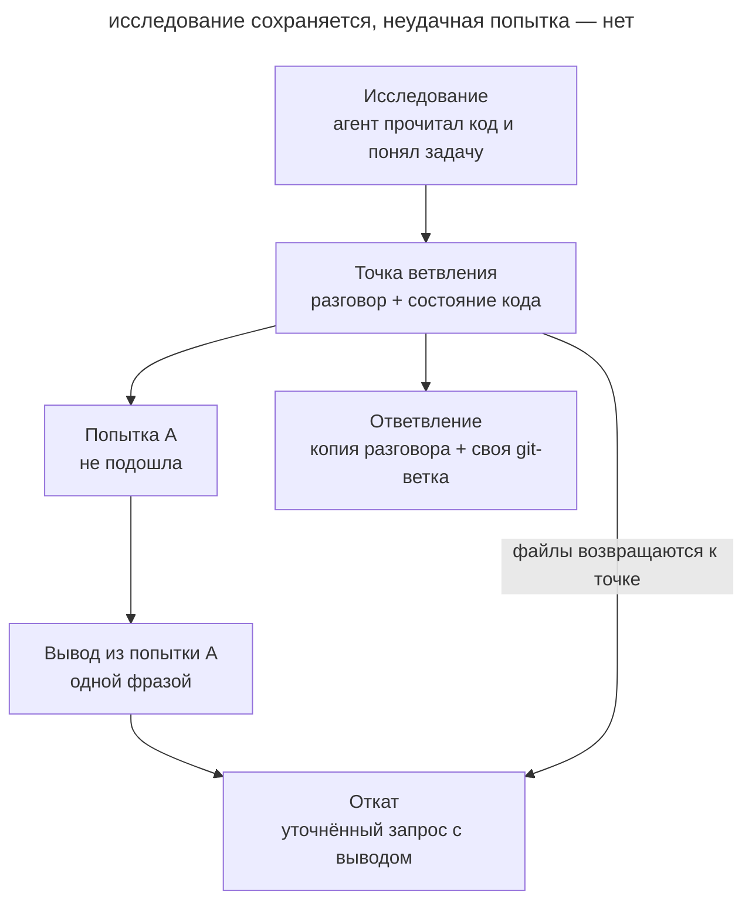

# Ветвление контекста

## Назначение

Вернуться к точке разговора, где агент уже собрал нужный контекст, и продолжить оттуда другую линию работы. Неудачная попытка не остаётся в окне, а исследование не приходится повторять в новой сессии. Код при этом должен соответствовать выбранной ветке разговора.

## Также известен как

Context forking; откат разговора (`/rewind`, `Esc Esc`) и `/branch` в Claude Code; `/fork` в Codex.

## Проблема

Агент прочитал очередь задач, клиент почты и конфигурацию, а затем реализовал первое решение. Оно не подходит. Естественная реакция — написать «не так, попробуй иначе». Тогда в окне остаются прочитанные файлы, провалившийся подход, ваше возражение и второй подход. Неудачная попытка продолжает влиять на ответы, а место в окне тратится на то, что уже не нужно.

Новая сессия избавляет от провала, но теряет исследование. Агенту снова придётся читать те же файлы, или вам придётся готовить [передаточный документ](handoff.md) для работы, которая не закончилась.

Похожая ситуация возникает, когда нужно сравнить два подхода. Если пробовать их по очереди в одном разговоре, второй вариант строится с оглядкой на первый. А если одна команда вывела огромный лог, ценный контекст до неё оказывается погребён под выводом.

Сложность в том, что у работы два состояния: разговор и файлы. Откат разговора сам по себе не возвращает код, а копия разговора работает в том же каталоге, что и оригинал.

## Решение

Рассматривайте историю разговора как дерево. Точкой ветвления служит момент, когда исследование закончено, а решение ещё не начато. Из неё доступны два хода.

- **Откат.** Вернитесь к точке ветвления и повторите запрос с учётом того, что выяснилось. Неудачная ветка отбрасывается, в окне остаются исследование и один уточнённый запрос.
- **Ответвление.** Скопируйте разговор и продолжайте работу в копии, оставив оригинал нетронутым. Так можно попробовать рискованный вариант или сравнить подходы из одного и того же исходного понимания.

При каждом ходе приводите код в соответствие с веткой разговора. После отката верните файлы к состоянию точки ветвления. Для ответвления заведите отдельную git-ветку, а если ветки работают одновременно, — отдельный worktree.

Урок неудачной ветки переносите явно: одной фразой в новом запросе или краткой сводкой, которую агент пишет перед откатом.

## Структура

Схема показывает одну точку ветвления и два пути из неё. Обратите внимание, что при откате файлы возвращаются вместе с разговором.

Попытка A отбрасывается вместе со своими правками, но её вывод попадает в новый запрос. Ответвление начинается из той же точки и получает собственное состояние кода, поэтому варианты не смешиваются.

## Участники / Компоненты

- **Точка ветвления** фиксирует разговор после исследования и соответствующее ему состояние кода.
- **Ветка разговора** продолжает работу из точки ветвления: заменяет неудачную попытку или идёт параллельно оригиналу.
- **Состояние кода** привязывается к ветке через чекпойнты инструмента, git-ветку или worktree.
- **Вывод неудачной ветки** переносит урок в новый запрос без самой попытки.
- **Разработчик** выбирает точку ветвления, решает, откатывать или ответвляться, и сравнивает результаты веток.

## Когда применять

- Агент пошёл неверным путём после ценного исследования.
- Нужно сравнить два подхода, опираясь на одно и то же понимание кода.
- Одна операция заполнила окно выводом, а контекст до неё ещё нужен.

Если начинается новая задача, откройте новую сессию. Если работа переходит в другую сессию, подготовьте [передаточный документ](handoff.md).

## Последствия и компромиссы

- ➕ Неудачная попытка не занимает окно и не влияет на следующие ответы.
- ➕ Исследование используется повторно без пересказа.
- ➕ Варианты сравниваются из одного исходного понимания задачи.
- ➖ Разговор и код легко рассинхронизировать: после отката только разговора правки остаются в файлах, а агент о них уже не знает.
- ➖ Чекпойнты инструмента учитывают не все изменения. Команды оболочки, внешние эффекты и правки фоновых сабагентов нужно откатывать через git или вручную.
- ➖ Ветки в одном рабочем каталоге видят правки друг друга.
- ➖ Урок отброшенной ветки теряется, если его не перенести явно.
- ➖ Откатиться можно только к границе вашего сообщения, а не к середине цепочки вызовов инструментов.

## Реализация

1. Когда исследование закончено, отметьте точку ветвления: закоммитьте или сохраните в stash текущее состояние кода. Это даёт опору и для изменений, которые чекпойнты не отслеживают.
2. Если попытка не подошла, решите, что нужно: заменить её или сохранить и попробовать другой вариант рядом.
3. Перед откатом попросите агента кратко записать, что выяснилось. В Claude Code для этого есть пункт «Summarize from here» в меню `/rewind`.
4. Откатите разговор вместе с кодом. Затем проверьте `git status`: изменения от команд оболочки и миграций инструмент не вернёт.
5. Повторите запрос и добавьте вывод из неудачной попытки.
6. Для сравнения подходов создайте ветку разговора на каждый вариант и отдельную git-ветку для её кода. Если варианты работают одновременно, дайте каждому свой worktree (см. [изолированную параллельную работу](isolated-parallel-work.md)).
7. Сравните варианты по одним и тем же проверкам. Лишние ветки закройте, а решение и причины перенесите в постоянные документы.

## Пример

Сервису уведомлений нужна повторная отправка писем при временных ошибках SMTP. Агент изучил очередь задач, клиент почты и настройки воркеров. Вы закоммитили чистое состояние и попросили реализовать повторы.

Агент добавил цикл повторов с `sleep` внутри клиента почты. Тесты проходят, но при недоступном сервере каждый воркер ждёт до минуты и перестаёт брать другие задачи. Вы помните, что очередь уже умеет откладывать задачи.

Вместо возражения в том же окне вы открываете `/rewind`, выбираете своё сообщение с просьбой реализовать повторы и восстанавливаете код и разговор. `git status` показывает чистое дерево: агент менял файлы через инструменты правки, и чекпойнт их вернул. В поле ввода возвращается исходный запрос, и вы дополняете его.

> Добавь повторную отправку писем при временных ошибках SMTP. Повторы внутри клиента почты не подходят: они блокируют воркер. Очередь уже поддерживает отложенные задачи через `enqueue(..., delay=...)`. Используй её, задержку увеличивай экспоненциально, после пятой попытки помечай письмо как неотправленное.

В окне остались прочитанные файлы и один уточнённый запрос. Агент ставит повтор отложенной задачей и добавляет тест на пятую попытку. Спор о блокирующем цикле в контекст не попал.

## Антипаттерны и частые ошибки

- **Откат разговора без кода.** Агент продолжает с точки, где правок ещё не было, но файлы уже изменены. Следующее решение строится поверх невидимых для него изменений.
- **Полное доверие чекпойнтам.** Удалённые командой файлы, применённые миграции и отправленные запросы не откатываются вместе с разговором. Держите коммит в точке ветвления.
- **Две ветки в одном каталоге.** Параллельные ветки разговора перезаписывают правки друг друга. Дайте каждой свою git-ветку или worktree.
- **Откат без урока.** Если не перенести вывод, агент может повторить ту же ошибку.
- **Ветвление слишком поздно.** Точка ветвления после неудачной попытки уже содержит провал. Выбирайте момент до первой попытки.

## Известные применения

- **Claude Code** открывает меню отката по `/rewind` или двойному `Esc`. Можно восстановить код и разговор, только разговор или только код, а также сжать часть разговора в сводку. `/branch` и `claude --continue --fork-session` копируют разговор и оставляют оригинал. [Документация](https://code.claude.com/docs/en/checkpointing) предупреждает, что чекпойнты не отслеживают команды оболочки и внешние изменения и не заменяют git.
- **Команда Claude Code** [советует](https://claude.com/blog/using-claude-code-session-management-and-1m-context) откатывать разговор вместо исправления неудачной попытки и предлагает перед откатом записывать урок через «Summarize from here».
- **Codex** по двойному `Esc` позволяет [отредактировать предыдущее сообщение](https://learn.chatgpt.com/docs/developer-commands?surface=cli) и ответвить разговор от этой точки. Команда `/fork` копирует текущий разговор, `/side` открывает временное ответвление для побочного вопроса, а `/worktree` продолжает разговор в новом worktree.
- **HumanLayer** [описывает](https://www.humanlayer.dev/blog/context-forking-to-save-time-trouble-and-tokens) три повода для ветвления: исправить курс, сравнить варианты дизайна и спасти ценный контекст после слишком большого вывода инструмента.

## Связанные паттерны

- [Инженерия контекста](context-engineering.md) объясняет, почему неудачная попытка в окне мешает следующим ответам.
- [Передача сессии](handoff.md) переносит контекст в новую сессию через документ, когда ветвление внутри разговора уже не подходит.
- [Изолированная параллельная работа](isolated-parallel-work.md) даёт параллельным веткам отдельные worktree.
- [Спроектируй дважды](design-it-twice.md) сравнивает варианты дизайна; ответвление позволяет строить их из одного исследования.
- [Одноразовый прототип](prototype-to-answer.md) проверяет вопрос экспериментом, который удобно вести в отдельной ветке.
