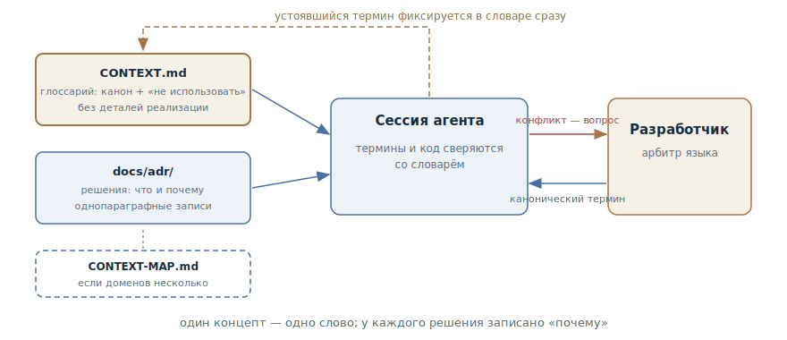

# Словарь домена

## Назначение

Зафиксировать канонический язык проекта в репозитории: глоссарий доменных
терминов и журнал архитектурных решений, которые агент читает в каждой
сессии. Один концепт — одно слово, у каждого неочевидного решения — записанное
«почему»: лечит дрейф терминов, переименования по кругу и попытки «исправить»
намеренное.

## Также известен как

CONTEXT.md, доменный глоссарий; единый язык (ubiquitous language) из DDD,
перенесённый в файл; ADR — architecture decision records.

## Проблема

У живого проекта есть собственный язык, и он нигде не записан:

- Один концепт называется тремя словами. В разговоре «аккаунт», в коде
  `Customer`, в новой таблице — `client`. Агент, не зная канона, законно
  использует любое — и каждая сессия добавляет синонимов.
- Агент предлагает переименования. Для него `Enrollment` выглядит как
  нестандартное имя для подписки — и он «улучшает» его в `Subscription`,
  разрывая язык, на котором команда говорит с бизнесом.
- Решения теряют своё «почему». Через полгода никто — ни человек, ни агент —
  не помнит, что общение сервисов через события вместо прямых вызовов было
  осознанным выбором. Агент видит «лишнюю сложность» и предлагает REST — и
  это приходится оспаривать заново в каждой сессии.

[Память проекта](claude-md-memory.md) эту дыру не закрывает: она отвечает на
вопрос «как мы работаем» — команды, соглашения, границы. Вопрос «что значат
слова» — другая ось, и сваливать глоссарий в общий файл правил значит раздуть
его.

## Решение

Два артефакта в репозитории, которые агент получает в каждой сессии.

**Глоссарий** — `CONTEXT.md`: список терминов домена. Формат жёсткий и
принципиально бедный:

- На концепт — одно каноническое слово; остальные синонимы перечислены под
  пометкой «не использовать».
- Определение в одно-два предложения: что это *есть*, а не что оно делает.
- Только термины этого домена. Общепрограммные понятия — таймауты, ретраи,
  паттерны — в словаре не живут, даже если проект ими полон.
- Никаких деталей реализации: словарь — не спецификация и не черновик.

**Журнал решений** — `docs/adr/`: короткие записи «что решили и почему», по
файлу на решение. ADR заводится, только когда выполняются все три условия:
решение трудно обратить, оно удивит читателя без контекста, и это результат
реального выбора между альтернативами. Достаточно одного абзаца — ценность в
том, что решение и его причина *записаны*, а не в заполненных секциях.

Дальше словарь работает в обе стороны. Агент сверяет с ним свою речь и код —
и перестаёт плодить синонимы. А когда разработчик сам употребляет слово,
конфликтующее с глоссарием, агент обязан спорить: «в глоссарии cancellation —
это отмена всего заказа, а ты, похоже, о частичной — что имеется в виду?»
Новый термин фиксируется в словаре в момент, когда он устоялся, — не
откладывая на потом.

## Структура



Слева артефакты: глоссарий с каноническими терминами и журнал решений; в
больших репозиториях с несколькими доменами их связывает карта контекстов
(`CONTEXT-MAP.md` — где какой словарь живёт и как контексты общаются). Оба
артефакта входят в сессию агента вместе с постоянным слоем контекста. Внутри
сессии работает цикл сверки: агент замечает конфликт термина и вызывает
разработчика на уточнение, разработчик утверждает каноническое слово — и оно
немедленно фиксируется в словаре. Пунктирная стрелка назад — это обновление:
словарь пополняется в момент кристаллизации термина, а не в конце недели.

## Участники / Компоненты

- **Глоссарий** (`CONTEXT.md`) — канонические термины с определениями и
  списками «не использовать».
- **Журнал решений** (`docs/adr/`) — однопараграфные записи неочевидных
  решений с их «почему».
- **Карта контекстов** (`CONTEXT-MAP.md`) — для репозиториев с несколькими
  доменами: какие контексты есть, где их словари, как они связаны.
- **Разработчик** — источник и арбитр языка: утверждает термины, решает
  споры.
- **Агент** — сверяет речь и код со словарём, оспаривает конфликты, обновляет
  словарь по факту решения.

## Когда применять

- У домена есть собственный язык: бизнес-термины, которые важно не размыть, —
  биллинг, логистика, страхование, образование.
- Проект живёт долго и переживёт не одну сотню сессий: без канона язык дрейфует
  с каждой из них.
- Агент уже путает термины, называет одно понятие по-разному или предлагает
  переименовать то, что называется так намеренно.
- Кодовая база разбита на несколько доменов, и одно слово значит разное в
  разных местах — нужна карта контекстов.

Для утилиты на выходные словарь избыточен: язык не успеет задрейфовать.

## Последствия и компромиссы

- ➕ Агент говорит с кодом и с вами на одном языке: имена в новом коде
  совпадают с языком команды без напоминаний.
- ➕ Переименовательный дрейф прекращается: «улучшить» каноническое имя агент
  может, только оспорив словарь явно.
- ➕ Решения перестают «чинить»: ADR отвечает на «почему так» до того, как
  агент предложил переделку.
- ➕ Словарь работает и на людей: новый разработчик получает язык проекта из
  того же файла, что и агент.
- ➖ Ещё один артефакт под поддержку: неактуальный словарь дезинформирует с
  авторитетным видом.
- ➖ Требует дисциплины момента: термин фиксируется, когда устоялся, — отложил
  на потом, значит потерял.
- ➖ Соблазн раздуть: детали реализации и общепрограммные термины превращают
  словарь в свалку, а ADR на каждый чих обесценивает журнал.

## Реализация

1. Создавайте лениво: `CONTEXT.md` — когда устоялся первый термин, `docs/adr/`
   — когда появилось первое решение, достойное записи. Пустые заготовки не
   нужны.
2. Держите формат словаря бедным: термин, одно-два предложения «что это
   есть», список «не использовать». Будьте категоричны: из синонимов выживает
   один.
3. Фильтруйте на входе: только концепты, уникальные для этого домена. Если
   термин встречается в любом проекте — ему тут не место.
4. ADR заводите по трём критериям — трудно обратить, удивительно без
   контекста, реальный выбор. Один абзац: контекст, решение, причина.
   Нумеруйте последовательно (`0001-...`, `0002-...`).
5. Подключите словарь к каждой сессии — самое простое: импорт из
   [памяти проекта](claude-md-memory.md) (в Claude Code — строка `@CONTEXT.md`
   в CLAUDE.md).
6. Поручите агенту защищать язык: попросите его сверять термины и спорить при
   конфликте, а решённое — сразу вносить в словарь.
7. В репозитории с несколькими доменами добавьте `CONTEXT-MAP.md`: список
   контекстов, их словарей и связей между ними; словари переезжают к своим
   модулям.

В [скилах Мэтта Покока](matt-pocock-skills.md) паттерн реализован скилом
`domain-modeling`: он ведёт CONTEXT.md и ADR по описанным правилам, а
остальные скилы пака — интервью, спецификация, реализация — читают словарь
как источник языка.

## Пример

Глоссарий образовательной платформы — короткий и категоричный:

```markdown
# Обучение

Контекст прохождения курсов: от записи до сертификата.

## Язык

**Зачисление (Enrollment)**:
Факт доступа студента к курсу. Создаётся при записи, живёт до отзыва.
_Не использовать_: подписка, покупка, доступ

**Поток (Cohort)**:
Группа студентов, проходящих курс по общему расписанию.
_Не использовать_: группа, класс, набор

**Выпуск (Completion)**:
Зачисление, по которому выполнены все обязательные модули.
_Не использовать_: окончание, закрытие курса
```

И ADR `docs/adr/0003-enrollment-not-subscription.md`:

```markdown
# Зачисление не привязано к оплате

Доступ к курсу и биллинг разведены намеренно: зачисление создаётся и
корпоративными договорами, и грантами, где подписки нет вообще. Поэтому
Enrollment — отдельная сущность, а не статус Subscription.
```

Разработчик ставит задачу: «сделай так, чтобы при отмене подписки студент
терял доступ к курсу». Агент, прочитав словарь, отвечает вопросом:

> В глоссарии «подписка» помечена как «не использовать» — здесь это
> Enrollment, и по ADR-0003 он не привязан к оплате. Ты хочешь отзывать
> зачисления, созданные конкретно через биллинг, или все зачисления
> пользователя?

Двусмысленность, которая в коде стала бы багом для корпоративных студентов,
умерла в первой реплике. Без словаря агент послушно связал бы Enrollment с
биллингом — и «улучшил» бы имена заодно.

## Анти-паттерны и частые ошибки

- **Словарь-спецификация.** В определения просачиваются детали реализации,
  имена таблиц и порядок вызовов — словарь превращается в устаревающий
  дубликат кода. Определяйте *что это*, остальное живёт в коде и спеках.
- **Словарь-энциклопедия.** Общепрограммные термины и очевидности раздувают
  файл — доменные слова тонут (см.
  [инженерию контекста](context-engineering.md): каждая строка стоит
  внимания).
- **Синонимы без арбитра.** Записать все варианты «как у нас говорят» без
  выбора канона — значит узаконить дрейф вместо того, чтобы его остановить.
- **Мёртвый словарь.** Файл есть, но в сессию не подключён и при решениях не
  обновляется — через месяц он врёт, и агент вместе с ним.
- **ADR на каждый чих.** Записи о тривиальных решениях хоронят важные.
  Три критерия — фильтр на входе, а не формальность.

## Известные применения

- **Скилы Мэтта Покока** — скил `domain-modeling`: CONTEXT.md с форматом
  «термин + не использовать», однопараграфные ADR с тремя критериями, карта
  контекстов для мульти-доменных репо; первоисточник паттерна в агентном
  исполнении.
- **Domain-Driven Design** — единый язык и ограниченные контексты Эрика
  Эванса: корень идеи, здесь перенесённый из головы команды в файл для
  агента.
- **ADR-конвенция** — записи архитектурных решений Майкла Найгарда и
  инструменты вроде adr-tools; десятилетняя практика, которую агент читает
  как контекст.
- **Kiro** — steering-файл product.md как частичный аналог: продуктовый
  контекст, подключаемый к каждой спек-сессии.

## Связанные паттерны

- [Память проекта](claude-md-memory.md) — соседняя ось постоянного слоя: «как
  мы работаем» против «что значат слова»; словарь подключается к сессии через
  неё.
- [Инженерия контекста](context-engineering.md) — словарь и ADR — часть
  постоянного слоя контекста и подчиняются его экономике: коротко и
  высокосигнально.
- [Спеко-ориентированная разработка](spec-driven-development.md) —
  спецификации, написанные каноническим языком, не расходятся друг с другом в
  терминах; словарь — общий знаменатель всех артефактов.
