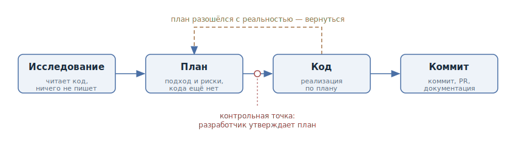

# Исследование — план — код — коммит

## Назначение

Разбить работу агента над нетривиальной задачей на четыре явные фазы —
исследование, планирование, реализация и фиксация результата, — чтобы агент
сначала понял задачу и согласовал подход с разработчиком, и только потом писал
код.

## Также известен как

Explore–Plan–Code–Commit (EPCC), «сначала план — потом код».

## Проблема

По умолчанию агент начинает писать код с первого же сообщения. Для простой
правки это нормально, но на нетривиальной задаче он ещё не видел нужных файлов,
не знает соглашений проекта и легко решает не ту проблему. Разработчик
обнаруживает это только на ревью готового диффа — в самой дорогой точке:
переделка стоит дороже, чем весь диалог до неё.

Попытка застраховаться более подробным промптом ведёт в другую крайность —
[преждевременную спецификацию](premature-specification.md): вы диктуете
реализацию вместо задачи. Нужен способ поймать неверное направление рано, не
отбирая у агента выбор подхода.

## Решение

Явно провести агента через четыре последовательные фазы и запретить писать код
в первых двух.

1. **Исследование.** Агент читает релевантный код и собирает контекст. Никаких
   правок — только понимание задачи.
2. **План.** Агент предлагает подход: что менять, в каком порядке, какие есть
   риски. Разработчик читает план и утверждает или правит его. Это главная
   контрольная точка: исправить направление на уровне плана в разы дешевле, чем
   на уровне кода.
3. **Код.** Агент реализует утверждённый план, сверяясь с ним и с доступными
   проверками (тесты, сборка, линтер).
4. **Коммит.** Результат фиксируется: коммит с осмысленным сообщением,
   пулл-реквест, при необходимости — обновление документации.

## Структура

Фазы идут строго последовательно, но процесс не однонаправленный: если во время
реализации план разошёлся с реальностью, правильный ход — вернуться к фазе плана
и пересогласовать его, а не «дотягивать» код до устаревшего плана. Контрольная
точка между планом и кодом принадлежит разработчику: без его явного «да» агент
к реализации не переходит.

## Участники / Компоненты

- **Разработчик** — ставит задачу, читает и утверждает план, принимает результат.
- **Агент** — исследует кодовую базу, предлагает план, реализует его.
- **План** — артефакт-посредник: короткий документ «что и как делаем». Его можно
  править, сохранить, выполнить в свежей сессии или передать другому агенту.
- **Кодовая база** — источник контекста в фазе исследования и объект изменений в
  фазе кода.

## Когда применять

- Задача нетривиальна: затрагивает несколько модулей, незнакомую часть системы
  или требует выбора между подходами.
- Цена неверного направления высока: большой дифф, миграция, публичный контракт.
- Вы хотите проверять направление, а не только готовый результат.

Для однострочных правок и механических изменений паттерн избыточен — четыре
фазы там только замедляют работу.

## Последствия и компромиссы

- ➕ Агент решает ту задачу, которую вы имели в виду: ошибка направления
  ловится на плане, а не на ревью диффа.
- ➕ Ревью плана на порядок дешевле ревью кода — и для человека, и по токенам.
- ➕ План остаётся артефактом: его можно доработать, выполнить в свежей сессии
  или использовать как описание пулл-реквеста.
- ➖ Для простых задач цикл медленнее и дороже прямой просьбы «сделай».
- ➖ План устаревает по ходу реализации — нужна дисциплина возврата к фазе
  плана, иначе код и план расходятся молча.
- ➖ Соблазн довести план до пошаговой инструкции возвращает к
  [преждевременной спецификации](premature-specification.md).

## Реализация

1. Начните с исследования и явно запретите код: «Прочитай файлы, отвечающие
   за X, и разберись, как устроено Y. Пока ничего не пиши».
2. Попросите план: «Составь план решения, код не пиши». Если инструмент
   поддерживает режим планирования (в Claude Code — plan mode), включите его:
   запрет на правки будет обеспечен самим инструментом, а не только промптом.
3. Прочитайте план как ревью: задавайте вопросы, вычёркивайте лишнее, требуйте
   альтернатив. Итерируйте до согласия — это самая дешёвая фаза для споров.
4. Утвердив план, попросите реализацию и укажите, чем агент может проверить
   себя: тесты, сборка, линтер.
5. Завершите фазой коммита: осмысленное сообщение, пулл-реквест с планом в
   описании, обновление документации, если её затронули изменения.

Паттерн не обязательно собирать из промптов вручную — популярные тулкиты
спеко-ориентированной разработки реализуют его готовыми командами. Ниже фазы
EPCC отображены на четыре самых распространённых.

### Через GitHub Spec Kit

[Spec Kit](https://github.com/github/spec-kit) проводит через фазы серией
слэш-команд, каждая из которых оставляет артефакт в репозитории:

- **Исследование и план** — `/speckit.specify` фиксирует, *что* строим
  (требования и пользовательские истории), `/speckit.clarify` задаёт вопросы по
  недоопределённым местам, `/speckit.plan` пишет технический план,
  `/speckit.tasks` режет его на задачи. Контрольная точка — ревью и правка этих
  артефактов до старта кода.
- **Код** — `/speckit.implement` выполняет задачи по списку.
- **Коммит** — обычный git-поток; `/speckit.analyze` дополнительно сверяет
  согласованность спецификации, плана и задач.

### Через OpenSpec

[OpenSpec](https://github.com/Fission-AI/OpenSpec) строит работу вокруг
«изменения» с жизненным циклом propose → review → apply → archive:

- **Исследование** — `/opsx:explore`: режим «партнёра для размышлений», который
  читает код и взвешивает варианты, ничего не меняя.
- **План** — `/opsx:propose` создаёт связку артефактов: `proposal.md` (зачем и
  что меняется), `specs/` (требования и сценарии), `design.md` (технический
  подход), `tasks.md` (чек-лист реализации). Контрольная точка — ревью связки
  до первой строки кода.
- **Код** — `/opsx:apply` выполняет задачи из `tasks.md`.
- **Коммит** — завершённое изменение архивируется в
  `openspec/changes/archive/`: история решений остаётся в репозитории рядом с
  кодом.

### Через Superpowers

[Superpowers](https://github.com/obra/superpowers) — пак скилов для Claude Code
с обязательными контрольными точками после каждой фазы:

- **Исследование и план** — `brainstorming` уточняет идею вопросами и
  предъявляет дизайн по секциям на валидацию; после подписи под дизайном
  `writing-plans` пишет план из мелких задач (2–5 минут каждая) с путями файлов
  и шагами проверки. Реализация не начнётся, пока вы явно не скажете «go».
- **Код** — `subagent-driven-development`: на каждую задачу поднимается свежий
  сабагент, внутри `test-driven-development` держит цикл red–green–refactor, а
  `using-git-worktrees` изолирует работу в отдельном worktree.
- **Коммит** — `requesting-code-review` сверяет результат со спецификацией,
  `finishing-a-development-branch` доводит ветку до merge или PR.

### Через скилы Мэтта Покока

Если в проекте установлен [пак скилов Мэтта Покока](https://github.com/mattpocock/skills),
паттерн собирается из готовых команд — его основной поток «idea → ship»
повторяет фазы EPCC:

- **Исследование и план** — `/grill-with-docs`: скил читает кодовую базу и
  интервьюирует вас, пока в плане не закончатся дыры; выводы оседают в
  `CONTEXT.md` и ADR. Вопрос, который не решается разговором, выносится в
  `/prototype` через `/handoff`.
- **Фиксация плана** — для работы больше одной сессии `/to-spec` превращает
  разговор в спецификацию, а `/to-tickets` режет её на трассирующие тикеты с
  блокирующими связями.
- **Код** — `/implement` ведёт реализацию по тикету, внутри гоняя `/tdd` по
  циклу red–green.
- **Коммит** — `/implement` завершается ревью `/code-review` (две оси:
  стандарты и спецификация) и только после него коммитит.

Контрольная точка паттерна при этом сохраняется: и итог `/grill-with-docs`, и
швы тестирования в `/to-spec` скилы явно сверяют с разработчиком.

## Пример

Задача: в CSV-экспорте отчётов время сдвинуто на час у части пользователей.

**Исследование:**

> Прочитай код экспорта отчётов и разберись, откуда в CSV берётся время и где
> оно может сдвигаться при переходе на летнее время. Пока ничего не меняй.

**План:**

> Составь план исправления. Формат файла менять нельзя — его читают внешние
> интеграции. Код не пиши.

Агент предлагает два варианта: конвертировать время при записи или при чтении.
Разработчик отвечает:

> Вариант с конвертацией на чтении ломает уже выгруженные файлы. Берём первый
> вариант, добавь в план тест на границу перехода на летнее время.

**Код:**

> План утверждаю. Реализуй и прогони тесты экспортёра.

**Коммит:**

> Закоммить и открой пулл-реквест; в описание вынеси план и решение, которое мы
> выбрали.

Неверное направление — правка на стороне чтения — было отброшено за одну
реплику на фазе плана. Обнаружься оно на ревью, пришлось бы выбрасывать готовую
реализацию.

## Анти-паттерны и частые ошибки

- **Пропуск исследования.** Агент планирует по догадкам о кодовой базе — план
  выглядит убедительно, но не сходится с реальным кодом.
- **Утверждение плана не читая.** Контрольная точка превращается в формальность,
  и паттерн лишь добавляет накладные расходы к обычному «сделай».
- **План-инструкция.** Требовать от плана пошаговой детализации до понимания
  задачи — [преждевременная спецификация](premature-specification.md).
- **Дотягивание кода до устаревшего плана.** Если реальность разошлась с планом,
  возвращайтесь к фазе плана, а не заставляйте код соответствовать документу.

## Известные применения

- **Claude Code** — plan mode как встроенная поддержка фазы плана; сам воркфлоу
  описан первым в списке в [Claude Code best
  practices](https://code.claude.com/docs/en/best-practices).
- Аналогичные режимы «сначала план» есть и в других агентах — например, plan
  mode в Cursor и architect mode в aider.
- **Спеко-ориентированные тулкиты** — GitHub Spec Kit, OpenSpec, Superpowers и
  пак скилов Мэтта Покока — разворачивают EPCC в полноценные методологии; их
  команды разобраны в разделе «Реализация».

## Связанные паттерны

- [Преждевременная спецификация](premature-specification.md) — анти-паттерн, в
  который вырождается фаза плана, если требовать детализации до понимания
  задачи.
