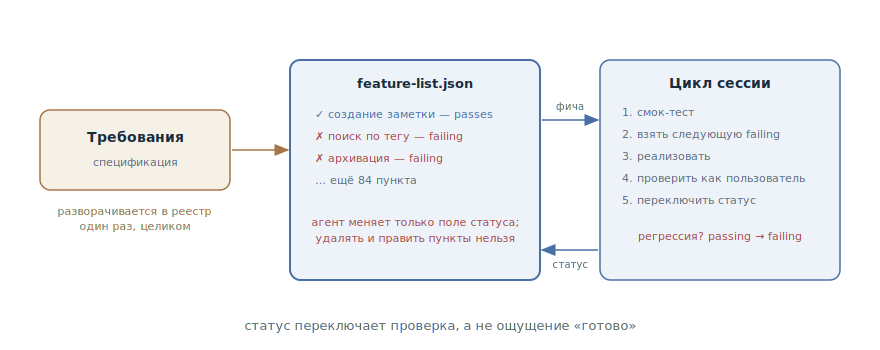

# Список фич

## Назначение

Вести постоянный реестр фич проекта, в котором каждая фича рождается со
статусом «не работает» и переключается в «работает» только после реальной
проверки. Хребет долгой работы: в любой момент видно, что сделано, что нет и
что брать следующим, — и это видно не по ощущениям, а по статусам.

## Также известен как

Feature list, feature list harness, реестр фич.

## Проблема

Работа на десятки фич и много сессий — гринфилд, большой модуль, автономные
прогоны. На этом масштабе привычные способы отслеживать прогресс ломаются:

- Критерий завершения размыт: агент считает сделанным то, что *написал*, а
  не то, что *работает*. «Готово 80 %» ничем не подтверждено.
- Сделанное тихо регрессирует: фича, работавшая три сессии назад, сломана
  вчерашней правкой, и никто этого не заметил — её больше не проверяют.
- Новая сессия не знает, что брать: без общего списка каждая начинает с
  переизобретения плана, а фичи то дублируются, то выпадают.
- [Журнал прогресса](progress-file.md) держит повествование — «где мы и
  почему», — но статусы в прозе агент рано или поздно переформулирует или
  затрёт: машинно-обновляемым отметкам в тексте не место.

## Решение

Файл-реестр в репозитории: полный список фич с бинарным статусом. Реестр
создаётся целиком в начале работы — разворачиванием требований в конкретные
проверяемые пункты, у каждого — описание, шаги проверки и статус
`passes: false`.

Дальше действуют правила:

1. **Статус переключает проверка, а не ощущение.** `passes: true` фича
   получает только после того, как агент прогнал её как пользователь —
   сквозной сценарий, для веба — через браузер и скриншоты, а не только
   юнит-тесты (см. [петлю обратной связи](give-agent-a-way-to-verify.md)).
2. **Реестр неприкосновенен.** Удалять фичи и редактировать формулировки
   задним числом запрещено — жёстко, в лоб: «убирать или править пункты
   недопустимо — это ведёт к потерянной или сломанной функциональности».
   Агент меняет только поле статуса.
3. **Регрессии возвращают статус.** Смок-тест в начале сессии может
   переключить `passing` обратно в `failing` — реестр отражает реальность,
   а не историю достижений.

Формат — JSON, а не Markdown: машинно-обновляемый файл в JSON агент портит и
перезаписывает заметно реже, чем markdown-текст, — правка сводится к
переключению одного поля.

Сессия работает от реестра: прочитать, взять следующую непройденную фичу,
реализовать, проверить, переключить статус — по одной за проход (почему по
одной — [отдельная глава](one-feature-at-a-time.md)).

## Структура



Слева требования — из них реестр разворачивается один раз, целиком, до
начала реализации. В центре сам реестр: пункты со статусами, и единственное
разрешённое агенту изменение — поле статуса. Справа цикл сессии: взять
следующую непройденную фичу, реализовать, проверить как пользователь,
переключить статус. Пунктирная стрелка вниз — регрессия: смок-тест возвращает
сломанную фичу в «не работает», и она снова в очереди.

## Участники / Компоненты

- **Реестр** — JSON-файл в репозитории: полный список фич со статусами;
  источник правды о прогрессе.
- **Фича** — конкретный проверяемый пункт: описание, шаги проверки, статус.
- **Агент** — берёт следующую непройденную, реализует, проверяет,
  переключает статус.
- **Проверка** — сквозной прогон как пользователь; только она переключает
  статус.
- **Разработчик** — ревьюит нарезку реестра в начале и выборочно сверяет
  статусы с реальностью.

## Когда применять

- Долгая работа с ясным конечным состоянием: гринфилд «собери приложение по
  спецификации», большой модуль, миграция с чек-листом.
- Автономные прогоны: агент работает сессиями без присмотра, и прогресс
  нужно видеть по артефакту, а не по пересказу.
- Несколько агентов или смены агент/человек над одним фронтом работ — реестр
  выравнивает картину для всех.

Для задачи в несколько шагов реестр избыточен — хватает `tasks.md` из
SDD-конвейера или плана в сессии.

## Последствия и компромиссы

- ➕ Прогресс объективен: «сделано 34 из 200» подтверждено проверками, а не
  ощущением.
- ➕ Регрессии видны: сломанная фича возвращается в очередь, а не исчезает
  из виду.
- ➕ Сессии сцепляются без пересказа: любая новая сессия знает, что брать
  следующим.
- ➖ Качество реестра — это качество нарезки: слишком крупные пункты
  непроверяемы, слишком мелкие хоронят сигнал в бюрократии.
- ➖ Неприкосновенность держится на инструкциях: без жёстких формулировок в
  промпте и памяти проекта агент однажды «подчистит» неудобный пункт.
- ➖ Бинарный статус грубоват: «работает наполовину» приходится выражать
  нарезкой на более мелкие фичи.

## Реализация

1. Разверните требования в реестр до начала реализации: каждый пункт —
   поведение, проверяемое сквозным сценарием («пользователь открывает чат,
   пишет запрос и видит ответ»), а не задача («сделать роутинг»).
2. Держите формат структурированным: JSON с полями категории, описания,
   шагов проверки и `passes`. Стартовое значение у всех — `false`.
3. Запишите правила в [память проекта](claude-md-memory.md): статус — только
   после сквозной проверки; удалять и править пункты недопустимо; агент
   меняет только `passes`.
4. Задайте ритуал сессии: прочитать реестр → смок-тест → взять следующую
   непройденную → реализовать → проверить как пользователь → переключить.
5. Свяжите с [журналом прогресса](progress-file.md): реестр держит статусы,
   журнал — повествование; они дополняют друг друга, а не дублируют.
6. Ревьюйте реестр как спецификацию: нарезка и формулировки — ваша зона;
   выборочно сверяйте `passing`-фичи с реальностью.

## Пример

Агент строит сервис заметок по спецификации. Инициализирующая сессия
развернула её в реестр из 87 пунктов:

```json
[
  {
    "category": "notes",
    "description": "Пользователь создаёт заметку и видит её в списке",
    "steps": ["открыть /notes", "нажать «Создать»", "ввести текст",
              "сохранить", "убедиться, что заметка в списке"],
    "passes": true
  },
  {
    "category": "search",
    "description": "Поиск по тегу возвращает только заметки с этим тегом",
    "steps": ["создать заметки с тегами work и home",
              "искать по тегу work",
              "убедиться, что home-заметок нет в выдаче"],
    "passes": false
  }
]
```

Очередная сессия начинается со смок-теста: создание заметки работает, но
архивация — `passing` с прошлой недели — падает после недавней правки схемы.
Агент переключает её в `false`, сообщает об этом и берёт следующую
непройденную — поиск по тегу. Реализует, прогоняет шаги из реестра через
браузер, прикладывает скриншот выдачи — и только после этого `passes: true`.

Разработчик, заглянув в реестр вечером, видит честную картину: 41 из 87,
включая одну регрессию, — без чтения диффов и расспросов.

## Анти-паттерны и частые ошибки

- **Чекбокс без проверки.** Статус переключён, потому что «код написан», —
  реестр превращается в список благих намерений. Переключение — финал
  [петли обратной связи](give-agent-a-way-to-verify.md), а не жест.
- **Агент редактирует реестр.** Переформулированный пункт «под то, что
  получилось» и тихо удалённая неудобная фича — потерянная функциональность.
  Запрет должен быть жёстким и записанным.
- **Статусы в прозе.** Реестр, вписанный в Markdown-повествование, агент
  затирает при обновлениях — машинные отметки живут в структурированном
  файле.
- **Реестр вместо спецификации.** Реестр — производная требований, а не их
  замена: «зачем» и контекст живут в спецификации, реестр держит только
  проверяемые статусы.
- **Юнит-тесты как проверка.** Зелёные юниты без сквозного прогона — это
  преждевременный успех: фича «работает» до первого пользователя.

## Известные применения

- **Харнесс Anthropic для долгоживущих агентов** — первоисточник: реестр на
  200+ фич для клона claude.ai, инициализирующий агент, правило «убирать
  или править пункты недопустимо», сквозная проверка через браузер до
  переключения статуса.
- **Эвал-харнессы** — та же механика в тестировании агентов: фиксированный
  список проверяемых сценариев со статусами, который нельзя подгонять под
  результат.
- **SDD-тулкиты** — `tasks.md` в [Spec Kit](spec-kit.md) и
  [OpenSpec](openspec.md) как слабая форма: чек-лист есть, но отметка — не
  всегда проверка; реестр ужесточает ровно это место.

## Связанные паттерны

- [Петля обратной связи](give-agent-a-way-to-verify.md) — переключение
  статуса и есть прохождение петли: реестр — это список петель, которые
  осталось замкнуть.
- [Одна фича за раз](one-feature-at-a-time.md) — дисциплина работы с
  реестром: один пункт за проход, против попытки сделать всё сразу.
- [Журнал прогресса](progress-file.md) — сосед по слою состояния:
  повествование «где мы и почему» против машинных статусов «что работает».
- [Спеко-ориентированная разработка](spec-driven-development.md) — реестр
  выводится из спецификации, как план и задачи; это её проверяемая
  проекция.
