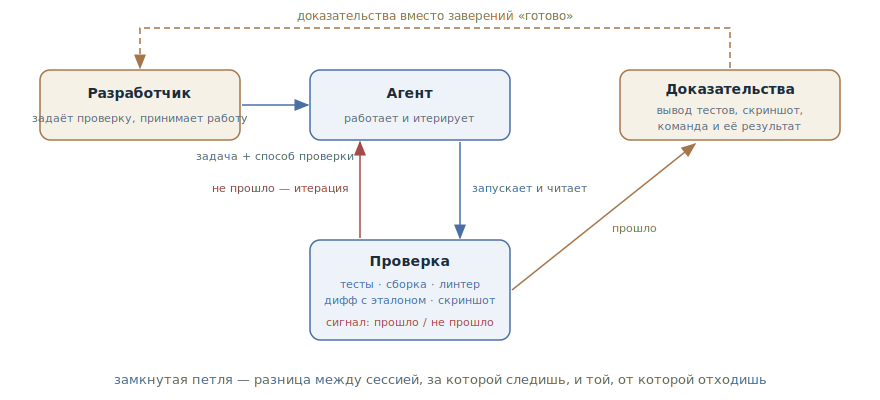

# Петля обратной связи

## Назначение

Дать агенту проверку с бинарным исходом — тесты, сборку, линтер, сравнение
скриншота с макетом, — которую он сам запускает, читает и итерирует до
зелёного. Петля проверки замыкается внутри сессии, а не через разработчика.

## Также известен как

Give the agent a way to verify its work, verification loop, замкнутый цикл
проверки.

## Проблема

Агент останавливается, когда работа *выглядит* готовой. Если у него нет
проверки, которую можно запустить, «выглядит готовой» — единственный доступный
ему сигнал. Дальше начинаются знакомые беды:

- Петлёй обратной связи становитесь вы: каждая ошибка ждёт, пока её заметит
  человек. Сессию нельзя оставить — от неё нельзя отойти даже на кофе.
- Код правдоподобен, но не работает: компилируется, читается гладко, а
  граничный случай падает. Правдоподобие — это то, что модель умеет лучше
  всего, и именно поэтому ему нельзя верить на слово.
- «Готово» ничего не значит: агент искренне рапортует об успехе, потому что
  критерий успеха нигде не задан.

## Решение

Перед стартом работы дать агенту проверку — любую, которая возвращает
читаемый им сигнал «прошло / не прошло»: набор тестов, код возврата сборки,
линтер, скрипт, сравнивающий вывод с эталоном, скриншот против макета. И явно
попросить: запускай, читай результат, итерируй до зелёного.

С этого момента петля замыкается без вас: агент делает шаг, запускает
проверку, читает провал, чинит — и так до прохождения. Ваше участие
смещается с «замечать ошибки» на два края петли: задать проверку на входе и
принять доказательства на выходе.

Насколько жёстко проверка держит остановку — лестница из четырёх ступеней,
каждая следующая меняет настройку на автономность:

1. **В одном промпте** — «прогони тесты и итерируй»; работает на любой задаче
   прямо сейчас.
2. **Цель на сессию** — проверка задаётся условием, которое перепроверяется
   после каждого хода агента, пока не выполнится.
3. **Детерминированный гейт** — хук на завершение: скрипт блокирует остановку
   сессии, пока проверка красная.
4. **Второе мнение** — сабагент со свежим контекстом пытается опровергнуть
   результат: работу оценивает не тот, кто её делал (см.
   [писателя и рецензента](writer-reviewer.md)).

И последнее правило: доказательства вместо заверений. Пусть агент покажет
вывод тестов, команду с её результатом или скриншот — читать доказательства
быстрее, чем перепроверять самому, и это единственный способ принять работу
сессии, за которой вы не следили.

## Структура

Разработчик стоит на краях петли: на входе он передаёт агенту задачу вместе
со способом проверки, на выходе принимает доказательства. Внутри петли —
цикл без человека: агент работает, запускает проверку, читает сигнал; красный
сигнал возвращает его к работе, зелёный — открывает выход с доказательствами.
Чем жёстче гейт на выходе (промпт → цель → хук → второе мнение), тем дольше
петля может крутиться без присмотра.

## Участники / Компоненты

- **Разработчик** — задаёт проверку и критерии до старта; принимает работу по
  доказательствам.
- **Агент** — работает, запускает проверку, читает сигнал, итерирует.
- **Проверка** — оракул с бинарным исходом: тесты, сборка, линтер,
  дифф-скрипт, скриншот против макета.
- **Сигнал** — «прошло / не прошло», прочитанный агентом внутри сессии.
- **Доказательства** — вывод проверки, предъявляемый разработчику вместо
  слова «готово».

## Когда применять

- Везде, где результат проверяем, — это базовая гигиена работы с агентом, а
  не приём для особых случаев.
- Обязательно — перед тем как оставить сессию без присмотра: без проверки
  автономная работа означает автономное накопление ошибок.
- Для UI — через скриншоты: агент сравнивает результат с макетом и
  перечисляет расхождения.
- Если проверки нет — сначала она: в легаси-коде первая задача агенту не
  «почини», а «напиши падающий тест, воспроизводящий баг».

## Последствия и компромиссы

- ➕ Петля замыкается без человека — разница между сессией, за которой
  следишь, и сессией, от которой отходишь.
- ➕ Ошибки ловятся внутри цикла, по цене итерации агента, а не на ревью по
  цене вашего времени.
- ➕ Доказательства ускоряют приёмку: прочитать вывод тестов быстрее, чем
  прогонять их самому.
- ➖ Проверку нужно иметь или построить: в коде без тестов паттерн начинается
  с написания проверки, и это отдельная работа.
- ➖ Агент оптимизирует ровно под проверку: слабая проверка выдаёт зелёный
  мусор. Качество петли равно качеству оракула.
- ➖ Проверку можно «взломать»: подогнать тест, ослабить условие, подавить
  ошибку. Запрет на правку проверки — часть паттерна.

## Реализация

1. Сформулируйте критерий до старта и впишите его в промпт: не «сделай
   валидатор», а «сделай валидатор; кейсы: X — true, Y — false; прогони
   тесты после реализации».
2. Нет проверки — постройте: попросите агента сначала написать падающий
   тест, воспроизводящий проблему, и только потом чинить (дисциплинированная
   форма — [TDD с агентом](tdd-with-agent.md)).
3. Явно замкните петлю: «запусти, прочитай результат, итерируй до зелёного».
   Без этой инструкции агент прогонит проверку один раз — или ни разу.
4. Запретите менять проверку: правка теста, ослабление условия и подавление
   ошибки — решение разработчика, а не ход в итерации. При необходимости
   закрепите запрет хуком.
5. Поднимайтесь по лестнице по мере автономности: для задачи под присмотром
   хватает промпта; для сессии, от которой отходите, — цель или хук; для
   долгой автономной работы — ревью свежим сабагентом.
6. Требуйте доказательств: вывод тестов, команда и её результат, скриншот.
   «Сделано» без доказательств — не сигнал.
7. Закрепите команды проверки в [памяти проекта](claude-md-memory.md), чтобы
   агент знал их в каждой сессии.

В тулкитах спеко-ориентированной разработки петля встроена в конвейер: в
[Spec Kit](spec-kit.md) и [OpenSpec](openspec.md) каждая задача из `tasks.md`
несёт свой способ проверки, в [Kiro](kiro.md) критерии приёмки записываются в
EARS-нотации ещё на фазе требований, в [Superpowers](superpowers.md) цикл
red–green–refactor обязателен внутри каждой задачи, а в
[скилах Мэтта Покока](matt-pocock-skills.md) `/implement` не завершается без
`/tdd` и двухосевого ревью.

## Пример

Задача — валидатор промокодов. Промпт задаёт проверку вместе с задачей:

> Напиши validatePromoCode. Кейсы: SUMMER25 действующего промо — true;
> просроченный код — false с причиной expired; код чужого региона — false с
> причиной region; пустая строка — false. Оформи кейсы тестами, прогони и
> итерируй, пока не пройдут. Тесты не редактируй.

Агент пишет реализацию и тесты, запускает: два из четырёх красные —
просроченный код проходит, потому что сравнение дат не учитывает часовой
пояс. Агент чинит, прогоняет снова — зелёно. В ответе — вывод тестраннера:
4 passed.

Разработчик всё это время занимался другим: ошибка с часовым поясом была
поймана и исправлена внутри петли, по цене одной итерации агента. Без
проверки она доехала бы до ревью — или до пользователей.

## Анти-паттерны и частые ошибки

- **Поверить на слово.** «Готово» без вывода проверки — не сигнал, а
  вежливость. Просить доказательства — не недоверие, а протокол.
- **Слабый оракул.** Проверка, которую нечестно легко пройти, производит
  зелёный мусор: агент оптимизирует под неё, а не под задачу.
- **Проверка есть, но петли нет.** Тесты лежат в репозитории, а агента не
  попросили их гонять — он и не гоняет. Петлю замыкает инструкция.
- **Агент правит оракула.** Подогнанный тест и подавленная ошибка выглядят
  как прогресс. Правка проверки — всегда отдельное решение разработчика.
- **Юнит-тесты как финал.** Зелёные юниты — ещё не работающая фича: без
  сквозной проверки как пользователь это преждевременный успех — см.
  одноимённый анти-паттерн.

## Известные применения

- **Claude Code best practices** — первоисточник: «проверка — это разница
  между сессией, за которой следишь, и сессией, от которой отходишь»;
  таблица «до/после» для промптов с критериями.
- **Claude Code** — механизация лестницы: `/goal` как условие на сессию,
  Stop-хуки как детерминированный гейт, ревью-сабагенты как второе мнение.
- **Харнесс Anthropic для долгоживущих агентов** — список фич со статусами
  `passing/failing`, которые переключаются только после реальной проверки, и
  сквозной smoke-тест в начале каждой сессии.
- **SDD-тулкиты** — критерии приёмки и проверяемые задачи как обязательная
  часть конвейера: EARS в Kiro, чек-листы `tasks.md` в Spec Kit и OpenSpec,
  обязательный TDD в Superpowers.

## Связанные паттерны

- [TDD с агентом](tdd-with-agent.md) — дисциплинированная форма петли:
  проверка пишется до кода и по одной на шаг.
- [Писатель и рецензент](writer-reviewer.md) — проверка суждением для того,
  что не сводится к бинарному оракулу: качество, полнота, соответствие плану.
- [Рефлексия](reflection.md) — самая дешёвая и самая слабая форма проверки:
  самокритика без внешнего оракула.
- [Четыре фазы](explore-plan-code-commit.md) — петля живёт в фазе кода:
  утверждённый план называет проверки, которыми агент сверяет реализацию.
