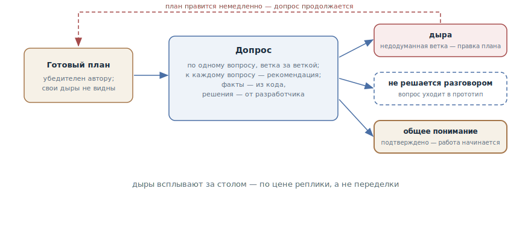

# Гриллинг

## Назначение

Отдать готовый план агенту на допрос: он безжалостно интервьюирует вас о
каждом аспекте — вопрос за вопросом, ветка за веткой, — пока дыры не
всплывут и не возникнет подтверждённое общее понимание. Стресс-тест *вашего*
мышления до начала работ, а не сбор требований.

## Также известен как

Grilling, допрос с пристрастием; `/grilling` в скилах Мэтта Покока.

## Проблема

План написан и выглядит убедительно — вам, его автору. В этом и беда:

- Свои дыры не видны: план убедителен ровно потому, что построен на ваших
  же допущениях — та же авторская слепота, что у агента с собственным кодом.
- Ревью коллеги дорого и часто поверхностно: «выглядит разумно» — самый
  частый и самый бесполезный отзыв на план.
- Дыры всплывают в реализации — в самой дорогой точке: недодуманная ветка
  дизайна оборачивается переделкой, а не репликой в разговоре.

## Решение

Перед началом работ — допрос:

> Интервьюируй меня безжалостно о каждом аспекте этого плана, пока мы не
> придём к общему пониманию. Иди по веткам дерева решений, разбирая
> зависимости между решениями по одной. К каждому вопросу предлагай свой
> рекомендуемый ответ. Спрашивай по одному вопросу за раз. Факты ищи в
> кодовой базе сам — но каждое решение выноси мне и жди ответа. Не начинай
> работу, пока я не подтвержу, что понимание общее.

Три правила держат конструкцию:

- **По одному вопросу.** Пачка вопросов сразу сбивает с толку — и позволяет
  ответить на удобные, пропустив неудобные.
- **Факты — из кода, решения — от вас.** Всё, что можно выяснить чтением
  кодовой базы, агент выясняет сам; вам достаются только настоящие развилки.
- **Рекомендация к каждому вопросу.** Вопрос с предложенным ответом — это
  позиция, с которой можно спорить; голый вопрос — перекладывание работы.

У каждого вопроса три исхода: ответ закрывает ветку; ответ вскрывает дыру —
план правится, допрос продолжается; вопрос не решается разговором — он
выносится в [одноразовый прототип](prototype-to-answer.md). Финал один:
явное подтверждение общего понимания — и только после него начинается
работа.

## Структура

Слева готовый план — убедительный для автора, с невидимыми ему дырами. В
центре цикл допроса: вопрос с рекомендацией, решение разработчика,
следующая ветка. Справа три исхода: вскрытая дыра возвращается правкой в
план — и допрос продолжается; вопрос, не решаемый разговором, уходит в
прототип; исчерпанные ветки завершаются подтверждением общего понимания —
единственной дверью к началу работ.

## Участники / Компоненты

- **План** — предмет допроса: написанный документ, а не идея в голове.
- **Агент-интервьюер** — ведёт по дереву решений, ищет факты в коде,
  рекомендует ответы; инструктирован быть безжалостным.
- **Разработчик** — отвечает за решения; его мышление и есть то, что
  тестируется.
- **Дыры** — продукт допроса: недодуманные ветки, вскрытые до реализации.
- **Общее понимание** — критерий финала: явное подтверждение, без которого
  работа не начинается.

## Когда применять

- Перед стартом значимой работы по плану, написанному в одиночку: чем
  дороже реализация, тем дешевле час допроса.
- Решение трудно обратимо: архитектурный выбор, публичный контракт,
  миграция.
- План «слишком гладкий»: ни одного открытого вопроса — верный признак, что
  вопросы просто не задавались.

Не нужен для планов на полчаса работы — там дыра стоит дешевле допроса. И
не путайте с [интервью у агента](let-claude-interview-you.md): интервью
*строит* спецификацию с нуля, гриллинг *атакует* готовый план.

## Последствия и компромиссы

- ➕ Дыры всплывают за столом, а не в реализации, — по цене реплики, а не
  переделки.
- ➕ Рекомендации агента делают допрос содержательным: вы спорите с
  позицией, а не отвечаете на анкету.
- ➕ Решения проговорены явно: после допроса план разделяют двое, а не
  предполагает один.
- ➖ Неприятно: план обстреливают, и хорошо построенный допрос находит
  дыры почти всегда. Это цена, а не дефект.
- ➖ Время: настоящий допрос — это десятки вопросов; на него надо заложить
  сессию, а не пять минут.
- ➖ Агент-соглашатель бесполезен: без явного «безжалостно» допрос
  вырождается в комплименты плану.

## Реализация

1. Допрашивайте документ, а не мысль: план должен быть написан — по
   написанному агент строит дерево решений, а не гадает.
2. Стартуйте промптом с тремя правилами: безжалостно, по одному вопросу,
   факты из кода — решения от меня, финал — подтверждение понимания.
3. Отвечайте честно, включая «не знаю»: незнание — это найденная дыра, а
   не провал допроса.
4. Правьте план по ходу: вскрытая дыра — немедленная правка документа, а
   не заметка «потом поправлю».
5. Выносите нерешаемое в прототип: спор, в котором кончились аргументы, —
   сигнал для [одноразового прототипа](prototype-to-answer.md), а не для
   упорства.
6. Фиксируйте решения на месте: устоявшиеся термины и принятые развилки — в
   [словарь домена](domain-context-file.md) и ADR, пока они горячие.
7. Завершайте явно: «понимание общее, начинаем» — сказанное словами, а не
   подразумеваемое молчанием.

## Пример

Разработчик написал план миграции тарифов и перед стартом отдаёт его на
допрос. Агент идёт по веткам:

> В плане апгрейд тарифа применяется немедленно, а про даунгрейд не сказано.
> Рекомендую: даунгрейд — с начала следующего периода, без пропорционального
> возврата. Так?

Разработчик соглашается — ветка закрыта, план дополнен. Через несколько
вопросов:

> План предполагает, что подписка всегда привязана к оплате. Но в словаре
> домена зачисления создаются и корпоративными контрактами — без подписки
> вообще. Как мигрируют корпоративные тарифы с отложенным стартом?

Об этом в плане нет ни слова — дыра. Обсуждение упирается в модель отмен:
аргументы кончились, обе стороны правдоподобны. Вопрос выносится в
прототип — так начинается история, знакомая по главам о
[передаче сессии](handoff.md) и [прототипе](prototype-to-answer.md).
Остальные ветки закрываются за час; разработчик подтверждает общее
понимание, и работа начинается — по плану, в котором самая дорогая дыра
найдена до первой строчки кода.

## Анти-паттерны и частые ошибки

- **Допрос идеи вместо плана.** Без написанного документа гриллинг
  вырождается в [интервью](let-claude-interview-you.md) — это другой
  инструмент для другой стадии.
- **Пачки вопросов.** Пять вопросов разом — и вы отвечаете на удобные три.
  По одному, с ожиданием ответа.
- **Агент отвечает сам себе.** Интервьюер, закрывающий свои же вопросы
  своими же рекомендациями без вашего ответа, тестирует не ваше мышление, а
  своё.
- **Дыры «на потом».** Вскрытая дыра, не внесённая в план немедленно,
  испаряется к концу сессии.
- **Вежливый интервьюер.** Без инструкции о безжалостности агент хвалит
  план и задаёт вопросы для галочки — стресс-теста не происходит.

## Известные применения

- **Скилы Мэтта Покока** — `/grilling`: первоисточник с формулой
  «безжалостно, по одному вопросу, факты из кода — решения от пользователя,
  не начинай без подтверждения»; в связке `/grill-with-docs` решения оседают
  в CONTEXT.md и ADR, а в [карте исследования](wayfinder.md) гриллинг —
  штатный тип тикета.
- **Претмортемы** — доагентная родословная: «представьте, что проект
  провалился, — почему?»; гриллинг автоматизирует роль скептика, задающего
  этот вопрос по каждой ветке.
- **Ревью дизайн-документов** — та же функция в командной инженерной
  культуре; агент делает её доступной командам из одного человека.

## Связанные паттерны

- [Интервью у агента](let-claude-interview-you.md) — зеркальный сосед:
  интервью строит спецификацию, гриллинг атакует готовый план.
- [Одноразовый прототип](prototype-to-answer.md) — выход для вопросов, не
  решаемых разговором: спор превращается в эксперимент.
- [Писатель и рецензент](writer-reviewer.md) — тот же принцип «автор не
  видит своих дыр», применённый к коду; гриллинг применяет его к плану — и
  к вам.
- [Словарь домена](domain-context-file.md) — приёмник решений допроса:
  термины и развилки фиксируются, пока они горячие.
