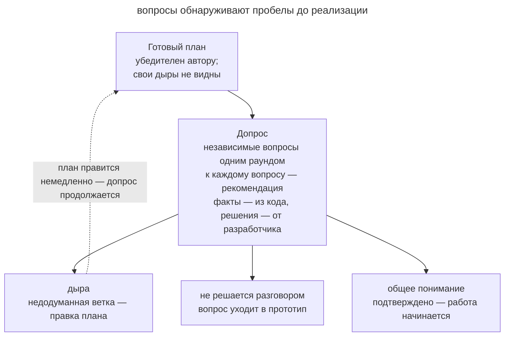

# Гриллинг

## Назначение

Попросите агента проверить готовый план серией вопросов, чтобы вскрыть допущения и зависимости решений до начала реализации.

## Также известен как

Grilling, допрос с пристрастием; `/grilling` в скиллах Мэтта Покока.

## Проблема

Допустим, вы написали план миграции тарифов. В нём описана обычная подписка, но пропущены корпоративные зачисления. Вам план кажется полным, потому что вы помните допущения, которые не записали. Но другой участник, например агент, этих допущений не видит.

Если до реализации никто не спросит о корпоративных зачислениях, агент применит одно правило ко всем пользователям. Поэтому разберите с агентом каждую ветку плана: тогда такой пропуск найдётся ещё до того, как агент изменит код.

## Решение

Прежде чем агент начнёт реализацию, попросите его проверить план вопросами. Например, так:

> Проверь каждое допущение этого плана. Сначала выясни, какие решения зависят от других. Вопросы, для которых все нужные ответы уже известны, задавай вместе, небольшим раундом. Вопрос, который зависит от ещё не полученного ответа, оставляй на следующий раунд. К каждому вопросу предлагай ответ, который рекомендуешь, и объясняй почему. Факты ищи в коде сам. Решения согласуй со мной и жди моего ответа. Реализацию начинай, только когда я подтвержу, что у нас общее понимание плана.

В этом промпте вы задаёте агенту три правила.

- **Зависимости между вопросами.** Несколько вопросов, которые не зависят друг от друга, агент задаёт вместе. Если следующий вопрос зависит от ответа на предыдущий, агент ждёт этого ответа. Раунд должен быть таким, чтобы вы успели разобрать все пункты.
- **Факты из кода.** Всё, что можно узнать, прочитав проект, агент находит сам. Вас он спрашивает только о решениях.
- **Рекомендация с обоснованием.** К каждому вопросу агент предлагает рекомендуемый ответ и объясняет, почему советует именно его. Так у вас появляется конкретный выбор для обсуждения.

Ваш ответ либо подтверждает пункт плана, либо показывает, что пункт нужно исправить. Иногда вопрос не решить разговором: чтобы ответить, нужно что-то запустить и посмотреть на результат. Такой вопрос вынесите в [одноразовый прототип](prototype-to-answer.md). Когда все значимые ветки разобраны, вы подтверждаете план, и агент начинает реализацию.

## Структура

На схеме агент получает готовый план и проходит по веткам решений.

```mermaid
---
title: вопросы обнаруживают пробелы до реализации
---
flowchart TB
  plan["Готовый план<br/>убедителен автору;<br/>свои дыры не видны"]:::accent
  grill["Допрос<br/>независимые вопросы одним раундом<br/>к каждому вопросу — рекомендация<br/>факты — из кода, решения — от разработчика"]
  hole["дыра<br/>недодуманная ветка — правка плана"]:::warn
  proto["не решается разговором<br/>вопрос уходит в прототип"]:::muted
  shared["общее понимание<br/>подтверждено — работа начинается"]:::accent
  plan --> grill
  grill --> hole
  grill --> proto
  grill --> shared
  hole -. "план правится немедленно — допрос продолжается" .-> plan
```

Найденный пропуск сразу возвращает вас к плану, а вопрос, для которого нужен эксперимент, уходит в прототип. Закончить допрос можете только вы: агент не решает сам, что общее понимание достигнуто.

## Участники / Компоненты

- **План** — документ, по которому агент задаёт вопросы.
- **Агент** задаёт вопросы, сам проверяет факты в коде и предлагает варианты решений.
- **Разработчик** отвечает на вопросы и утверждает изменения в плане.
- **Найденные пробелы** — сценарии и зависимости, которые в плане ещё не разобраны.
- **Общее понимание** — вы и агент одинаково понимаете план. Перед реализацией вы явно это подтверждаете.

## Когда применять

- Вам предстоит серьёзная работа по плану, который вы составили в одиночку.
- Решение трудно откатить: например, оно меняет публичный контракт или схему данных.
- В плане есть допущения, которые ещё никто не проверял вопросами.

Если правка небольшая и её легко откатить, допрос может обойтись дороже самой реализации. А если плана ещё нет, начните с [интервью у агента](let-claude-interview-you.md): там агент по вашим ответам составляет исходную спецификацию. Гриллинг проверяет план, который уже написан.

## Последствия и компромиссы

- ➕ Вы находите пропущенные сценарии до того, как агент напишет код.
- ➕ К каждому вопросу агент даёт рекомендацию, поэтому вы обсуждаете конкретный вариант.
- ➕ Допущения, которые вы держали в голове, записываются в план.
- ➖ Бывает трудно пересматривать решения, которые вы считали окончательными.
- ➖ На подробный разбор нужно выделить отдельное время.
- ➖ Агент может соглашаться с вами и пропускать слабые места, если вы не поставите ему ясную задачу критически проверить план.

## Реализация

1. Запишите план, чтобы агент мог ссылаться на конкретные решения.
2. Попросите агента проверить допущения и задавать независимые вопросы вместе. Получив ответы, агент уточняет план и решает, какие вопросы задать в следующем раунде.
3. Если вы не знаете ответа, так и скажите: «не знаю». Запишите такой вопрос в план как открытый.
4. Каждое согласованное изменение вносите в план сразу, по ходу разговора.
5. Вопросы, для которых нужен эксперимент, передавайте в [одноразовый прототип](prototype-to-answer.md).
6. Согласованные термины записывайте в [словарь домена](domain-context-file.md), а причины архитектурных решений — в ADR (architecture decision record), короткий файл с решением и его причиной.
7. Перед реализацией явно подтвердите план.

## Пример

Перед миграцией тарифов вы отдаёте агенту план на проверку. Агент начинает с правил смены тарифа.

> Апгрейд в плане применяется сразу. Даунгрейд предлагаю применять с начала следующего периода и не возвращать разницу за оставшиеся дни. Подходит ли это правило продукту?

Вопрос о корпоративных договорах от правила даунгрейда не зависит, и агент задаёт его в том же раунде. А дата пересчёта платежа зависит, поэтому этот вопрос агент откладывает до вашего ответа.

> В плане подписка всегда связана с оплатой. Но по словарю корпоративный договор создаёт зачисление — доступ к курсу — без подписки. Как мигрировать корпоративные договоры, которые ещё не вступили в силу?

Этого сценария в плане нет. Вы уточняете продуктовое правило: если договор отменили до даты начала, в эту дату доступ открываться не должен. Остаётся технический вопрос: если событие начала договора уже стоит в очереди, не откроет ли оно доступ после отмены?

На этот вопрос разговором не ответить, нужен [прототип](prototype-to-answer.md). В прототипе вы создадите договор с будущей датой начала, отмените его и переведёте часы на день после даты начала. Если доступ откроется, значит, обработчик события начала не учитывает отмену.

Агент готовит [передачу сессии](handoff.md) с этим вопросом и сценарием. К миграции вы вернётесь, когда проверите решение.

## Антипаттерны и частые ошибки

- **Нет исходного плана.** Тогда вы не проверяете решения, а собираете требования, и разговор превращается в [интервью](let-claude-interview-you.md).
- **Зависимые вопросы в одном раунде.** Поздний вопрос может опираться на решение, которое вы ещё не приняли. Например, дата пересчёта платежа зависит от правила даунгрейда. Отложите такой вопрос до ответа. А если раунд независимых вопросов такой длинный, что часть пунктов вы пропускаете, сократите его.
- **Агент отвечает за вас.** Рекомендация агента — ещё не решение. Решение принимаете вы, поэтому агент должен дождаться вашего ответа.
- **Дыры «на потом».** Если не внести найденную дыру в план сразу, к концу сессии она потеряется.
- **Формальное согласие.** Агент хвалит план, но не проверяет допущения. Так пропущенные сценарии не найти.

## Известные применения

- **Скиллы Мэтта Покока** реализуют этот процесс в `/grilling` и `/grill-with-docs`. В [карте исследования](wayfinder.md) гриллинг — один из типов работы: тикет такого типа уточняет решение вместе с разработчиком.
- **Премортем** — до старта проекта вы представляете, что он провалился, и ищете, почему так могло выйти.
- **Ревью дизайн-документов** решает похожую задачу: план проверяет не его автор, а другой участник.

## Связанные паттерны

- [Интервью у агента](let-claude-interview-you.md) собирает исходные требования, когда плана ещё нет.
- [Спроектируй дважды](design-it-twice.md) сравнивает альтернативные конструкции до реализации.
- [Одноразовый прототип](prototype-to-answer.md) отвечает на вопросы, которые не решить разговором.
- [Писатель и рецензент](writer-reviewer.md) независимо проверяет уже готовый код.
- [Словарь домена](domain-context-file.md) хранит согласованные термины и решения.
