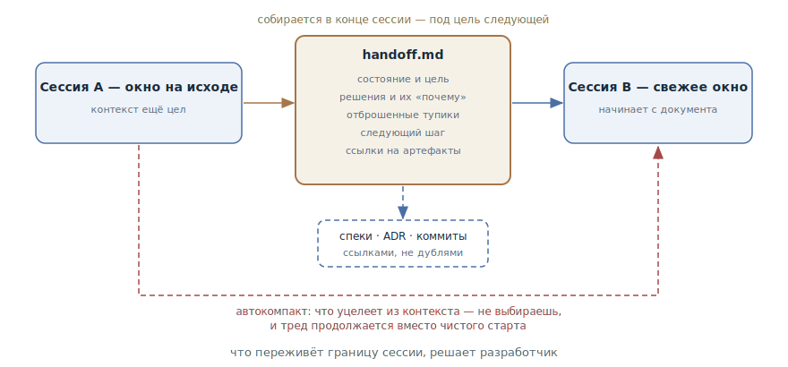

# Передача сессии

## Назначение

На границе сессии осознанно упаковать её содержимое в передаточный документ,
с которого начнёт работу следующая сессия или другой агент, — вместо того
чтобы доверять автосуммаризации решать, что из контекста выживет.

## Также известен как

Handoff, хендофф; `/handoff` в скилах Мэтта Покока; передаточный документ.

## Проблема

У каждой сессии есть граница: окно заканчивается, работа передаётся другому
агенту, или следующий этап удобнее делать с чистого листа. Через границу
контекст сам не переходит, и оба штатных способа его переноса плохи:

- **Автокомпакт** срабатывает по порогу и суммаризирует по собственному
  разумению. Что уцелеет — принятые решения или пересказ давно отработанных
  логов, — вы не выбираете. Терять он будет молча: обнаружится это только
  когда агент «забудет» договорённость.
- **Пересказ вручную** дорог и дыряв: разработчик восстанавливает по памяти
  то, что агент знал точнее, — и неизбежно теряет причины решений и
  отброшенные тупики.

Есть и третья беда: суммаризация продолжает *ту же* работу в *том же* треде.
А следующая сессия часто нужна для другого — прототипа, реализации по
готовому плану, ревью. Ей нужен не пересказ всей истории, а выжимка под её
конкретную цель.

## Решение

Последним действием сессии разработчик просит агента собрать передаточный
документ — и говорит, для чего будет следующая сессия. Агент, ещё держа весь
контекст в окне, упаковывает его под эту цель:

- текущее состояние и цель следующей сессии;
- ключевые решения — с причинами, а не только итогами;
- что уже пробовали и отбросили, чтобы не пробовать снова;
- конкретный следующий шаг;
- ссылки на постоянные артефакты — спецификации, ADR, коммиты, тикеты —
  вместо их пересказа;
- подсказки следующему агенту: какие скилы и инструменты пригодятся.

Секреты — ключи, пароли, персональные данные — вычищаются: документ покидает
пределы сессии. Сам он одноразовый и в репозиторий не коммитится: место
долговременного знания — в спецификациях, ADR и
[журнале прогресса](progress-file.md), а передача живёт от сессии до сессии.

Новая сессия начинается с чтения документа — и получает плотный, курированный
контекст под свою задачу, а не лотерею автокомпакта и не хвост чужой истории.

## Структура



Верхний путь — паттерн: уходящая сессия, пока контекст ещё цел, собирает
передаточный документ под названную цель; следующая сессия читает его первым
сообщением. Постоянные артефакты в документ не переписываются — он ссылается
на них, и новая сессия дочитает нужное сама. Нижний пунктирный путь — то, чему
паттерн противопоставлен: автокомпакт переносит через границу то, что выберет
сам, и продолжает тот же тред вместо чистого старта под новую цель.

## Участники / Компоненты

- **Уходящая сессия** — единственный момент, когда контекст ещё полон;
  собирает документ.
- **Передаточный документ** — одноразовая выжимка под цель: состояние,
  решения, тупики, следующий шаг, ссылки.
- **Следующая сессия** — свежее окно (другой агент, другой профиль работы);
  начинает с чтения документа.
- **Разработчик** — задаёт цель следующей сессии и решает, когда граница
  наступила.
- **Постоянные артефакты** — спецификации, ADR, коммиты, тикеты; в документ
  входят ссылками.

## Когда применять

- Окно на исходе, а работа не закончена — передача вместо надежды на
  автокомпакт.
- Меняется характер работы: исследование → прототип, план → реализация,
  реализация → ревью. Следующему этапу нужен чистый лист и выжимка, а не вся
  история.
- Работа передаётся другому агенту или коллеге.
- Долгая дискуссия накопила решения, которые жалко доверить компакту.

Если работа продолжается в той же сессии тем же курсом — достаточно
[журнала прогресса](progress-file.md); передача — ход именно на границе.

## Последствия и компромиссы

- ➕ Что переживёт границу, решает разработчик, а не порог автокомпакта.
- ➕ Следующая сессия стартует с контекста, скроенного под её цель, — плотнее
  и дешевле, чем хвост чужой истории.
- ➕ Причины решений и отброшенные тупики переезжают явно — именно то, что
  автосуммаризация теряет первым.
- ➖ Ручной ход: границу нужно заметить заранее — документ, собранный после
  компакта, упаковывает уже урезанный контекст.
- ➖ Качество зависит от упаковки: плохо собранный документ теряет то же, что
  и автомат.
- ➖ Соблазн дублировать артефакты: пересказ спецификации в передаче — лишние
  токены и второй источник истины.

## Реализация

1. Заведите команду: готовый скил `/handoff` есть в
   [паке Мэтта Покока](matt-pocock-skills.md), в Claude Code легко сделать
   свою слэш-команду. Важно, чтобы это был один вызов, а не ритуал на память.
2. Всегда называйте цель: «собери handoff для сессии, которая будет X».
   Документ под реализацию и документ под ревью — разные документы.
3. Держите состав: состояние и цель, решения с причинами, отброшенное,
   следующий шаг, ссылки на артефакты, рекомендуемые скилы.
4. Не дублируйте: всё, что уже записано в спецификации, ADR, коммитах и
   тикетах, — входит ссылкой, не пересказом.
5. Вычищайте секреты: документ будет прочитан вне этой сессии.
6. Храните вне репозитория — во временном каталоге: это одноразовый документ.
   То, что должно жить долго, по итогам сессии уходит в постоянные артефакты.
7. Следующую сессию начинайте с документа: «прочитай такой-то файл и
   продолжи».
8. Следите за окном: передача собирается *до* компакта. Если инструмент
   показывает заполнение окна — это сигнал готовить границу.

## Пример

Сессия спланировала миграцию тарифов и упёрлась в открытый вопрос: потянет ли
выбранная модель отмен подписки корпоративные контракты. Решать его удобнее
прототипом в чистой сессии. Разработчик закрывает текущую:

> Собери handoff для следующей сессии: она будет делать прототип модели
> отмен, вопрос — выдерживает ли модель корпоративные контракты с
> отложенным стартом.

Агент пишет во временный каталог `handoff-cancellation-prototype.md`:

```markdown
# Handoff: прототип модели отмен

## Цель сессии
Проверить прототипом: выдерживает ли событийная модель отмен
корпоративные контракты с отложенным стартом.

## Контекст
План миграции тарифов готов (см. docs/specs/tariff-migration.md).
Открытый вопрос №3 оттуда — модель отмен.

## Решения
- Отмена — событие с датой вступления, не смена статуса: нужна
  история для биллинга (ADR-0009).

## Отброшено
- Флаг cancelled_at на подписке: теряет повторные отмены после
  реактивации.

## Следующий шаг
Прототип: три сценария — немедленная отмена, отмена с датой,
отмена до старта контракта.

## Рекомендуемые скилы
/prototype — сессия целиком про throwaway-код.
```

Новая сессия начинается с одной строки:

> Прочитай /tmp/handoff-cancellation-prototype.md и приступай.

Прототип-сессия не тащит за собой три часа планирования — только выжимку под
свой вопрос и ссылку на спецификацию, если понадобятся детали.

## Анти-паттерны и частые ошибки

- **Доверить границу автокомпакту.** Решения и причины уходят молча; паттерн
  существует ровно затем, чтобы этого не было.
- **Передача-дамп.** Выгрузить всю историю «на всякий случай» — следующая
  сессия начинает с чужого шума вместо чистого контекста. Передача — выжимка
  под цель.
- **Пересказ артефактов.** Спецификация и ADR уже написаны — в передаче им
  место ссылкой. Дубль устареет и начнёт врать.
- **Передача в git.** Одноразовый документ в репозитории — мусор и риск
  утечки: он писался без оглядки на долгую жизнь. Долговременное — в журнал,
  ADR и спецификации.
- **Собирать после компакта.** Поздно: половина контекста уже выброшена.
  Передача пишется, пока окно цело.

## Известные применения

- **Скилы Мэтта Покока** — `/handoff`: одноразовый документ во временном
  каталоге, секция рекомендуемых скилов, запрет на дублирование артефактов,
  зачистка секретов; в основном потоке пака передача связывает интервью с
  прототипом и другие смены этапа.
- **Claude Code** — `/compact` с инструкцией («compact, фокус на X») —
  встроенный младший брат паттерна: фокус задать можно, но результат остаётся
  в том же треде и не переживает смену сессии.
- **Компакция из статьи Anthropic о контекст-инжиниринге** — автоматизированный
  вариант той же операции в харнессах долгоживущих агентов: суммаризировать с
  максимальным recall, потом повышать точность.
- **Сабагенты** — та же передача снизу вверх: сабагент возвращает координатору
  конденсированную сводку своей работы, а не полный след.

## Связанные паттерны

- [Журнал прогресса](progress-file.md) — сосед по слою состояния: журнал
  ведётся по ходу и живёт в репозитории, передача пишется один раз на границе
  и умирает после прочтения.
- [Инженерия контекста](context-engineering.md) — передача — это осознанная
  компакция: ручное применение принципа «минимум токенов, максимум сигнала»
  к границе сессии.
- [Четыре фазы](explore-plan-code-commit.md) — утверждённый план — готовый
  передаточный документ: его можно выполнить в свежей сессии, не тащя
  историю обсуждения.
- [Спеко-ориентированная разработка](spec-driven-development.md) — постоянные
  артефакты SDD и одноразовая передача дополняют друг друга: первые хранят
  знание, вторая переносит рабочий момент.
