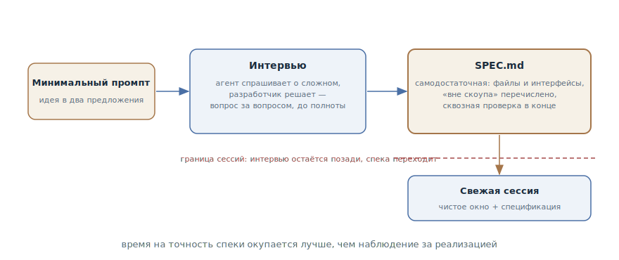

# Интервью у агента

## Назначение

Перевернуть постановку большой задачи: не писать спецификацию самому, а
начать с минимального описания и позволить агенту интервьюировать вас — до
тех пор, пока из ответов не соберётся самодостаточная спецификация. Исполняет
её свежая сессия с чистым контекстом.

## Также известен как

Let Claude interview you, интервью наоборот, agent-led interview.

## Проблема

Большая фича живёт у вас в голове — и оттуда плохо достаётся:

- Писать спецификацию самому тяжело и однобоко: вы не знаете, чего не
  знаете. Краевые случаи, UX-развилки и компромиссы, о которых вы не
  подумали, в текст не попадут — их некому спросить.
- Вывалить всё в один длинный промпт — получится куча текста без структуры:
  важное вперемешку с очевидным, а дыры всё равно на месте.
- Недосказанность всплывает в худший момент: посреди реализации агент
  встречает нерешённый вопрос — и молча решает его сам, как получится.

## Решение

Начать с минимума и отдать инициативу агенту:

> Хочу построить [краткое описание]. Интервьюируй меня подробно: спрашивай о
> технической реализации, UX, краевых случаях, рисках и компромиссах. Не
> задавай очевидных вопросов — копай сложные места, о которых я мог не
> подумать. Продолжай, пока не покроем всё, потом запиши полную спецификацию
> в SPEC.md.

Роли распределяются так: агент спрашивает — и он хорош в этом, потому что
знает типовые дыры фич этого рода; вы решаете — каждый ответ фиксирует
решение, которое иначе всплыло бы посреди реализации.

Финал интервью — **самодостаточная** спецификация: она называет затронутые
файлы и интерфейсы, явно перечисляет, что *вне* скоупа, и заканчивается
сквозным шагом проверки, доказывающим, что фича работает. Самодостаточность —
критерий готовности: по такой спеке можно работать, не имея доступа к автору.

Исполнение — в свежей сессии: чистое окно, целиком отданное реализации, и
спецификация как источник. Интервью в контекст исполнителя не тащится — всё,
что в нём было ценного, уже в SPEC.md. Время, потраченное на точность
спецификации, окупается лучше времени, потраченного на наблюдение за
реализацией.

## Структура

Слева минимальный промпт — пара предложений идеи. В центре цикл интервью:
агент спрашивает о сложных местах, разработчик решает, вопрос за вопросом.
Справа продукт — самодостаточная спецификация с файлами, границами скоупа и
сквозной проверкой. Пунктирная граница отделяет её от исполнения: свежая
сессия получает спеку и чистое окно, интервью остаётся позади.

## Участники / Компоненты

- **Разработчик** — источник решений: отвечает, выбирает, режет скоуп.
- **Агент-интервьюер** — задаёт вопросы о том, о чём вы не подумали;
  инструктирован не спрашивать очевидного.
- **SPEC.md** — продукт интервью: самодостаточная спецификация с файлами,
  границами и проверкой.
- **Свежая сессия** — исполнитель: чистое окно плюс спецификация, без хвоста
  интервью.

## Когда применять

- Большая фича, требования к которой есть в голове, но не на бумаге, — и
  писать их самому не хочется или не выходит.
- Вы одиночка или маленькая команда без выделенного аналитика: агент
  закрывает роль того, кто задаёт неудобные вопросы.
- Прошлые спеки, написанные в одиночку, стабильно оказывались с дырами в
  одних и тех же местах.

Не нужно для мелких правок — там хватает обычной постановки — и когда
спецификация уже существует: готовый план не интервьюируют, а
[атакуют](grilling.md).

## Последствия и компромиссы

- ➕ Вопросы вскрывают то, о чём вы не подумали: агент знает типовые дыры —
  ретраи, гонки, пустые состояния, права доступа.
- ➕ Спецификация рождается структурированной и самодостаточной — это
  готовый вход для [конвейера SDD](spec-driven-development.md).
- ➕ Исполнитель получает чистый контекст: окно не завалено часом
  переговоров.
- ➖ Интервью стоит времени и терпения: десятки вопросов подряд утомляют.
- ➖ Качество зависит от инструкции: без «не задавай очевидного» агент
  начнёт с «какой фреймворк используем».
- ➖ Ответы «на отвали» обесценивают всё: «как считаешь лучше» на каждый
  вопрос даёт спецификацию из догадок агента — с тем же успехом можно было
  не интервьюироваться.

## Реализация

1. Напишите минимальный промпт: идея в одно-два предложения плюс просьба
   интервьюировать — с явным «копай сложные места, не спрашивай очевидного».
2. Отвечайте как владелец: каждый ответ — решение. Не знаете — так и
   говорите: «не знаю, предложи варианты» лучше, чем случайный выбор.
3. Требуйте финала файлом: полная спецификация в `SPEC.md`, а не резюме в
   чате.
4. Проверьте самодостаточность: названы файлы и интерфейсы, перечислено
   «вне скоупа», в конце — сквозной шаг проверки. Чего-то нет — ещё раунд
   вопросов.
5. Исполняйте свежей сессией: новый контекст, `SPEC.md` на входе. Для
   работы больше одной сессии спека уходит в
   [конвейер SDD](spec-driven-development.md) — планом и задачами.

## Пример

Разработчик хочет вебхуки для интеграций и пишет ровно это:

> Хочу добавить вебхуки, чтобы клиенты получали события о заказах.
> Интервьюируй меня подробно, копай то, о чём я не подумал, потом запиши
> спецификацию в SPEC.md.

Агент спрашивает — по одному, с рекомендацией к каждому вопросу: какие
события в первой версии; что делать, если получатель отвечает 500 —
рекомендую экспоненциальные ретраи с потолком; нужна ли подпись payload —
рекомендую HMAC; гарантируем ли порядок событий; что с дедупликацией на
стороне клиента. На вопросе «что делать, если получатель стабильно медленный
и копит очередь» разработчик останавливается: об этом он не думал вообще —
решают отключать вебхук после N провалов с уведомлением.

Через двадцать вопросов в `SPEC.md` лежит спецификация: события и формат,
политика ретраев, подпись, «вне скоупа: UI настройки — следующей итерацией»,
сквозная проверка — «создать заказ, увидеть доставленное событие в
тестовом приёмнике, уронить приёмник, увидеть ретраи и отключение».
Разработчик открывает свежую сессию: «реализуй по SPEC.md» — и исполнитель
работает по документу, в котором вопрос про медленного получателя уже решён.

## Анти-паттерны и частые ошибки

- **«Как считаешь лучше» на всё.** Интервью работает, только пока решения
  ваши: агент, отвечающий сам себе, производит спецификацию из догадок.
- **Интервью без файла.** Решения, оставшиеся в переписке, умрут вместе с
  сессией — финал всегда `SPEC.md`.
- **Исполнение в той же сессии.** Окно завалено интервью, и исполнитель
  тащит за собой час переговоров вместо чистого контекста. Спека
  самодостаточна — дайте ей свежую сессию.
- **Очевидные вопросы.** Без явного «копай сложное» агент интервьюирует по
  верхам — и дыры остаются на месте.
- **Интервью вместо гриллинга.** Если план уже написан, строить его заново
  вопросами поздно — его надо [атаковать](grilling.md).

## Известные применения

- **Claude Code best practices** — первоисточник с готовым промптом:
  интервью через AskUserQuestion, «dig into the hard parts I might not have
  considered», спецификация в SPEC.md, исполнение свежей сессией.
- **Kiro** — спек-сессии как режим IDE: та же идея, встроенная в
  инструмент, — требования рождаются в диалоге с поэтапными подтверждениями.
- **Скилы Мэтта Покока** — `/grill-with-docs`: интервью, которое
  параллельно читает кодовую базу и оседает решениями в CONTEXT.md и ADR.

## Связанные паттерны

- [Гриллинг](grilling.md) — зеркальный сосед: интервью *строит*
  спецификацию с нуля, гриллинг *атакует* готовый план.
- [Спеко-ориентированная разработка](spec-driven-development.md) —
  приёмник результата: SPEC.md — готовый вход конвейера.
- [Четыре фазы](explore-plan-code-commit.md) — младший масштаб: там
  агент исследует и планирует сам, здесь план рождается из ваших решений.
- [Преждевременная спецификация](premature-specification.md) — анти-паттерн,
  от которого интервью защищает: спецификация собирается из решений по
  вопросам, а не из ранних догадок о реализации.
