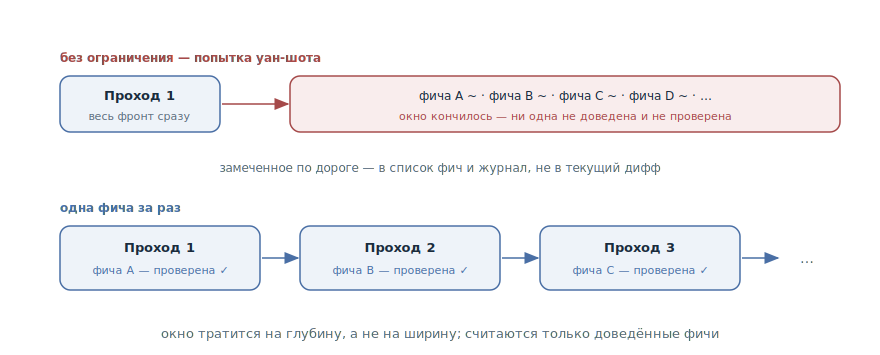

# Одна фича за раз

## Назначение

Ограничить агента одной фичей за проход: сессия берёт один пункт, доводит
его до проверенного «работает» — и только потом берёт следующий. Ограничение
против встроенной тяги агента сделать всё сразу: окно тратится на глубину, а
не на ширину.

## Также известен как

One feature at a time, one feature per session, инкрементальный прогресс;
родня WIP-лимита из канбана.

## Проблема

Предоставленный себе агент на большой задаче пытается сделать слишком много
сразу — по сути, уан-шотнуть всё приложение. Выглядит это продуктивно:
файлы создаются десятками, фичи «начинаются» одна за другой. Кончается
всегда одинаково:

- Окно съедено шириной фронта: на середине десятой фичи контекст
  исчерпан, и ни одна из десяти не доведена.
- «Почти готово» нечем проверить: проверка требует законченного поведения,
  а законченного нет нигде.
- Полусделанное хуже несделанного: следующая сессия наследует не чистый
  список задач, а раскопки — что из начатого работает, что бросить, что
  доделывать.
- Обрыв сессии стоит дорого: теряется прогресс по всему фронту сразу.

## Решение

Явное ограничение, закреплённое в памяти проекта и промптах: **один проход —
одна фича, доведённая до конца**. Конец — это не «код написан», а полный
цикл:

1. Взять один пункт — следующий непройденный из
   [списка фич](feature-list-harness.md) или один тикет.
2. Реализовать только его.
3. Проверить как пользователь — прогнать
   [петлю обратной связи](give-agent-a-way-to-verify.md) до зелёного.
4. Зафиксировать: статус в списке, коммит, запись в
   [журнале прогресса](progress-file.md).

Всё замеченное по дороге — сломанная соседняя фича, напрашивающийся
рефакторинг — не расширяет текущий проход, а записывается: новым пунктом в
список или заметкой в журнал. Если после финала окно позволяет, агент берёт
следующий пункт — тем же циклом, а не «заодно».

Почему это работает: одна фича целиком помещается в окно с запасом на
итерации проверки; завершённость становится бинарной — фича либо доведена и
проверена, либо не начата; и любой обрыв сессии стоит максимум одной
недоделанной фичи, а не всего фронта.

## Структура

Верхняя дорожка — то, что происходит без ограничения: один проход веером
раскрывается на весь фронт, окно кончается раньше фронта, и в осадке —
россыпь «почти», которую нечем проверить. Нижняя дорожка — паттерн: цепочка
проходов, каждый из которых заканчивается одной доведённой и проверенной
фичей. Скорость по ощущению ниже, скорость по факту — выше: считаются только
законченные пункты.

## Участники / Компоненты

- **Проход** — единица работы: сессия или её часть, посвящённая ровно одной
  фиче.
- **Фича** — один проверяемый пункт; определение «доведена» даёт проверка,
  а не объём написанного.
- **Список фич** — очередь, из которой проход берёт следующий пункт и куда
  уходит всё замеченное по дороге.
- **Агент** — реализует и проверяет; ограничение удерживается промптом и
  памятью проекта.
- **Разработчик** — держит дисциплину: не докидывает «заодно» и требует
  финала перед следующим пунктом.

## Когда применять

- Долгая работа от списка фич — там ограничение и родилось: без него
  автономные сессии стабильно пытаются сделать всё сразу.
- Автономные прогоны: чем меньше присмотра, тем жёстче должна быть рамка
  прохода.
- Как дефолт для любой нетривиальной работы: «и X заодно» в промпте — уже
  заявка на размазанный, непроверяемый дифф.

Не подходит для честно сквозных изменений — миграции формата, переименования
через всю базу: их не нарезать на фичи, и им нужен отдельный проход со своим
критерием завершения.

## Последствия и компромиссы

- ➕ Каждый проход заканчивается проверенным приростом: прогресс считается в
  доведённых фичах, а не в начатых.
- ➕ Окно тратится на глубину: реализация, проверка и итерации одной фичи —
  вместо распыления на десять.
- ➕ Обрыв дёшев: сессия умерла — потеряна максимум одна недоделанная фича,
  и артефакты говорят, какая.
- ➖ Медленнее по ощущению: нет бодрящей иллюзии «всё почти готово». Это
  цена того, что «готово» стало правдой.
- ➖ Сквозные изменения в рамку не влезают — их приходится выделять в
  отдельные проходы с собственным критерием.
- ➖ Дисциплина двусторонняя: агента держит промпт, а разработчика — ничто;
  соблазн «докинь ещё и Y» в конце удачного прохода ломает паттерн изнутри.

## Реализация

1. Закрепите правило в [памяти проекта](claude-md-memory.md): «за проход —
   одна фича, доведённая до проверенного статуса; попутные находки — в
   список, не в дифф».
2. Формулируйте промпт прохода узко: «возьми следующую непройденную фичу из
   списка и доведи её до passes», а не «поработай над приложением».
3. Определите финал прохода и требуйте его целиком: проверка, статус,
   коммит, запись в журнале. Фича без финала — не сделана.
4. Замеченное по дороге направляйте в артефакты: баг — новым пунктом списка,
   идея рефакторинга — заметкой в журнал. Дифф прохода трогает только свою
   фичу.
5. Если окно позволяет продолжить — следующий пункт начинается как новый
   проход, с чтения списка, а не как расширение текущего диффа.
6. Сквозную подготовку — миграции, переименования, инфраструктуру —
   планируйте отдельными проходами с явным критерием завершения.

## Пример

Сервис заметок из [главы о списке фич](feature-list-harness.md). В памяти
проекта — правило одного прохода. Разработчик запускает сессию:

> Возьми следующую непройденную фичу из feature-list.json и доведи до
> passes.

Агент берёт «поиск по тегу». По дороге замечает: пагинация списка заметок
сломана, а фильтры просятся под рефакторинг. Вместо того чтобы чинить и
переписывать «заодно», он добавляет пагинацию новым пунктом в список,
записывает идею рефакторинга в журнал — и продолжает поиск. К концу прохода:
поиск реализован, прогнан как пользователь, `passes: true`, коммит, запись в
журнале.

Для контраста — то, что было до правила: промпт «поработай над приложением»
закончился сессией, которая «реализовала поиск, фильтры, пагинацию и начала
экспорт». Окно умерло на экспорте; проверено не было ничего; следующая
сессия потратила половину контекста на выяснение, что из этого вообще
работает.

## Анти-паттерны и частые ошибки

- **Попытка уан-шота.** «Сделай всё приложение» одним проходом — фронт
  шире окна, в осадке россыпь «почти». Ожидать фичу от одного промпта без
  цикла проверки — отдельный анти-паттерн, разобранный в своём разделе.
- **«Заодно».** Каждое попутное «и ещё поправь X» размазывает дифф и
  отодвигает проверку. Замеченное — в список, не в проход.
- **Фича без финала.** Реализована, но не проверена и не зафиксирована —
  проход не засчитан: следующая сессия начнёт с раскопок.
- **Ширина вместо глубины.** Начать три пункта «параллельно» — тот же
  уан-шот в миниатюре: заканчивается нулём доведённых.
- **Попутный рефакторинг.** Переписывание соседнего кода внутри прохода
  смешивает два изменения в один дифф — и проверку фичи с проверкой
  рефакторинга.

## Известные применения

- **Харнесс Anthropic для долгоживущих агентов** — первоисточник: без
  ограничения «агент пытался сделать слишком много сразу — по сути,
  уан-шотнуть приложение»; правило «выбери одну фичу и работай над ней»
  вместе с ритуалом сессии.
- **Superpowers** — та же рамка на уровне задач: план нарезается на задачи
  по 2–5 минут, и каждую реализует отдельный сабагент со свежим окном.
- **Скилы Мэтта Покока** — трассирующие тикеты: работа нарезается на
  тикеты с блокирующими связями, `/implement` ведёт ровно один тикет за
  раз.
- **WIP-лимиты канбана** — доагентная родословная: ограничение
  незавершённой работы как способ заставить систему *заканчивать*, а не
  *начинать*.

## Связанные паттерны

- [Список фич](feature-list-harness.md) — поставляет очередь: проход берёт
  следующий непройденный пункт и возвращает проверенный статус.
- [Петля обратной связи](give-agent-a-way-to-verify.md) — определяет
  «доведена»: финал прохода — зелёная проверка, а не объём кода.
- [Журнал прогресса](progress-file.md) — принимает попутные находки и
  фиксирует финал прохода для следующей сессии.
- [Четыре фазы](explore-plan-code-commit.md) — тот же принцип завершённости
  в масштабе одной задачи: проход заканчивается коммитом, а не «почти».
