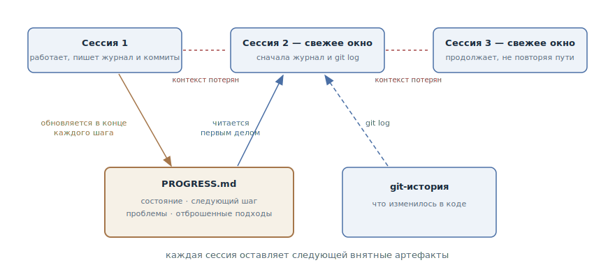

# Журнал прогресса

## Назначение

Вести рядом с кодом файл-журнал долгой работы — где мы, что дальше, что уже
отброшено, — который агент обновляет по ходу и читает первым делом в новой
сессии. Свежее контекстное окно восстанавливает картину по одному файлу, а не
археологией по коду и переписке.

## Также известен как

Progress file, progress log; `claude-progress.txt` из статьи Anthropic про
харнессы, `PROGRESS.md`.

## Проблема

Работа не поместилась в одно контекстное окно: фича на несколько дней,
миграция, долгая отладка. Каждая новая сессия — и каждый компакт — начинается
с амнезии:

- Git-история отвечает на вопрос «что изменилось», но молчит о главном: что
  *не доделано*, почему выбран этот путь и что уже пробовали и отбросили.
- Агент со свежим окном повторяет тупиковые попытки: решение, отвергнутое
  вчера за час экспериментов, сегодня снова выглядит привлекательно.
- Восстановление состояния по коду стоит дорого: агент сжигает половину
  свежего окна на чтение диффов и файлов, прежде чем сделать первый полезный
  шаг, — а иногда уверенно берётся не за то.

Полагаться на автосуммаризацию при компакте — лотерея: что именно уцелеет из
контекста, решаете не вы.

## Решение

Журнал состояния в репозитории, рядом с кодом. Агент обновляет его в конце
каждого значимого шага — это такая же часть завершения шага, как коммит. Новая
сессия начинается с ритуала: прочитать журнал и свежий git log — и только
потом работать.

В журнале живёт то, чего нет в git-истории:

- **текущее состояние** — что работает, что в процессе;
- **следующий шаг** — с чего начинать, если сессия оборвётся прямо сейчас;
- **известные проблемы** — грабли, о которых следующая сессия должна знать
  заранее;
- **отброшенные подходы** — что пробовали, почему не сработало.

Журнал и git-история дополняют друг друга и не дублируются: git отвечает «что
изменилось в коде», журнал — «где мы и куда дальше». Пересказывать диффы в
журнале не нужно.

Ритуал держится не на памяти агента, а на [памяти проекта](claude-md-memory.md):
правило «в начале сессии прочитай `PROGRESS.md`, в конце значимого шага —
обнови» лежит там и действует в каждой сессии автоматически.

## Структура



Сессии идут чередой, и между ними — обрыв: окно закончилось или
скомпактилось, контекст потерян. Непрерывность обеспечивают два артефакта
внизу: журнал прогресса, который каждая сессия обновляет по ходу работы, и
git-история с коммитами. Новая сессия начинает с чтения обоих — журнал даёт
состояние и направление, git log — фактические изменения — и продолжает
работу с того места, где оборвалась предыдущая, не повторяя её путь.

## Участники / Компоненты

- **Журнал прогресса** (`PROGRESS.md`) — состояние, следующий шаг, проблемы,
  отброшенные подходы; живёт в репозитории.
- **Git-история** — комплемент журнала: фактические изменения кода,
  возможность откатиться к рабочему состоянию.
- **Агент** — обновляет журнал по ходу и читает его первым делом в новой
  сессии.
- **Разработчик** — задаёт ритуал и ревьюит журнал: по нему видно прогресс,
  не раскапывая диффы.
- **Память проекта** — закрепляет ритуал, чтобы он не зависел от переписки.

## Когда применять

- Работа заведомо больше одной сессии: многодневная фича, миграция, большой
  рефакторинг.
- Сессии длинные и регулярно упираются в компакт — журнал страхует от потерь
  при каждом сжатии окна.
- Над задачей попеременно работают несколько сессий, несколько агентов или
  агент вперемешку с человеком — журнал выравнивает картину для всех.

Для задачи, которая помещается в одну сессию, журнал избыточен: хватает плана
в самой сессии.

## Последствия и компромиссы

- ➕ Восстановление состояния стоит один файл: новая сессия делает полезный
  шаг через минуту, а не через пол-окна археологии.
- ➕ Тупики не повторяются: отброшенный подход записан вместе с причиной.
- ➕ Прогресс виден человеку: заглянуть в журнал быстрее, чем расспрашивать
  агента или читать диффы.
- ➖ Требует дисциплины обновления: пропущенная запись — и журнал врёт
  следующей сессии.
- ➖ Разрастается без ухода: журнал, куда только пишут, становится вторым
  источником шума (см. [инженерию контекста](context-engineering.md)).
- ➖ Соблазн дублировать git: пересказ диффов раздувает журнал и не добавляет
  сигнала.

## Реализация

1. Заведите файл при старте долгой работы и закрепите ритуал в
   [памяти проекта](claude-md-memory.md): «в начале сессии прочитай
   `PROGRESS.md` и свежий `git log`; в конце значимого шага обнови
   `PROGRESS.md`».
2. Держите четыре секции: состояние, следующий шаг, известные проблемы,
   отброшенные подходы. «Следующий шаг» — самая ценная: пишите его так, чтобы
   сессия могла оборваться в любой момент.
3. Пишите «где мы и почему», а не «что изменилось» — второе уже записано в
   git.
4. Сделайте обновление частью определения «шаг завершён»: код, тесты, коммит,
   журнал.
5. Держите журнал коротким: свежее — наверху, отработанные секции сворачивайте
   или удаляйте. Журнал читается каждую сессию и подчиняется той же экономике
   внимания, что и остальной контекст.
6. Статусы, которые агент обновляет машинно — например, список фич с
   отметками «работает/не работает», — выносите из прозы в отдельный
   структурированный файл: JSON агент портит реже, чем Markdown. Этот приём
   разобран в главе о списке фич в разделе организации проекта.

В конвейерах спеко-ориентированной разработки роль журнала для отдельной фичи
играет `tasks.md`: списки задач с отметками выполнения есть в
[Spec Kit](spec-kit.md), [OpenSpec](openspec.md) и [Kiro](kiro.md), а в
[Superpowers](superpowers.md) план из мелких задач прямо задуман как документ,
по которому работу можно продолжить с любого места. Журнал прогресса — тот же
приём без конвейера: один файл на любую долгую работу.

## Пример

Идёт многодневная миграция платежей на новый шлюз. В корне репозитория —
`PROGRESS.md`:

```markdown
# Миграция платежей на шлюз PayFlow

## Состояние
Вебхуки переведены и покрыты тестами. Карта ошибок шлюза готова.
Возвраты — в работе.

## Следующий шаг
Перевести `RefundService`: он последний ходит в старый клиент.
Начать с идемпотентных ключей — см. «Отброшено».

## Известные проблемы
- Sandbox шлюза отклоняет суммы меньше 1.00 — в тестах используем 1.05.

## Отброшено
- Адаптер поверх старого интерфейса: не ложатся идемпотентные ключи
  PayFlow, дешевле переписать вызовы (подробности в ADR-0007).
```

Сессия обрывается на середине — окно закончилось. Разработчик открывает
новую:

> Продолжаем миграцию на PayFlow — начни с PROGRESS.md.

Агент читает журнал и git log, берётся за `RefundService` — и не предлагает
заново «изящный адаптер», на проверку которого прошлая сессия потратила час:
причина отказа записана. Закончив с возвратами, он обновляет состояние и
следующий шаг — теперь оборваться может и эта сессия.

## Анти-паттерны и частые ошибки

- **Журнал-дневник.** Пересказ каждого действия вместо состояния: файл растёт
  с каждой сессией, и следующая тратит окно на чтение истории вместо работы.
- **Дубликат git log.** «Изменил X, добавил Y» — это уже записано в коммитах.
  Журнал отвечает на вопросы, на которые git ответить не может.
- **Обновление «потом».** Журнал, отставший от реальности, хуже пустого:
  новая сессия уверенно работает по вранью.
- **Статусы в прозе.** Машинно-обновляемые отметки в свободном тексте агент
  рано или поздно переформулирует или затрёт — им место в структурированном
  файле рядом.
- **Журнал вместо передачи.** Записи по ходу не заменяют осознанной упаковки
  на границе сессии: у [передачи сессии](handoff.md) другой момент и другая
  плотность.

## Известные применения

- **Харнесс Anthropic для долгоживущих агентов** — первоисточник:
  `claude-progress.txt` рядом с git-историей, ритуал старта сессии (git log →
  журнал → список фич → smoke-тест) и правило «каждая сессия оставляет
  следующей внятные артефакты».
- **Авто-память Claude Code** — журнал на уровне инструмента: агент сам ведёт
  заметки о проекте в `~/.claude/projects/<project>/memory/` и подгружает их
  в каждую сессию; журнал прогресса — та же идея, но про конкретную работу и
  в самом репозитории.
- **SDD-тулкиты** — `tasks.md` с отметками выполнения в
  [Spec Kit](spec-kit.md), [OpenSpec](openspec.md), [Kiro](kiro.md) и планы
  [Superpowers](superpowers.md): журнал прогресса, встроенный в конвейер
  фичи.
- **Структурированные заметки** из статьи Anthropic о контекст-инжиниринге —
  агент, ведущий `NOTES.md` за пределами окна, — тот же механизм в общем
  виде.

## Связанные паттерны

- [Передача сессии](handoff.md) — сосед по слою состояния: журнал ведётся по
  ходу работы, передача пишется один раз на границе сессии.
- [Инженерия контекста](context-engineering.md) — журнал — это слой состояния,
  вынесенный из окна; и он же подчиняется правилу «коротко и высокосигнально».
- [Память проекта](claude-md-memory.md) — место, где закрепляется ритуал
  чтения и обновления журнала.
- [Спеко-ориентированная разработка](spec-driven-development.md) — `tasks.md`
  конвейера выполняет роль журнала в масштабе одной фичи.
