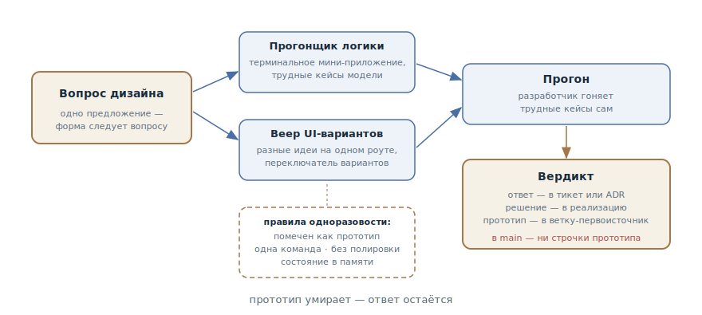

# Одноразовый прототип

## Назначение

Построить выбрасываемый прототип, который отвечает на конкретный вопрос
дизайна — «эта модель состояний вообще летает?», «как это должно
выглядеть?» — до того, как писать настоящую реализацию. Проверяется замысел,
а не код: прототип умирает, ответ остаётся.

## Также известен как

Throwaway prototype, spike (в терминах экстремального программирования),
прототип-ответ; `/prototype` в скилах Мэтта Покока.

## Проблема

Некоторые вопросы дизайна не решаются рассуждением:

- Модель состояний безупречна на бумаге и в плане — а на третьем реальном
  сценарии выясняется, что переходы неудобны и половина случаев в неё не
  ложится. Текстовое ревью этого не ловит: у ревьюера те же ограничения,
  что у автора, — он тоже рассуждает, а не прогоняет.
- Интерфейс не выбирается по описанию. «Список или канбан?» — спор на час;
  два работающих варианта решают его за минуту.
- Спор в плане зашёл в тупик: обе стороны правдоподобны, аргументы
  кончились, решение важное и трудно обратимое.

Строить по-настоящему, чтобы проверить, — дорого: если модель неверна,
реализацию переделывать. А прототип «на скорую руку» без дисциплины
незаметно превращается в продакшен: код, написанный без тестов и обработки
ошибок, начинает жить вечно, потому что «уже работает».

## Решение

Сформулировать вопрос одним предложением — и построить самый дешёвый
артефакт, который на него отвечает. Вопрос решает форму:

- **«Эта логика / модель состояний ощущается правильной?»** — крошечное
  интерактивное терминальное приложение, которое прогоняет модель через
  случаи, о которых трудно рассуждать на бумаге. После каждого действия —
  полное состояние наружу: видно, что изменилось.
- **«Как это должно выглядеть?»** — несколько радикально разных вариантов
  интерфейса на одном роуте с переключателем. Не три оттенка одной идеи, а
  разные идеи.

Правила, делающие прототип безопасным:

1. **Одноразовый с рождения** — и явно помечен: имя, из которого случайный
   читатель поймёт, что это не продакшен.
2. **Одна команда запуска** — разработчик стартует его не задумываясь.
3. **Без персистентности** — состояние в памяти: хранение — это то, что
   прототип *проверяет*, а не то, от чего он зависит.
4. **Без полировки** — ни тестов, ни обработки ошибок сверх минимума, ни
   абстракций. Цель — узнать быстро.

Агент сделал этот паттерн практичным: прототип, стоивший дня работы, теперь
стоит десятки минут — и его действительно не жалко выбросить.

Финал обязателен: вердикт — ответ и вопрос, который он закрыл, —
записывается в тикет или ADR; валидированное решение уходит в настоящую
реализацию; сам прототип коммитится в одноразовую ветку как первоисточник, и
на него остаётся ссылка. В main попадает только решение — не код прототипа.

## Структура

Слева вопрос — он существует до прототипа и определяет его форму: вопрос о
логике порождает терминальный прогонщик, вопрос о виде — веер вариантов
интерфейса. Оба артефакта строятся по одним правилам одноразовости и
попадают в руки разработчика: он прогоняет трудные кейсы сам. Справа —
единственный выживший артефакт: вердикт. Решение уходит в реализацию,
прототип — в ветку-первоисточник, в main не попадает ни строчки
прототипного кода.

## Участники / Компоненты

- **Вопрос дизайна** — одно предложение; существует до прототипа и решает
  его форму. Нет вопроса — нет прототипа.
- **Прототип** — выбрасываемый артефакт: терминальный прогонщик для логики
  или веер вариантов для UI.
- **Разработчик** — прогоняет трудные кейсы своими руками и выносит вердикт;
  прототип строится под его руки.
- **Агент** — строит быстро и без полировки; дисциплину одноразовости держит
  промпт.
- **Вердикт** — записанный ответ: что проверяли, что выяснили, что решили.

## Когда применять

- Модель состояний или логика с трудными случаями, о которых неудобно
  рассуждать на бумаге: подписки, статусы заказов, конфликты синхронизации.
- Выбор интерфейса: несколько работающих вариантов вместо спора по
  описаниям.
- Спор в плане зашёл в тупик, а решение трудно обратимо: час прототипа
  дешевле дня переделки.

Не нужен, когда вопрос решается чтением кода или документации — и когда
ответ очевиден любым способом дешевле прототипа.

## Последствия и компромиссы

- ➕ Дизайн проверяется до реализации: переделка «модель не легла» не
  случается, потому что модель прогнали заранее.
- ➕ Спор превращается в эксперимент: вместо «мне кажется» обе стороны
  смотрят на работающие варианты.
- ➕ Ответ дешёвый: без тестов, полировки и персистентности прототип
  строится за долю цены настоящей реализации.
- ➖ Главный риск — «допили этот прототип»: код без тестов и обработки
  ошибок в продакшене. Дисциплина финала — часть паттерна.
- ➖ Прототип отвечает только на заданный вопрос: «в прототипе работало» не
  обобщается на нагрузку, безопасность и граничные случаи, которых он не
  касался.
- ➖ Трата времени, если ответ был очевиден: сначала дешёвые способы —
  код, документация, короткий спор.

## Реализация

1. Сформулируйте вопрос одним предложением и напишите его в промпте прямо:
   «прототип должен ответить на вопрос X».
2. Выберите форму: логика — терминальный прогонщик с командами и печатью
   состояния; UI — несколько радикально разных вариантов с переключателем.
3. Продиктуйте правила одноразовости: рядом с будущим местом в коде, имя с
   пометкой прототипа, одна команда запуска, состояние в памяти, без
   тестов и полировки.
4. Прогоняйте сами: попросите агента подготовить трудные кейсы, но руки на
   клавиатуре — ваши. Вопрос «ощущается ли правильной» отвечается
   ощущением.
5. Запишите вердикт в тикет или ADR: вопрос, ответ, что решили.
6. Закройте аккуратно: решение — в настоящую реализацию (заново, не
   копипастой из прототипа), прототип — в одноразовую ветку со ссылкой из
   тикета, из main — ничего.
7. Прототип в свежей сессии начинайте с [передачи](handoff.md): выжимка
   вопроса и контекста вместо хвоста дискуссии.

## Пример

Продолжение истории из главы о [передаче сессии](handoff.md): план миграции
тарифов упёрся в вопрос — выдерживает ли событийная модель отмен
корпоративные контракты с отложенным стартом. Сессия прототипа начинается с
передаточного документа:

> Прочитай /tmp/handoff-cancellation-prototype.md. Собери одноразовый
> терминальный прототип модели отмен: команды subscribe, cancel <дата>,
> reactivate, tick; после каждой команды печатай полное состояние подписки
> и очередь событий. Без тестов и хранения — состояние в памяти. Назови
> так, чтобы было видно: это прототип.

Агент собирает прогонщик, запускаемый одной командой. Разработчик гоняет
сценарии: немедленная отмена — ок; отмена с датой — ок; а на сценарии
«отложенная отмена, потом реактивация до её вступления» модель ломается:
событие отмены остаётся в очереди и срабатывает после реактивации. На
бумаге этот случай никто не увидел.

Вердикт — в ADR: модель событий подтверждена с поправкой — реактивация
вытесняет неисполненные события отмены. Прототип уходит в ветку
`prototype/cancellation-model`, ссылка — в тикет реализации. Реализация
пишется заново по утверждённой модели; из прототипа в main не попадает ни
строки.

## Анти-паттерны и частые ошибки

- **«Допили этот прототип».** Главный грех: код, писавшийся как
  выбрасываемый, уезжает в продакшен. Реализация пишется заново по
  вердикту — прототип был вопросом, а не первой версией.
- **Прототип без вопроса.** «Давай попробуем и посмотрим» производит код,
  но не ответ: нечего записывать в вердикт, незачем было строить.
- **Полировка одноразового.** Тесты, обработка ошибок и абстракции в
  прототипе — трата: он умрёт раньше, чем они окупятся.
- **Обобщение вердикта.** «В прототипе работало» относится ровно к
  проверенному вопросу — не к нагрузке, не к безопасности, не к граничным
  случаям, которых прогон не касался.
- **Прототип выброшен вместе с ответом.** Код удалили, вердикт не записали
  — через месяц вопрос вернётся, и на него снова будет нечем ответить.

## Известные применения

- **Скилы Мэтта Покока** — `/prototype`: две ветки (логика — терминальный
  прогонщик, UI — веер вариантов на одном роуте), правила одноразовости и
  обязательный финал «решение в код, прототип в ветку-первоисточник».
- **Spike solutions в экстремальном программировании** — классический
  предок: короткий выбрасываемый эксперимент для снятия технического риска
  перед оценкой и реализацией.
- **«Design it twice» Джона Аустерхаута** — родственный принцип: заставить
  себя рассмотреть радикально разные варианты дизайна; веер UI-вариантов —
  его механизация.
- **Трассирующие пули из «Прагматичного программиста»** — полезный контраст:
  трассирующий код остаётся и обрастает, прототип выбрасывается. Смешение
  этих двух режимов и порождает «прототип в продакшене».

## Связанные паттерны

- [Петля обратной связи](give-agent-a-way-to-verify.md) — прототип — это
  проверка для решений, у которых нет машинного оракула: сигнал «прошло /
  не прошло» здесь выдают руки и глаза разработчика.
- [Передача сессии](handoff.md) — штатный вход в прототип: выжимка вопроса
  и контекста для чистой сессии вместо хвоста дискуссии.
- [Четыре фазы](explore-plan-code-commit.md) — вопрос для прототипа обычно
  рождается на фазе плана: спор, который не решается текстом, выносится в
  эксперимент.
- [Спеко-ориентированная разработка](spec-driven-development.md) — вердикт
  прототипа возвращается в спецификацию как требование или ограничение —
  до того, как реализация началась.
