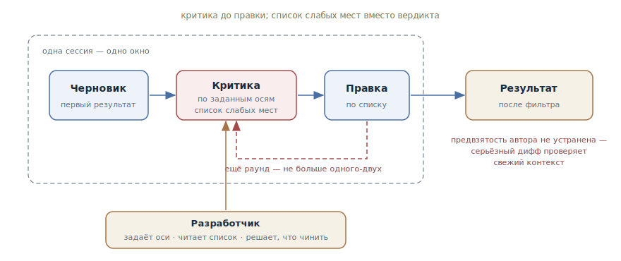

# Рефлексия

## Назначение

Отдельным ходом попросить агента раскритиковать собственный результат по
заданным осям и улучшить его по итогам критики: сгенерировал → оценил →
улучшил. Самый дешёвый ход проверки — без внешнего оракула, без свежей
сессии, внутри того же окна.

## Также известен как

Reflection (один из четырёх канонических паттернов Эндрю Ына), self-critique,
самокритика; в терминах Anthropic — evaluator-optimizer, повёрнутый в ручной
режим.

## Проблема

Первый ответ агента — черновик, даже когда выглядит законченным. Код
работает на счастливом пути, но граничные случаи не обработаны, ошибки
проглатываются, требование из середины разговора потеряно. При этом:

- Машинного оракула нет: читаемость, полнота обработки ошибок, соответствие
  требованиям и качество дизайна не проверяются тестом — сюда не дотягивается
  [петля обратной связи](give-agent-a-way-to-verify.md).
- Заводить свежую сессию на каждый черновик дорого: полноценный
  [писатель и рецензент](writer-reviewer.md) оправдан для серьёзного диффа,
  а не для каждой функции.
- Просьба «сделай лучше» без структуры даёт косметику: агент переименует
  переменные и добавит комментарии, не тронув настоящих слабых мест.

Забавный факт о моделях: они находят собственные ошибки, если их об этом
попросить, — но не ищут их по умолчанию, потому что закончили работу и
считают её хорошей.

## Решение

После того как результат получен, сделать два явных хода.

**Ход первый — критика без правки.** Попросить агента изучить собственную
работу и перечислить слабые места по осям, которые вы зададите: корректность,
граничные случаи, обработка ошибок, соответствие требованиям, простота.
Ключевые слова — «перечисли проблемы», а не «всё ли хорошо»: на вопрос-вердикт
агент отвечает «всё хорошо», на просьбу назвать три самых слабых места — ищет
и находит.

**Ход второй — правка по списку.** Из найденного чинится то, что того стоит:
список проблем сначала попадает к вам, и что чинить, а что принять как
осознанный компромисс — решение разработчика.

Разделение ходов — не формальность: критика, смешанная с правкой в одном
промпте, вырождается в «поправил и заодно похвалил». Оценка до улучшения.

У паттерна есть встроенный потолок: критик сидит в том же окне, что и автор,
и разделяет его слепые пятна. Рефлексия ловит то, что автор *способен*
увидеть, — упущенный случай, забытое требование, — но не ошибку в самом
рассуждении, которое привело к решению. Один-два раунда дают основной
прирост; дальше — полировка по кругу, и если результат всё ещё не внушает
доверия, нужен свежий контекст.

## Структура

Весь цикл живёт внутри одной сессии: черновик, критика по заданным осям,
правка по списку — и, при необходимости, ещё один раунд. Разработчик снаружи
задаёт оси критики и решает, что из списка чинить. Выход справа — результат с
пометкой: предвзятость автора не устранена, для серьёзных изменений финальную
проверку делает свежий контекст.

## Участники / Компоненты

- **Агент-автор и агент-критик** — одна и та же модель в одном окне: в этом
  дешевизна паттерна и его потолок.
- **Оси критики** — заданный разработчиком список: границы, ошибки,
  требования, простота. Без осей критика съезжает в косметику.
- **Список слабых мест** — артефакт первого хода; проходит через
  разработчика, а не сразу в правку.
- **Разработчик** — задаёт оси, читает список, решает, что чинить и сколько
  раундов крутить.

## Когда применять

- Там, где нет машинного оракула: качество дизайна, полнота обработки
  ошибок, читаемость, соответствие требованиям из разговора.
- Как штатный ход перед коммитом и перед ревью: дешёвая чистка, поднимающая
  планку того, что вообще доходит до людей.
- Для некодовых артефактов: спецификация, план, документация — «найди дыры в
  этом плане» работает так же, как для кода.
- Когда свежая сессия избыточна: правка невелика, а полный цикл
  писатель-рецензент дороже самой правки.

## Последствия и компромиссы

- ➕ Почти бесплатно: один-два хода в той же сессии, никакой инфраструктуры.
- ➕ Заметно поднимает первый черновик: типовые упущения — границы, ошибки,
  забытые требования — отлавливаются самим агентом.
- ➕ Работает на всём, что агент производит, — не только на коде.
- ➖ Критик предвзят: он автор. Ошибку в исходном рассуждении рефлексия не
  найдёт — она воспроизведёт её и в критике.
- ➖ Убывающая отдача: после второго раунда агент полирует и переставляет,
  а не находит новое.
- ➖ Риск ритуала: рефлексия «для галочки» с вердиктом «всё хорошо» создаёт
  ложную уверенность — хуже, чем ничего.

## Реализация

1. Дождитесь результата и попросите критику отдельным ходом — не в том же
   промпте, что и задача.
2. Задайте оси явно: «проверь на граничные случаи, обработку ошибок и
   соответствие требованиям из задачи». Оси без адреса — критика без адреса.
3. Форсируйте поиск: «перечисли три самых слабых места» вместо «всё ли в
   порядке». Вердикты запрещены, нужен список.
4. Прочитайте список сами: что чинить, что принять — ваше решение, иначе
   агент «исправит» и осознанные компромиссы.
5. Попросите правку по выбранным пунктам и остановитесь после одного-двух
   раундов.
6. Повторяющиеся оси упакуйте в команду — свою слэш-команду или скил, чтобы
   рефлексия была одним вызовом, а не абзацем текста каждый раз.
7. Калибруйте доверие: рефлексия — фильтр перед проверкой, а не замена ей.
   Серьёзный дифф после рефлексии всё равно идёт через
   [писателя и рецензента](writer-reviewer.md) или петлю с оракулом.

## Пример

Агент закончил функцию выгрузки отчёта в CSV. Прежде чем коммитить,
разработчик делает ход критики:

> Не защищай этот код — найди в нём проблемы. Перечисли три самых слабых
> места по осям: граничные случаи, обработка ошибок, память на больших
> данных. Пока ничего не правь.

Агент возвращает список: при ошибке записи файловый дескриптор не
закрывается; отчёт целиком собирается в памяти — на больших выгрузках это
сотни мегабайт; пустой отчёт выгружается без заголовков колонок, что ломает
внешний парсер. Разработчик отвечает:

> Первое и третье почини. Стриминг пока не делаем — выгрузки ограничены
> десятью тысячами строк, оставь комментарий с этим ограничением.

Две настоящие проблемы поймана до коммита ценой двух реплик. Заметьте, чего
не случилось: агент не «переписал получше» всё подряд и не тронул осознанный
компромисс с памятью — потому что список прошёл через разработчика.

## Анти-паттерны и частые ошибки

- **Вопрос-вердикт.** «Проверь, всё ли хорошо» получает «всё хорошо».
  Просите список слабых мест — числом.
- **Критика и правка одним промптом.** Смешанный ход вырождается в
  косметику с самопохвалой. Сначала список, потом решение, потом правка.
- **Рефлексия без осей.** «Улучши код» даёт переименования и комментарии.
  Оси задают, где копать.
- **Бесконечная полировка.** Третий раунд и дальше — перестановка мебели.
  Не находит нового — меняйте инструмент, а не повторяйте ход.
- **Рефлексия вместо проверки.** Самокритика не заменяет ни тестов, ни
  свежего взгляда: это фильтр, снижающий шум перед настоящей проверкой, и
  создавать ею уверенность нельзя.

## Известные применения

- **Эндрю Ын, четыре агентных паттерна** — Reflection в канонической
  формулировке: «LLM изучает собственную работу, чтобы найти способы её
  улучшить»; в связке с остальными паттернами агентный цикл поднимал
  GPT-3.5 на HumanEval с 48,1 % (zero-shot) до 95,1 %.
- **Reflexion (Shinn et al., NeurIPS 2023)** — агент-внутренний предок:
  вербальная саморефлексия, накапливаемая в эпизодической памяти между
  попытками.
- **Anthropic, evaluator-optimizer** — тот же цикл «генератор — оценщик» как
  автоматизированный воркфлоу из «Building effective agents»; рефлексия —
  его ручной, управляемый разработчиком случай.
- **Constitutional AI** — самокритика как механизм обучения: модель
  критикует собственные ответы против списка принципов и переписывает их —
  свидетельство, что самокритика у моделей работает, если её запросить.

## Связанные паттерны

- [Петля обратной связи](give-agent-a-way-to-verify.md) — когда есть
  машинный оракул, он всегда сильнее самокритики; рефлексия закрывает то,
  до чего оракул не дотягивается.
- [Писатель и рецензент](writer-reviewer.md) — следующая ступень: критик со
  свежим контекстом, не разделяющий слепых пятен автора. Рефлексия — фильтр
  перед ним, а не замена.
- [TDD с агентом](tdd-with-agent.md) — сосед по секции: TDD страхует
  корректность оракулом до кода, рефлексия чистит то, что оракулом не
  выражается.
