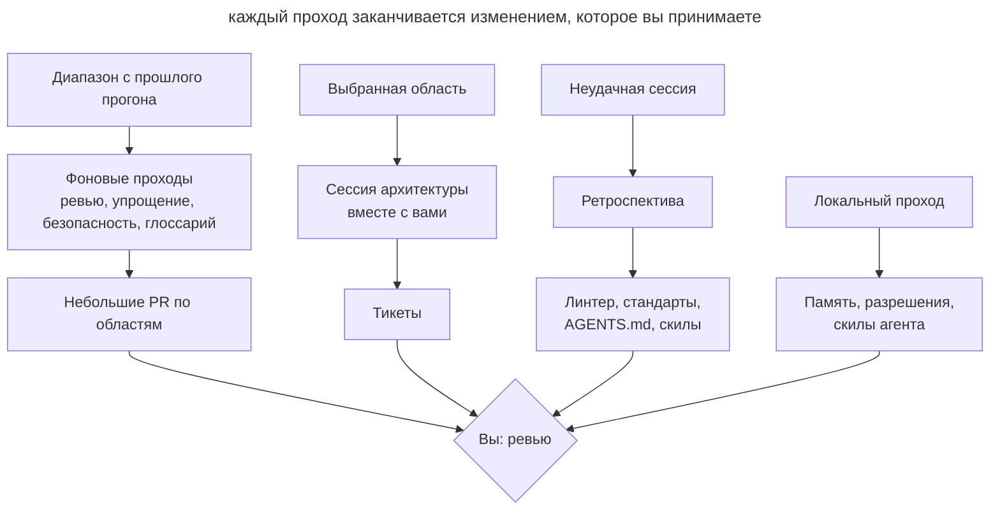

# Плановое обслуживание

## Назначение

Регулярно запускать агента на проходы, которые ищут дрейф кода, документации и агентского окружения, и возвращать результат небольшими PR или тикетами. Каждый проход имеет свою частоту, свою область и свой способ запуска: в облаке, локально или вместе с вами.

## Также известен как

Garbage collection, doc gardening, maintenance routines, регулярные задачи, санитарные проходы.

## Проблема

Агенты пишут десятки тысяч строк в неделю. Ревью каждого PR проверяет только его diff. Если три PR по отдельности нарушают стандарт чуть-чуть и в разных местах, ни одно ревью этого не заметит, а через месяц отклонение станет новой нормой, которую агент копирует дальше.

Вместе с кодом устаревает всё, что помогает агенту работать. Глоссарий не знает о новых моделях, в _AGENTS.md_ копятся правила, которые уже ничего не меняют, скил запуска приложения ссылается на удалённый скрипт, allowlist разрешений разрастается, а в личной памяти агента оседают факты о проекте, которых нет в репозитории. Каждая такая мелочь стоит агенту лишних вызовов и ошибок в каждой следующей сессии.

Разовая чистка «когда станет совсем плохо» не работает: к этому моменту дрейф уже разошёлся по кодовой базе, и исправление превращается в большой рискованный рефакторинг. Ручная еженедельная уборка тоже не масштабируется: команда тратит на неё день и всё равно не успевает за объёмом.

## Решение

Составьте список регулярных проходов и для каждого определите четыре вещи.

1. **Что дрейфует.** Код относительно стандартов, доменный язык относительно глоссария, инструкции относительно практики, окружение агента относительно реального проекта.
2. **Частоту.** Она зависит от скорости дрейфа. Всё, что следует за кодом, проверяйте раз в неделю. Инструкции и окружение агента меняются медленнее, их достаточно смотреть раз в месяц.
3. **Область.** Проход по всему репозиторию даёт поверхностный отчёт. Задайте диапазон коммитов, каталоги с наибольшим числом изменений, слой или доменное понятие.
4. **Способ запуска.** Проходу, которому нужен только репозиторий, подходит фоновая задача в облаке. Проходу, которому нужны ваша память, транскрипты или поднятое приложение, нужна ваша машина. Проход с решениями, которые принимаете только вы, проводится вместе с вами.

Результат каждого прохода должен быть действием, а не отчётом: PR с правками по одной области или тикеты. Отчёт, который никто не превратил в изменение, только добавляет шум.

Отдельно от плановых проходов держите разбор по событию. Ретроспектива сессии полезна сразу после неудачной работы, пока вы помните, что пошло не так. Через неделю разбирать уже нечего.

## Структура

Схема показывает три способа запуска и то, куда приходит результат каждого.



Фоновые проходы работают без вас и приходят готовыми PR. Находки недельного ревью подсказывают, какую область взять на сессию архитектуры. Ретроспектива запускается не по расписанию, а по неудачной сессии. Локальные проходы обслуживают сам инструмент и в проект попадают редко.

## Участники / Компоненты

- **Расписание** запускает проходы с заданной частотой и хранит их промпты.
- **Точка отсчёта** задаёт диапазон: тег прошлого прогона или дата.
- **Проход** проверяет одну область на один вид дрейфа.
- **Эталон** описывает норму: стандарты кодирования, глоссарий, ADR, _AGENTS.md_.
- **Результат** оформляет находки как PR или тикеты.
- **Вы** принимаете изменения, выбираете область для архитектуры и отвечаете на вопросы ретроспективы.

## Когда применять

- Агенты пишут больше кода, чем команда успевает внимательно прочитать.
- В проекте есть эталон, с которым можно сверяться: стандарты, глоссарий, ADR.
- Над репозиторием работают несколько людей или несколько параллельных сессий.
- В проекте уже накопилось агентское окружение: инструкции, скилы, хуки, разрешения.

В маленьком проекте с одним разработчиком и редкими изменениями достаточно ретроспективы после неудачных сессий и ежемесячного прохода по инструкциям.

## Последствия и компромиссы

- ➕ Дрейф исправляется мелкими шагами, пока он ещё локален.
- ➕ Инструкции и скилы остаются короткими и соответствуют реальной работе.
- ➕ Фоновые проходы не требуют вашего времени до момента ревью.
- ➖ Недельные PR тоже нужно читать; если они копятся, проходы теряют смысл.
- ➖ Фоновый агент ошибается так же, как любой другой, поэтому его PR проходят обычное ревью.
- ➖ Проходы стоят токенов и лимитов, особенно на больших диапазонах.
- ➖ Расписание устаревает вместе с проектом и само требует пересмотра.

## Реализация

1. Выпишите, что в проекте служит эталоном и что может от него отставать. Без эталона ревью стандартов и проверка глоссария превращаются во вкусовщину.
2. Для каждого прохода задайте частоту, область и формат результата. Начните с недельного ревью стандартов и ежемесячного прохода по инструкциям, остальное добавляйте, когда появится повторяющаяся проблема.
3. Задавайте диапазон явно. Фоновая задача не обязана помнить прошлый запуск: передавайте в промпт тег прогона или период вида «коммиты за последние 7 дней».
4. Режьте большой diff по каталогам. Десятки тысяч строк не помещаются в один проход, поэтому запускайте по задаче на каждую крупную область.
5. Разделяйте проходы по проекту и обслуживание инструмента. Первые меняют репозиторий и идут в PR; вторые меняют ваши настройки и память.
6. Раз в месяц просматривайте само расписание: какие проходы давно ничего не находят, а какие дают PR, которые никто не читает.

### Проходы по проекту

Эти проходы не зависят от агента. Большая часть из них — [скиллы Мэтта Покока](matt-pocock-skills.md), и пак нужно установить заранее: `npx skills@latest add mattpocock/skills`, затем один раз `/setup-matt-pocock-skills`. Установщик кладёт скилы в _.agents/skills_, откуда их читает Codex; Claude Code читает только _.claude/skills_, поэтому там должны быть ссылки на них. В Claude Code скил вызывается как `/имя`, в Codex как `$имя`. Там, где у агента есть встроенная команда, она описана в том же подразделе.

#### Ретроспектива

**Что это.** Скил `retro` из раздела in-progress пака Мэтта Покока ([исходник](https://github.com/mattpocock/skills/tree/main/skills/in-progress/retro)). Модель не вызывает его сама, запускаете только вы.

**Как работает.** Скил подгружает `writing-for-agents` как руководство по стилю и читает транскрипт сессии, по умолчанию текущей. Улучшения он ищет в семи категориях: навигация по проекту, автоматические проверки, стандарты для ревью, _AGENTS.md_, экономия вызовов, правила, которые ничего не меняют, и доступ к информации. Механическое нарушение он предлагает ловить линтером, хуком или CI, а в стандарты записывать только то, что требует суждения. Кандидатов показывает по убыванию важности и сам ничего не меняет.

**Когда.** Сразу после сессии, где агент буксовал: много исправлений, откат, долгий поиск, повторная ошибка.

**Запуск.**

```text
/retro агент трижды искал, где настраиваются рассылки, и дважды правил сгенерированный файл
```

В Codex тот же текст начинается с `$retro`. Принятые предложения вы реализуете в этой же сессии.

#### Ревью стандартов

**Что это.** Скил `code-review` из пака ([исходник](https://github.com/mattpocock/skills/tree/main/skills/engineering/code-review)). В Claude Code есть встроенная команда `/code-review`, которая ищет ошибки корректности. Скил проекта с тем же именем её заменяет, а встроенная остаётся доступна как `/review`.

**Как работает.** Скил берёт diff от точки отсчёта (`git diff <точка>...HEAD`) и находит документы со стандартами, например _CODING_STANDARDS.md_ и _CONTRIBUTING.md_. Затем запускает два сабагента параллельно. Standards сверяет diff со стандартами проекта и с базовым списком запахов кода из «Рефакторинга» Фаулера. Spec сверяет diff с исходной задачей. Для планового прохода нужна только ось Standards. Нарушения делятся на жёсткие и спорные, у каждого есть ссылка на правило.

**Когда.** Раз в неделю, облачной задачей, по отдельной задаче на каждую крупную область.

**Запуск.** Промпт для задачи по одной области:

```text
/code-review от последнего коммита main старше 7 дней, только ось Standards, только каталог app/services. Исправь нарушения и открой PR, в описании перечисли нарушенные правила из CODING_STANDARDS.md
```

В Codex тот же промпт начинается с `$code-review`. Там есть и встроенная команда `codex review --base <ветка>`, которая берёт правила ревью из раздела `## Code Review Rules` в _AGENTS.md_ ([документация](https://learn.chatgpt.com/docs/code-review)). Автоматическое ревью PR на GitHub (`@codex review`) смотрит один PR и сообщает только о серьёзных проблемах, поэтому недельный проход оно не заменяет.

#### Упрощение

**Что это.** В Claude Code встроенный скил `/simplify` ([документация](https://code.claude.com/docs/en/commands)). В Codex встроенного аналога нет.

**Как работает.** Четыре сабагента параллельно смотрят изменённый код: переиспользование существующих хелперов, упрощение, эффективность и уровень абстракции. Найденное сразу исправляется. Ошибки корректности `/simplify` не ищет, для них есть `/code-review`. Аргументом можно передать путь или PR.

**Когда.** Раз в неделю по 3–5 каталогам с наибольшим числом изменений.

**Запуск.** Облачная задача сначала определяет каталоги по `git log --since="7 days ago" --stat`, затем запускает команду по каждому:

```text
/simplify app/services
```

В Codex используйте обычный промпт: «найди повторы, лишние слои и мёртвый код в изменениях за неделю в app/services и убери их».

#### Ревью безопасности

**Что это.** В Claude Code встроенная команда `/security-review` ([документация](https://code.claude.com/docs/en/security-guidance), [исходник](https://github.com/anthropics/claude-code-security-review)). В Codex упоминание `@codex security review` в PR и отдельный плагин Codex Security ([документация](https://learn.chatgpt.com/docs/security)).

**Как работает.** `/security-review` берёт diff текущей ветки с веткой по умолчанию в `origin` и ищет инъекции, ошибки авторизации и утечки данных. Диапазон коммитов она не принимает. `@codex security review` проверяет PR, полный отчёт появляется во вкладке Security Report задачи.

**Когда.** На каждой ветке перед слиянием и раз в неделю по основной ветке.

**Запуск.** На ветке перед слиянием:

```text
/security-review
```

Недельный проход по основной ветке ставится облачной задачей с обычным промптом:

```text
Проверь безопасность изменений в main за последние 7 дней: авторизация, платежи, загрузка файлов, вызовы внешних API. На каждую подтверждённую находку открой отдельный PR с исправлением и тестом, который её воспроизводит
```

#### Проверка глоссария

**Что это.** Скил `domain-modeling` из пака ([исходник](https://github.com/mattpocock/skills/tree/main/skills/engineering/domain-modeling)).

**Как работает.** Скил сверяет термины в коде и разговоре с _CONTEXT.md_ и указывает на противоречия: глоссарий называет понятие одним словом, а код другим, или код ведёт себя не так, как описано. Разрешённый термин он записывает в глоссарий сразу. _CONTEXT.md_ остаётся только словарём, без деталей реализации. Если в корне есть _CONTEXT-MAP.md_, скил работает с несколькими контекстами.

**Когда.** Раз в неделю, облачной задачей.

**Запуск.**

```text
/domain-modeling сверь CONTEXT.md с моделями и сервисами, добавленными в main за 7 дней: новые понятия без записи, записи со старыми именами классов, термины из раздела Avoid, которые снова появились в коде. Правки глоссария оформи PR, спорные термины перечисли в описании
```

Скил рассчитан на разговор с вами. В облачной задаче спросить некого, поэтому спорные термины уходят в описание PR, и решаете их вы.

#### Архитектура

**Что это.** Скил `improve-codebase-architecture` из пака ([исходник](https://github.com/mattpocock/skills/tree/main/skills/engineering/improve-codebase-architecture)). Он сам подгружает `codebase-design` и `grilling`. План превращается в тикеты скилом `to-tickets` ([исходник](https://github.com/mattpocock/skills/tree/main/skills/engineering/to-tickets)).

**Как работает.** Скил берёт из `codebase-design` словарь: модуль, интерфейс, глубина, шов, адаптер. Затем читает _CONTEXT.md_ и ADR выбранной области, и сабагент обходит код в поисках трения: чтобы понять одно понятие, приходится прыгать по многим мелким модулям; интерфейс почти так же сложен, как реализация; модули протекают друг в друга через швы. Подозрительные модули проверяются тестом удаления: если удалить модуль, сложность соберётся в одном месте или просто переедет? Кандидатов скил показывает HTML-отчётом во временной папке. По выбранному кандидату проводит `grilling` и при желании сравнивает варианты интерфейса через design-it-twice. `to-tickets` режет план на вертикальные срезы с блокирующими связями и публикует их в трекер.

**Когда.** Раз в неделю, вместе с вами. Область по очереди: слой или доменное понятие. Выбирайте её там, где недельные ревью и упрощение нашли больше всего.

**Запуск.**

```text
/improve-codebase-architecture app/services
```

После разбора выбранного места запустите `/to-tickets`.

#### Инструкции для агентов

**Что это.** Скил `writing-for-agents` из пака ([исходник](https://github.com/mattpocock/skills/tree/main/skills/productivity/writing-for-agents)).

**Как работает.** Это справочник о том, как писать документы для агента. Он разбирает указатели на контекст, две нагрузки (на контекст агента и на внимание человека), порядок шагов и справки, критерии завершения и единый источник правды. С ним видны дубли между файлами, разросшиеся документы и запреты, которые тянут внимание к запрещённому сильнее, чем отводят от него.

**Когда.** Раз в месяц.

**Запуск.**

```text
/writing-for-agents пройди AGENTS.md, CODING_STANDARDS.md и docs/agents/: найди дубли между файлами, правила, которые разошлись с тем, как мы работаем, и то, что стоит вынести за указатель
```

#### Свои скилы

**Что это.** Тот же `writing-for-agents`. Для скилов он дополнительно разбирает frontmatter и способ вызова.

**Как работает.** Скил сверяет инструкции со справочником и с тем, как скил реально срабатывает: описание должно называть случаи, в которых скил нужен, а шаги должны заканчиваться проверяемым критерием.

**Когда.** Раз в месяц.

**Запуск.**

```text
/writing-for-agents пройди скилы, которые мы написали сами: run-app и finish-task. Убери шаги, которые агент больше не выполняет, и поправь описания так, чтобы скил срабатывал, когда нужен
```

#### ADR

**Что это.** Тот же `domain-modeling`.

**Как работает.** Скил читает _docs/adr_, сверяет решения с кодом и более поздними ADR и проставляет статусы и ссылки.

**Когда.** Раз в месяц.

**Запуск.**

```text
/domain-modeling пройди docs/adr: какие решения заменены более поздними, какие так и не реализованы. Проставь статусы и ссылки на заменившие ADR
```

#### Память агента

**Что это.** Обычный промпт, отдельной команды нет. В Claude Code автопамять лежит в _~/.claude/projects/&lt;проект&gt;/memory_, а `/memory` показывает записи ([документация](https://code.claude.com/docs/en/memory)). В Codex есть Memories в _~/.codex/memories/_; по умолчанию они выключены ([документация](https://learn.chatgpt.com/docs/customization/memories)).

**Как работает.** Агент читает свою память и сверяет её с репозиторием. В Claude Code фоновая консолидация (настройка `autoDreamEnabled`) уже удаляет устаревшие записи и помечает противоречия с _CLAUDE.md_, но факты о проекте в репозиторий не переносит. Документация Codex не рекомендует править Memories руками, поэтому там факты переносятся в _AGENTS.md_, а генерацию при необходимости отключают через `memories.generate_memories`.

**Когда.** Раз в месяц, локально.

**Запуск.**

```text
Пройди свою память по этому проекту. Факты о коде, командах и устройстве проекта перенеси в AGENTS.md или docs/, если их там нет, и удали из памяти. Оставь только то, как работать со мной
```

### Расписание и обслуживание в Claude Code

Сверено с Claude Code 2.1.283 и [справочником команд](https://code.claude.com/docs/en/commands) на 2026-09-26. Названия команд меняются быстрее, чем сам подход. Всё, кроме `/schedule`, запускается локально: этим командам нужны ваши транскрипты, настройки или поднятое окружение.

#### Расписание: `/schedule`

**Что это.** Встроенная команда, она же `/routines` ([документация](https://code.claude.com/docs/en/routines)).

**Как работает.** Команда в разговоре создаёт облачную задачу: спрашивает расписание, репозиторий и промпт. Каждый запуск клонирует репозиторий с веткой по умолчанию и может пользоваться подключёнными коннекторами. Результат задача отдаёт как PR из ветки с префиксом `claude/`, ход запуска виден в транскрипте на claude.ai.

**Запуск.**

```text
/schedule каждый понедельник в 9:00 проверяй стандарты в main за последние 7 дней по каталогам app/services, app/policies и app/javascript, отдельный PR на каждый каталог
```

#### Разрешения: `/fewer-permission-prompts`

**Что это.** Встроенный скил.

**Как работает.** Скил читает транскрипты сессий, собирает частые вызовы Bash и MCP только для чтения и предлагает список по приоритету. После вашего согласия дописывает правила в `permissions.allow` общего _.claude/settings.json_.

**Когда.** Раз в месяц.

**Запуск.**

```text
/fewer-permission-prompts
```

#### Здоровье установки: `/doctor`

**Что это.** Встроенный скил.

**Как работает.** Скил проверяет установку (дубли, `PATH`, повреждённые файлы настроек) и версию. Он находит неиспользуемые скилы, MCP-серверы и плагины с их стоимостью в контексте и отмечает медленные хуки. Файлы _CLAUDE.md_ он чистит от дублей и от того, что можно узнать из кода. Часто отклоняемые команды только для чтения добавляет в личный _.claude/settings.local.json_. _AGENTS.md_ в его проверках нет, поэтому инструкции сокращает проход `writing-for-agents`.

**Когда.** Раз в месяц, после `/fewer-permission-prompts`.

**Запуск.**

```text
/doctor
```

#### Скилы: `/skill-doctor`

**Что это.** Встроенная команда, работает с версии 2.1.252.

**Как работает.** Команда показывает для каждого скила, сколько он стоит в контексте и как часто используется, чтобы было видно, что отключить. Скилы, которых нет в _.claude/skills_, Claude Code не видит вовсе, поэтому заодно проверьте, что ссылки на _.agents/skills_ на месте.

**Когда.** Раз в месяц.

**Запуск.**

```text
/skill-doctor какие скилы окупают свои токены, а какие мёртвый груз
```

#### Запуск приложения: `/run-skill-generator`

**Что это.** Встроенный скил.

**Как работает.** Скил пишет проектный скил, который учит `/run` и `/verify` собирать, запускать и проверять ваше приложение с чистого окружения. Если записанный скил перестал работать, `/run` сам предлагает его обновить. Claude правит файл, только когда запуск пошёл не так.

**Когда.** Раз в месяц и каждый раз, когда `/run` сообщает, что скил устарел.

**Запуск.**

```text
/run-skill-generator
```

### Расписание и обслуживание в Codex

Сверено с Codex CLI 0.156.1 и документацией на learn.chatgpt.com на 2026-09-26.

#### Расписание: Scheduled tasks и `codex-action`

**Что это.** Scheduled tasks — функция приложения Codex ([документация](https://learn.chatgpt.com/docs/automations)). `openai/codex-action` — GitHub Action, который запускает Codex в CI ([документация](https://learn.chatgpt.com/docs/github-action), [исходник](https://github.com/openai/codex-action)).

**Как работает.** Задача в приложении запускается в локальном проекте или в отдельном worktree по расписанию и работает без подтверждений (`approval_policy = "never"`) в вашей песочнице по умолчанию. Результат приходит в раздел Scheduled, который работает как входящие. Компьютер и приложение при этом должны быть включены. Action запускает `codex exec` на любом триггере GitHub, включая cron, и не зависит от вашей машины. PR он сам не открывает, для этого нужен отдельный шаг.

**Запуск.** В приложении создайте задачу в разделе Scheduled с расписанием и промптом, например `$code-review от последнего коммита main старше 7 дней, только ось Standards, только app/services`. В CI тот же проход выглядит так:

```yaml
on:
  schedule:
    - cron: "0 6 * * 1"
jobs:
  standards:
    runs-on: ubuntu-latest
    permissions:
      contents: write
      pull-requests: write
    steps:
      - uses: actions/checkout@v5
        with:
          fetch-depth: 0
      - uses: openai/codex-action@v1
        with:
          openai-api-key: ${{ secrets.OPENAI_API_KEY }}
          prompt-file: .github/prompts/weekly-standards.md
      - uses: peter-evans/create-pull-request@v7
        with:
          branch: maintenance/weekly-standards
          title: "refactor: weekly standards pass"
```

Перед тем как ставить проход на расписание, убедитесь, что песочница не даёт ему выйти за пределы репозитория.

#### Разрешения: правила `.rules`

**Что это.** Механизм правил выполнения команд, помечен как экспериментальный ([документация](https://learn.chatgpt.com/docs/agent-configuration/rules)).

**Как работает.** Правила пишутся как `prefix_rule(pattern=[...], decision="allow" | "prompt" | "forbidden")` в файлах _.rules_ рядом с каждым слоем конфигурации: _~/.codex/rules/_ и _.codex/rules/_ в доверенном проекте. Из подходящих правил побеждает самое строгое. Каждое «разрешить» в TUI дописывает правило в _~/.codex/rules/default.rules_, а команды для просмотра и чистки нет.

**Когда.** Раз в месяц: просмотрите файл руками, общие правила перенесите в _.codex/rules/_ репозитория, лишние удалите.

**Запуск.** Проверка, как правила решат конкретную команду:

```text
codex execpolicy check --pretty --rules ~/.codex/rules/default.rules -- git push origin main
```

#### Здоровье установки: `codex doctor`

**Что это.** Встроенная команда CLI ([документация](https://learn.chatgpt.com/docs/cli/reference)).

**Как работает.** Команда проверяет установку, конфигурацию, авторизацию, окружение, Git и терминал. В TUI `/debug-config` показывает слои конфигурации, а `/hooks` показывает хуки и позволяет доверить или отключить их ([документация](https://learn.chatgpt.com/docs/hooks)).

**Когда.** Раз в месяц.

**Запуск.**

```text
codex doctor
```

#### Размер _AGENTS.md_

**Что это.** Лимит конфигурации `project_doc_max_bytes`, по умолчанию 32 KiB ([документация](https://learn.chatgpt.com/docs/agent-configuration/agents-md)).

**Как работает.** Codex собирает _AGENTS.md_ от корня проекта до рабочего каталога и прекращает загрузку, когда суммарный размер доходит до лимита. Предупреждения нет: правила из последних файлов просто не попадают в контекст.

**Когда.** Раз в месяц, вместе с проходом `writing-for-agents`.

**Запуск.** Попросите агента в том же проходе посчитать суммарный размер всех _AGENTS.md_ по пути к самым глубоким каталогам и сравнить с лимитом.

#### Скилы

**Что это.** Настройка `[[skills.config]]` в _config.toml_ ([документация](https://learn.chatgpt.com/docs/build-skills)). Аналога `/skill-doctor` нет.

**Как работает.** Codex читает _.agents/skills_ напрямую, симлинки не нужны. Неиспользуемый скил отключают записью `[[skills.config]]` с `enabled = false`. Как часто скил срабатывает, можно оценить по сессиям в _~/.codex/sessions_.

**Когда.** Раз в месяц.

**Запуск.**

```text
Посчитай по сессиям в ~/.codex/sessions за последний месяц, какие скилы из .agents/skills вызывались и сколько раз. Перечисли те, что не вызывались ни разу
```

#### Запуск приложения

**Что это.** Local environments приложения Codex ([документация](https://learn.chatgpt.com/docs/environments/local-environment)). Генератора скила запуска нет.

**Как работает.** В Local environments описываются скрипты подготовки worktree и частые действия, например запуск приложения.

**Когда.** Раз в месяц: проверьте, что скрипты по-прежнему поднимают приложение с нуля.

## Пример

В проекте за неделю приходит около двадцати тысяч строк, стандарты лежат в _CODING_STANDARDS.md_, код разложен по слоям в _app/_. Недельная задача ревью стандартов получает такой промпт.

> Проверь соответствие стандартам в main за последние 7 дней. Используй скил code-review, только ось Standards. Раздели изменения по каталогам верхнего уровня в app/ и пройди каждый отдельно. На каждую область с находками открой отдельный PR и перечисли в описании нарушенные правила из CODING_STANDARDS.md со ссылками на коммиты, где они появились.

В понедельник приходят три PR: в _app/services_ два сервиса снова ходят в базу мимо репозиториев, в _app/policies_ появилась проверка роли через строку вместо перечисления, в _app/javascript/pages_ дублируется форматирование дат. Первые два PR вы принимаете после короткого ревью. Третий показывает, что правило про форматирование дат можно проверить линтером, и вы заводите тикет на правило вместо строчки в стандартах.

На сессию архитектуры в эту неделю вы берёте _app/services_: там больше всего находок второй месяц подряд. Отчёт показывает, что сервисы тонкие и почти целиком пересказывают репозитории; выбранное место прорабатывается до плана и уходит тикетами.

## Антипаттерны и частые ошибки

- **Проход по всему репозиторию.** Агент понемногу смотрит всё и находит только очевидное. Задавайте область.
- **Один большой PR.** Правки по всем областям в одном PR невозможно ревьюить, его откладывают, и следующий проход находит то же самое.
- **Отчёт вместо изменения.** HTML-отчёты копятся во временной папке, и ничего не меняется.
- **Ретроспектива по памяти.** Разбор сессий недельной давности опирается на то, что никто уже не помнит.
- **Надежда на ревью каждого PR.** Автоматическое ревью PR ловит ошибки в diff, но не отклонение, которое складывается из многих PR.
- **Обслуживание инструмента вперемешку с проектом.** Правки личных разрешений и памяти попадают в командный PR или, наоборот, командные правила остаются в личных настройках.
- **Расписание без пересмотра.** Проходы, которые давно ничего не находят, продолжают тратить лимиты, а PR от них перестают читать.

## Известные применения

- **OpenAI** описывает в статье [Harness engineering](https://openai.com/index/harness-engineering/) фоновые задачи Codex, которые с регулярной частотой ищут отклонения от «золотых принципов», обновляют оценки качества по доменам и слоям и открывают целевые PR с рефакторингом. Отдельный агент doc-gardening ищет устаревшую документацию. Раньше команда тратила на уборку каждую пятницу, и это не масштабировалось.
- **Скиллы Мэтта Покока** дают готовые проходы для регулярного запуска: `retro`, `code-review`, `domain-modeling`, `writing-for-agents`, `improve-codebase-architecture`.
- **Claude Code** содержит встроенные проверки окружения `/doctor`, `/skill-doctor` и `/fewer-permission-prompts`, а `/schedule` запускает облачные задачи по расписанию.
- **Codex** в документации к Scheduled tasks приводит пример задачи, которая просматривает прошлые сессии и улучшает скилы.

## Связанные паттерны

- [Память проекта](claude-md-memory.md) описывает файл инструкций, который ежемесячный проход держит коротким.
- [Раздутая память](bloated-claude-md.md) показывает, во что превращаются инструкции без регулярной чистки.
- [Словарь домена](domain-context-file.md) задаёт эталон для недельной проверки глоссария.
- [Скиллы](skills-as-packaged-workflows.md) упаковывают проходы так, чтобы их можно было запускать по расписанию.
- [Писатель и рецензент](writer-reviewer.md) разделяет написание и ревью; плановое ревью стандартов работает на уровне недели, а не одного PR.
- [Исполняемые ограничения](executable-guardrails.md) получают новые проверки из ретроспектив и ограничивают фоновые задачи песочницей.
