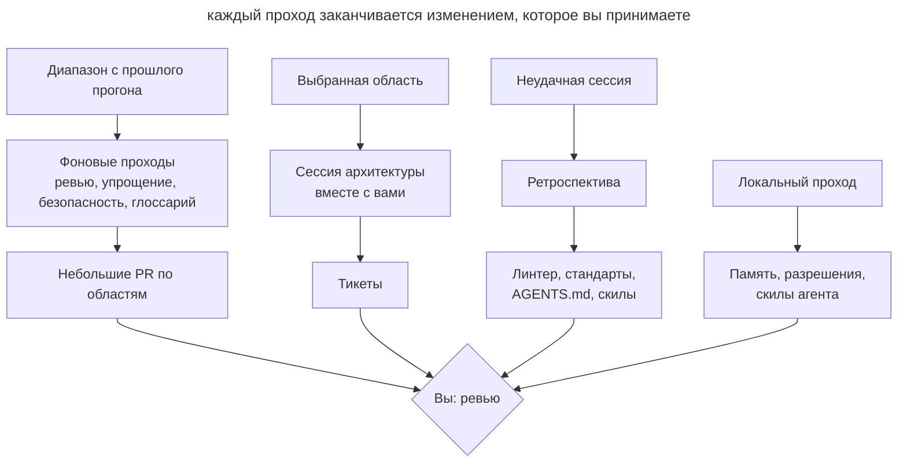

# Плановое обслуживание

## Назначение

Регулярно запускать агента на проходы, которые ищут дрейф кода, документации и агентского окружения, и возвращать результат небольшими PR или тикетами. Каждый проход имеет свою частоту, свою область и свой способ запуска: в облаке, локально или вместе с вами.

## Также известен как

Garbage collection, doc gardening, maintenance routines, регулярные задачи, санитарные проходы.

## Проблема

Агенты пишут десятки тысяч строк в неделю. Ревью каждого PR проверяет только его diff. Если три PR по отдельности нарушают стандарт чуть-чуть и в разных местах, ни одно ревью этого не заметит, а через месяц отклонение станет новой нормой, которую агент копирует дальше.

Вместе с кодом устаревает всё, что помогает агенту работать. Глоссарий не знает о новых моделях, в _AGENTS.md_ копятся правила, которые уже ничего не меняют, скил запуска приложения ссылается на удалённый скрипт, allowlist разрешений разрастается, а в личной памяти агента оседают факты о проекте, которых нет в репозитории. Каждая такая мелочь стоит агенту лишних вызовов и ошибок в каждой следующей сессии.

Разовая чистка «когда станет совсем плохо» не работает: к этому моменту дрейф уже разошёлся по кодовой базе, и исправление превращается в большой рискованный рефакторинг. Ручная еженедельная уборка тоже не масштабируется: команда тратит на неё день и всё равно не успевает за объёмом.

## Решение

Составьте список регулярных проходов и для каждого определите четыре вещи.

1. **Что дрейфует.** Код относительно стандартов, доменный язык относительно глоссария, инструкции относительно практики, окружение агента относительно реального проекта.
2. **Частоту.** Она зависит от скорости дрейфа. Всё, что следует за кодом, проверяйте раз в неделю. Инструкции и окружение агента меняются медленнее, их достаточно смотреть раз в месяц.
3. **Область.** Проход по всему репозиторию даёт поверхностный отчёт. Задайте диапазон коммитов, каталоги с наибольшим числом изменений, слой или доменное понятие.
4. **Способ запуска.** Проходу, которому нужен только репозиторий, подходит фоновая задача в облаке. Проходу, которому нужны ваша память, транскрипты или поднятое приложение, нужна ваша машина. Проход с решениями, которые принимаете только вы, проводится вместе с вами.

Результат каждого прохода должен быть действием, а не отчётом: PR с правками по одной области или тикеты. Отчёт, который никто не превратил в изменение, только добавляет шум.

Отдельно от плановых проходов держите разбор по событию. Ретроспектива сессии полезна сразу после неудачной работы, пока вы помните, что пошло не так. Через неделю разбирать уже нечего.

## Структура

Схема показывает три способа запуска и то, куда приходит результат каждого.

Фоновые проходы работают без вас и приходят готовыми PR. Находки недельного ревью подсказывают, какую область взять на сессию архитектуры. Ретроспектива запускается не по расписанию, а по неудачной сессии. Локальные проходы обслуживают сам инструмент и в проект попадают редко.

## Участники / Компоненты

- **Расписание** запускает проходы с заданной частотой и хранит их промпты.
- **Точка отсчёта** задаёт диапазон: тег прошлого прогона или дата.
- **Проход** проверяет одну область на один вид дрейфа.
- **Эталон** описывает норму: стандарты кодирования, глоссарий, ADR, _AGENTS.md_.
- **Результат** оформляет находки как PR или тикеты.
- **Вы** принимаете изменения, выбираете область для архитектуры и отвечаете на вопросы ретроспективы.

## Когда применять

- Агенты пишут больше кода, чем команда успевает внимательно прочитать.
- В проекте есть эталон, с которым можно сверяться: стандарты, глоссарий, ADR.
- Над репозиторием работают несколько людей или несколько параллельных сессий.
- В проекте уже накопилось агентское окружение: инструкции, скилы, хуки, разрешения.

В маленьком проекте с одним разработчиком и редкими изменениями достаточно ретроспективы после неудачных сессий и ежемесячного прохода по инструкциям.

## Последствия и компромиссы

- ➕ Дрейф исправляется мелкими шагами, пока он ещё локален.
- ➕ Инструкции и скилы остаются короткими и соответствуют реальной работе.
- ➕ Фоновые проходы не требуют вашего времени до момента ревью.
- ➖ Недельные PR тоже нужно читать; если они копятся, проходы теряют смысл.
- ➖ Фоновый агент ошибается так же, как любой другой, поэтому его PR проходят обычное ревью.
- ➖ Проходы стоят токенов и лимитов, особенно на больших диапазонах.
- ➖ Расписание устаревает вместе с проектом и само требует пересмотра.

## Реализация

1. Выпишите, что в проекте служит эталоном и что может от него отставать. Без эталона ревью стандартов и проверка глоссария превращаются во вкусовщину.
2. Для каждого прохода задайте частоту, область и формат результата. Начните с недельного ревью стандартов и ежемесячного прохода по инструкциям, остальное добавляйте, когда появится повторяющаяся проблема.
3. Задавайте диапазон явно. Фоновая задача не обязана помнить прошлый запуск: передавайте в промпт тег прогона или период вида «коммиты за последние 7 дней».
4. Режьте большой diff по каталогам. Десятки тысяч строк не помещаются в один проход, поэтому запускайте по задаче на каждую крупную область.
5. Разделяйте проходы по проекту и обслуживание инструмента. Первые меняют репозиторий и идут в PR; вторые меняют ваши настройки и память.
6. Раз в месяц просматривайте само расписание: какие проходы давно ничего не находят, а какие дают PR, которые никто не читает.

### Общий набор

Проходы ниже не зависят от агента. Большая часть опирается на [скиллы Мэтта Покока](matt-pocock-skills.md), которые одинаково лежат в _.agents/skills_ для Claude Code и Codex.

| Частота | Проход | Результат |
|---|---|---|
| сразу после сессии, где агент буксовал | `retro` в этой же сессии | Предложения по окружению. Механические нарушения ловит линтер, хук или CI; правила-суждения записаны в стандарты для ревью; из _AGENTS.md_ убраны правила, которые ничего не меняют |
| раз в неделю | `code-review` по основной ветке за неделю, только ось стандартов, по одной задаче на область | Отклонение от стандартов, которое не видно по одному PR, исправлено отдельными PR |
| раз в неделю | Упрощение 3–5 каталогов с наибольшим числом изменений за неделю | Повторы, лишние слои и мёртвый код удалены |
| раз в неделю | Ревью безопасности изменений за неделю, прежде всего авторизации, платежей, загрузки файлов и внешних API | Находки исправлены |
| раз в неделю | `domain-modeling` по _CONTEXT.md_ | Новые модели внесены в глоссарий, переименования отражены, запрещённые термины убраны из кода |
| раз в неделю | `improve-codebase-architecture <область>` вместе с вами; область по очереди: слой или доменное понятие | Одно место, где модуль стоит углубить, проработано до плана и разбито на тикеты через `to-tickets` |
| раз в месяц | `writing-for-agents` по _AGENTS.md_, стандартам ревью и документации для агентов | Дубли между файлами убраны, правила, разошедшиеся с практикой, исправлены |
| раз в месяц | `writing-for-agents` по своим скилам | Мёртвые шаги убраны, описания поправлены так, чтобы скил срабатывал, когда нужен |
| раз в месяц | `domain-modeling` по _docs/adr_ | Заменённые и нереализованные ADR получили статусы и ссылки |
| раз в месяц | Проверка памяти агента | Факты о проекте из личной памяти перенесены в репозиторий или удалены; в памяти остаётся только то, как работать с вами |

Область для архитектуры подсказывают недельные проходы: берите каталог, где ревью и упрощение нашли больше всего, или место, на навигацию по которому жаловалась ретроспектива.

### В Claude Code

Сверено с Claude Code 2.1.283 на 2026-09-26. Названия команд меняются быстрее, чем сам подход.

- **Расписание.** `/schedule` (он же `/routines`) создаёт облачные задачи по расписанию. Задача клонирует репозиторий, может пользоваться подключёнными коннекторами и отдаёт результат как PR из ветки с префиксом `claude/`. Сюда подходят недельные ревью, упрощение, безопасность и глоссарий.
- **Упрощение.** Встроенный `/simplify` смотрит изменённый код и сразу применяет правки, ошибки он не ищет. Список каталогов передайте ему явно.
- **Безопасность.** `/security-review` проверяет только изменения текущей ветки относительно базовой и диапазон коммитов не принимает. Запускайте его на ветке перед слиянием, а недельный проход по основной ветке поставьте облачной задачей с обычным промптом на ревью безопасности за период.
- **Разрешения.** `/fewer-permission-prompts` ищет в транскриптах частые безопасные вызовы и добавляет их в общий _.claude/settings.json_.
- **Здоровье установки.** `/doctor` проверяет установку и версию, неиспользуемые MCP-серверы и плагины, медленные хуки, а часто отклоняемые команды только для чтения добавляет в личный _.claude/settings.local.json_. Его проверки на дубли и лишнее смотрят файлы _CLAUDE.md_ и _.claude/rules_, а _AGENTS.md_ в этом списке нет, поэтому инструкции сокращает проход `writing-for-agents`.
- **Скилы.** `/skill-doctor` показывает, какие загруженные скилы не используются и сколько контекста они занимают. Claude Code читает скилы из _.claude/skills_, поэтому скилы из _.agents/skills_ подключают туда симлинками; проверьте, что ни один не потерялся.
- **Запуск приложения.** `/run-skill-generator` создаёт скил, который знает, как поднять ваше приложение. Встроенный `/run` сам предлагает обновить такой скил, если тот перестал работать.
- **Память.** Автопамять хранится в _~/.claude/projects/&lt;проект&gt;/memory_. Фоновая консолидация (настройка `autoDreamEnabled`) удаляет устаревшие записи и помечает противоречия с _CLAUDE.md_, но факты о проекте в репозиторий не переносит. Эту часть проверки делайте сами.

Облачные задачи получают только репозиторий. Проверка памяти, `/doctor`, `/fewer-permission-prompts`, `/skill-doctor` и `/run-skill-generator` запускаются локально, потому что им нужны ваши транскрипты, настройки или поднятое окружение.

### В Codex

Сверено с Codex CLI 0.156.1 и документацией на learn.chatgpt.com на 2026-09-26.

- **Расписание.** В приложении Codex есть **Scheduled tasks**. Задача запускается в локальном проекте или в отдельном worktree, результат приходит в раздел Scheduled как во входящие. Компьютер и приложение при этом должны работать. Для запуска без вашей машины используйте `openai/codex-action` в GitHub Actions с триггером по cron.
- **Ревью.** `codex review --base <ветка>` проверяет diff без интерактивной сессии, `/review` делает то же в TUI. Автоматическое ревью PR на GitHub (`@codex review`) смотрит один PR и сообщает только о серьёзных проблемах, поэтому недельный проход по стандартам его не заменяет. Правила для ревью Codex берёт из раздела `## Code Review Rules` в _AGENTS.md_.
- **Безопасность.** `@codex security review` проверяет PR; для более широких проверок есть отдельный плагин Codex Security.
- **Упрощение.** Встроенной команды нет. Используйте `codex review` с собственной инструкцией или свой скил.
- **Разрешения.** Каждое «разрешить» в TUI дописывает правило в _~/.codex/rules/default.rules_, а команды для просмотра и чистки нет. Раз в месяц просматривайте этот файл руками, общие правила переносите в _.codex/rules/_ репозитория, проверяйте их через `codex execpolicy check`. Механизм правил помечен как экспериментальный.
- **Здоровье установки.** `codex doctor` проверяет установку, конфигурацию, авторизацию и Git; `/debug-config` показывает слои конфигурации; `/hooks` показывает хуки и их доверие.
- **Инструкции.** Codex прекращает загружать _AGENTS.md_, когда их суммарный размер превышает `project_doc_max_bytes` (по умолчанию 32 KiB), и не предупреждает об этом. Ежемесячный проход по инструкциям должен следить и за этим порогом.
- **Скилы.** Codex читает _.agents/skills_ напрямую, симлинки не нужны. Аналога `/skill-doctor` нет: неиспользуемые скилы отключают через `[[skills.config]]` с `enabled = false`, а использование можно оценить по сессиям в _~/.codex/sessions_.
- **Запуск приложения.** Генератора скила нет. Команды запуска и подготовки worktree описывают в Local environments приложения; проверяйте их вместе с остальным окружением.
- **Память.** Memories выключены по умолчанию. Если вы их включили, записи лежат в _~/.codex/memories/_ и генерируются из прошлых сессий. Документация не рекомендует править их руками, поэтому при проверке переносите факты о проекте в _AGENTS.md_ или документацию, а генерацию при необходимости отключайте через `memories.generate_memories`.

Задачи в приложении работают без подтверждений (`approval_policy = "never"`) в вашей песочнице по умолчанию. Перед тем как ставить проход на расписание, убедитесь, что песочница не даёт ему выйти за пределы репозитория.

## Пример

В проекте за неделю приходит около двадцати тысяч строк, стандарты лежат в _CODING_STANDARDS.md_, код разложен по слоям в _app/_. Недельная задача ревью стандартов получает такой промпт.

> Проверь соответствие стандартам в main за последние 7 дней. Используй скил code-review, только ось Standards. Раздели изменения по каталогам верхнего уровня в app/ и пройди каждый отдельно. На каждую область с находками открой отдельный PR и перечисли в описании нарушенные правила из CODING_STANDARDS.md со ссылками на коммиты, где они появились.

В понедельник приходят три PR: в _app/services_ два сервиса снова ходят в базу мимо репозиториев, в _app/policies_ появилась проверка роли через строку вместо перечисления, в _app/javascript/pages_ дублируется форматирование дат. Первые два PR вы принимаете после короткого ревью. Третий показывает, что правило про форматирование дат можно проверить линтером, и вы заводите тикет на правило вместо строчки в стандартах.

На сессию архитектуры в эту неделю вы берёте _app/services_: там больше всего находок второй месяц подряд. Отчёт показывает, что сервисы тонкие и почти целиком пересказывают репозитории; выбранное место прорабатывается до плана и уходит тикетами.

## Антипаттерны и частые ошибки

- **Проход по всему репозиторию.** Агент понемногу смотрит всё и находит только очевидное. Задавайте область.
- **Один большой PR.** Правки по всем областям в одном PR невозможно ревьюить, его откладывают, и следующий проход находит то же самое.
- **Отчёт вместо изменения.** HTML-отчёты копятся во временной папке, и ничего не меняется.
- **Ретроспектива по памяти.** Разбор сессий недельной давности опирается на то, что никто уже не помнит.
- **Надежда на ревью каждого PR.** Автоматическое ревью PR ловит ошибки в diff, но не отклонение, которое складывается из многих PR.
- **Обслуживание инструмента вперемешку с проектом.** Правки личных разрешений и памяти попадают в командный PR или, наоборот, командные правила остаются в личных настройках.
- **Расписание без пересмотра.** Проходы, которые давно ничего не находят, продолжают тратить лимиты, а PR от них перестают читать.

## Известные применения

- **OpenAI** описывает в статье [Harness engineering](https://openai.com/index/harness-engineering/) фоновые задачи Codex, которые с регулярной частотой ищут отклонения от «золотых принципов», обновляют оценки качества по доменам и слоям и открывают целевые PR с рефакторингом. Отдельный агент doc-gardening ищет устаревшую документацию. Раньше команда тратила на уборку каждую пятницу, и это не масштабировалось.
- **Скиллы Мэтта Покока** дают готовые проходы для регулярного запуска: `retro`, `code-review`, `domain-modeling`, `writing-for-agents`, `improve-codebase-architecture`.
- **Claude Code** содержит встроенные проверки окружения `/doctor`, `/skill-doctor` и `/fewer-permission-prompts`, а `/schedule` запускает облачные задачи по расписанию.
- **Codex** в документации к Scheduled tasks приводит пример задачи, которая просматривает прошлые сессии и улучшает скилы.

## Связанные паттерны

- [Память проекта](claude-md-memory.md) описывает файл инструкций, который ежемесячный проход держит коротким.
- [Раздутая память](bloated-claude-md.md) показывает, во что превращаются инструкции без регулярной чистки.
- [Словарь домена](domain-context-file.md) задаёт эталон для недельной проверки глоссария.
- [Скиллы](skills-as-packaged-workflows.md) упаковывают проходы так, чтобы их можно было запускать по расписанию.
- [Писатель и рецензент](writer-reviewer.md) разделяет написание и ревью; плановое ревью стандартов работает на уровне недели, а не одного PR.
- [Исполняемые ограничения](executable-guardrails.md) получают новые проверки из ретроспектив и ограничивают фоновые задачи песочницей.
