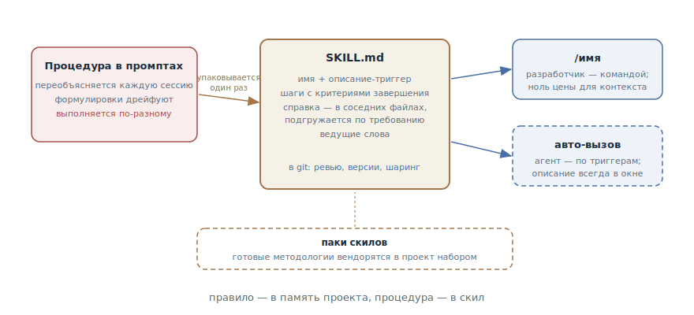

# Скилы

## Назначение

Упаковать повторяющуюся процедуру в скил — именованный файл с инструкциями,
который агент подгружает по требованию, а разработчик вызывает одной
командой, — вместо того чтобы переобъяснять процедуру в каждом промпте.
Мета-паттерн этой книги: почти любой её паттерн можно упаковать в скил — и
половина уже упакована.

## Также известен как

Skills, слэш-команды, custom commands, packaged workflows.

## Проблема

У рабочего процесса есть процедуры: ритуал релиза, порядок ревью, шаги
триажа, цикл TDD. Пока они живут в голове и переписке, происходит
предсказуемое:

- Процедура переобъясняется в каждой сессии — абзац текста, который вы
  печатаете в двадцатый раз.
- Формулировки дрейфуют: сегодня объяснили чуть иначе, чем вчера, — и агент
  выполнил процедуру чуть иначе. Стохастической системе хватает и меньшего
  повода.
- Свалить процедуры в [память проекта](claude-md-memory.md) нельзя: она
  загружается каждую сессию целиком, и многошаговым инструкциям там не
  место — это прямой путь к раздутой памяти, половину которой агент
  игнорирует.
- Процедура не передаётся: коллега объясняет своему агенту тот же ритуал
  своими словами — с другим результатом.

## Решение

Процедура становится файлом в репозитории: скил — `SKILL.md` с именем,
описанием и телом-инструкцией. У этой упаковки четыре свойства, которых нет
у промпта:

1. **По требованию.** В отличие от памяти проекта скил не занимает окно,
   пока не вызван: у него нулевая цена в каждой сессии, где он не нужен, —
   это то самое место, куда из памяти выносятся многошаговые процедуры.
2. **Два режима вызова.** *Пользовательский* — скил вызывается только по
   имени (`/release`), ничего не стоит контексту, но помнить о нём должны
   вы. *Модельный* — описание скила с триггерами всегда в окне, и агент
   дотягивается до него сам, когда запрос подходит. Модельный режим
   выбирают только когда агент должен сам решать, что скил нужен, — каждое
   такое описание оплачивается контекстом каждой сессии.
3. **Как код.** Скил лежит в git: правка процедуры — это дифф под ревью, а
   не устное предание. Команда получает одну процедуру на всех.
4. **Переносимость.** Скилы собираются в паки и вендорятся из проекта в
   проект — так распространяются целые методологии.

Цель упаковки — **предсказуемость**: агент идёт одним и тем же *процессом*
каждый запуск, даже если результаты различаются. Ей служат приёмы письма:
шаги с проверяемыми критериями завершения («каждая изменённая модель
учтена», а не «составь список»); справка, вынесенная в соседние файлы и
подгружаемая по требованию; ведущие слова — ёмкие термины, уже знакомые
модели, на которые вешается целый кусок поведения.

Граница с памятью проекта проста: **правило — в память, процедура — в
скил**. «Коммиты на английском» — правило, оно нужно всегда. «Как мы
релизим» — процедура, она нужна по требованию.

## Структура



Слева — жизнь процедуры до упаковки: переобъяснение в каждой сессии и
дрейф. В центре — скил: имя, описание-триггер, шаги с критериями
завершения, справка в соседних файлах; всё это лежит в git и правится через
ревью. Справа — два способа вызова: разработчик командой по имени или агент
сам по триггерам описания. Внизу — паки: скилы переносятся между проектами
готовыми наборами.

## Участники / Компоненты

- **Скил** — `SKILL.md` плюс соседние файлы справки; одна процедура — один
  скил.
- **Описание-триггер** — определяет вызов: человекочитаемая строка для
  пользовательского режима, список триггеров для модельного.
- **Разработчик** — автор и редактор: замечает повторяющуюся процедуру,
  упаковывает, чистит.
- **Агент** — исполняет скил как процесс: шаг за шагом, до критериев
  завершения.
- **Пак** — набор скилов, вендоримый в проект: методология в виде каталога
  файлов.

## Когда применять

- Процедура повторилась два-три раза — тот же триггер, что у памяти
  проекта, только для «как делать», а не «что верно».
- Процедура должна выполняться одинаково всеми и всегда: релиз, ревью,
  триаж, миграции.
- Паттерны этой книги хочется сделать вызываемыми: передача сессии, TDD,
  триаж и карта исследования упаковываются в скилы буквально.

Не упаковывайте одноразовое: скил, вызванный один раз, — это накладные
расходы на файл, который никто не найдёт через месяц.

## Последствия и компромиссы

- ➕ Предсказуемость: процедура выполняется одним и тем же процессом в
  каждой сессии и у каждого члена команды.
- ➕ Контекст свободен: в отличие от памяти скил ничего не стоит, пока не
  вызван; окно тратится только на нужную процедуру.
- ➕ Процедуры становятся кодом: ревью, версии, история изменений, шаринг
  паком.
- ➖ Поддержка: скилы оседают — устаревшие слои копятся, потому что
  добавить безопасно, а удалить страшно. Без чистки пак деградирует.
- ➖ Пользовательские скилы нагружают память разработчика: индекс — это вы.
  Когда скилов больше, чем помнится, нужен скил-роутер, который знает
  остальные.
- ➖ Модельные описания едят контекст всегда: щедро раздавать
  автоматический вызов — тот же раздутый контекст, только сбоку.

## Реализация

1. Ловите триггер: процедура объясняется второй раз — пора упаковывать.
2. Создайте `SKILL.md` с фронтматтером (имя, описание) и телом: шаги в
   порядке исполнения, у каждого — проверяемый критерий завершения.
3. Выберите режим вызова. По умолчанию — пользовательский: вызов по имени,
   ноль цены для контекста. Модельный — только если агент должен
   дотягиваться до скила сам; тогда описание пишется как список триггеров.
4. Справку выносите в соседние файлы и ссылайтесь на них из шагов — они
   подгрузятся, только когда дойдёт дело (см.
   [инженерию контекста](context-engineering.md): это её принцип «по
   требованию» в миниатюре).
5. Ищите ведущие слова: один ёмкий термин («трассер», «туман войны»,
   «красный») закрепляет поведение дешевле абзаца.
6. Чистите регулярно: проверяйте каждую строку на актуальность, удаляйте
   предложения-пустышки целиком. Скилы без чистки оседают.
7. Разрослось — заведите роутер: один пользовательский скил, который
   перечисляет остальные и когда какой звать.
8. Не изобретайте пак с нуля: [Superpowers](superpowers.md) и
   [скилы Мэтта Покока](matt-pocock-skills.md) — готовые методологии в
   формате скилов; вендорите и адаптируйте.

## Пример

Каждый релиз сервиса разработчик диктует агенту один и тот же абзац:
собрать changelog из коммитов от последнего тега, поднять версию, проверить
миграции, прогнать смок-набор, создать тег и релиз. Раз в месяц абзац
мутирует — и релизы выходят чуть разные.

Процедура упаковывается в `.claude/skills/release/SKILL.md`:

```markdown
---
name: release
description: Собрать и выпустить релиз сервиса
disable-model-invocation: true
---

1. Собери changelog из коммитов от последнего тега; каждая строка —
   Conventional Commit. Критерий: каждый коммит либо в changelog,
   либо явно отброшен как служебный.
2. Подними версию по semver из содержимого changelog.
3. Проверь непримененные миграции — их быть не должно.
4. Прогони смок-набор: make smoke. Критерий: зелёный вывод приложен.
5. Тег и релиз с changelog в описании.
```

Теперь релиз — это `/release`. Через месяц команда решает добавить проверку
незакрытых фиче-флагов — это пулл-реквест на одну строку в SKILL.md, а не
рассылка «теперь объясняйте агенту ещё и это».

А что паттерн — мета, видно по самой книге: передача сессии, TDD, триаж,
карта исследования и прототип разобраны в главах как паттерны — и все пять
существуют в паке Мэтта Покока как вызываемые скилы.

## Анти-паттерны и частые ошибки

- **Скил-свалка.** Вся память проекта, перенесённая в один скил, или скил
  «на всё»: упаковка работает, пока одна процедура — один скил.
- **Всё модельное.** Автоматический вызов у каждого скила — и описания
  съедают окно каждой сессии: раздутая память вернулась через чёрный ход.
- **Шаги без критериев.** «Сделай ревью и исправь» без проверяемого
  «готово» — агент завершает шаг, когда устал, а не когда закончил.
- **Седимент.** Слои устаревших инструкций, которые страшно удалять.
  Чистка скилов — та же дисциплина, что чистка памяти проекта.
- **Дублирование с памятью.** Одно и то же правило и в CLAUDE.md, и в
  скиле — два источника истины, которые разойдутся. Правило живёт в одном
  месте.

## Известные применения

- **Claude Code** — скилы как механизм: `SKILL.md` в `.claude/skills/`,
  режимы вызова через `disable-model-invocation`, аргументы, плагины как
  паки; встроенные скилы вроде `/code-review` — тот же паттерн от
  производителя.
- **Superpowers** — целая методология SDD, поставляемая как пак скилов:
  brainstorm, планирование, TDD-реализация сабагентами, ревью.
- **Скилы Мэтта Покока** — пак с роутером и мета-скилом *writing great
  skills* — справочником о том, как писать сами скилы: предсказуемость,
  режимы вызова, критерии завершения, ведущие слова.
- **AGENTS.md-экосистема** — командные каталоги процедур в других
  инструментах: от правил Cursor до пользовательских команд в разных
  агентах; формат различается, паттерн тот же.

## Связанные паттерны

- [Память проекта](claude-md-memory.md) — парный паттерн с чёткой границей:
  правило — в память (нужно всегда), процедура — в скил (нужна по
  требованию); скилы — главное средство от раздутой памяти.
- [Инженерия контекста](context-engineering.md) — скил — это подгрузка по
  требованию в чистом виде: ноль токенов до вызова, полная инструкция после.
- [Передача сессии](handoff.md), [TDD с агентом](tdd-with-agent.md),
  [Триаж задач](triage-state-machine.md),
  [Карта исследования](wayfinder.md) — паттерны этой книги, которые в
  реальных паках существуют именно как скилы: упаковка — их родная форма.
