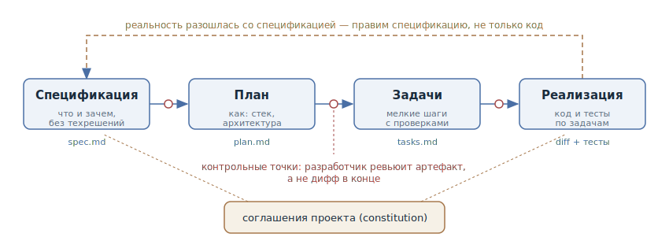

# Спеко-ориентированная разработка

## Назначение

Сделать источником истины не код и не переписку с агентом, а спецификацию —
живой документ в репозитории, который описывает *что* и *зачем* строим.
Спецификация разворачивается в технический план и список задач, агент реализует
их шаг за шагом, а разработчик ревьюит артефакты на каждом переходе — задолго
до того, как появится дифф.

## Также известен как

Spec-Driven Development (SDD), spec-first, «спецификация как источник истины».

## Проблема

В диалоговой работе с агентом намерение живёт в переписке. Для короткой задачи
этого достаточно, но у большой фичи переписка не масштабируется:

- Контекстное окно заканчивается раньше, чем фича. Новая сессия начинает с
  нуля — что решили, почему выбрали этот подход и что осталось сделать,
  приходится восстанавливать по памяти и по коду.
- Промпт эфемерен. Через месяц никто — ни человек, ни агент — не сможет
  ответить, «так и задумано» или «так получилось»: намерение нигде не
  записано, остался только код.
- Без зафиксированных требований каждая следующая просьба «допили вот здесь»
  понемногу уводит реализацию от исходной цели, и заметить дрейф нечем — не с
  чем сравнивать.

Противоположная крайность — вайб-кодинг: описать цель одной фразой и принимать
всё, что скомпилировалось. На прототипе это работает, в живой кодовой базе
оставляет слой кода, о котором никто не может сказать, что он *должен* делать.

## Решение

Перед реализацией зафиксировать намерение в спецификации — файле в репозитории,
а не в переписке — и дальше вести работу от неё:

1. **Спецификация.** Что строим и зачем: пользовательские сценарии, требования,
   критерии приёмки. Без технических решений — «что», а не «как».
2. **План.** Как строим: стек, архитектура, затронутые модули, контракты.
   Технические решения появляются только здесь, когда «что» уже согласовано.
3. **Задачи.** План нарезается на мелкие проверяемые шаги — у каждого есть
   способ убедиться, что шаг выполнен.
4. **Реализация.** Агент выполняет задачи по списку, сверяясь со спецификацией
   и планом.

Каждый переход — контрольная точка: разработчик ревьюит артефакт и правит его
текстом. Ошибка в требованиях ловится на спецификации, ошибка в архитектуре —
на плане; и то и другое дешевле, чем на готовом диффе. Если по ходу реализации
выяснилось, что спецификация неверна, правится сначала она, потом код — иначе
документ молча устареет и перестанет быть источником истины.

## Структура

Четыре артефакта образуют конвейер, и каждый следующий выводится из
предыдущего: план — из спецификации, задачи — из плана, код — из задач. Все
артефакты лежат в репозитории и проходят обычное ревью. Отдельным входом служат
соглашения проекта (в Spec Kit — «конституция»): стандарты и ограничения,
которые агент обязан учитывать на каждой фазе. Пунктирная стрелка назад — правка
спецификации, когда реальность с ней разошлась.

## Участники / Компоненты

- **Разработчик** — формулирует намерение, ревьюит и утверждает каждый
  артефакт, принимает результат.
- **Агент** — разворачивает намерение в спецификацию, план и задачи; реализует
  задачи, сверяясь с артефактами.
- **Спецификация** — источник истины: что строим и зачем, критерии приёмки.
- **План и задачи** — производные артефакты: технический подход и нарезка на
  проверяемые шаги.
- **Соглашения проекта** — постоянные правила (стандарты, стек, ограничения),
  общие для всех спецификаций.

## Когда применять

- Фича больше одной сессии: работа переживает контекстное окно, и артефакты —
  единственный способ передать состояние следующей сессии или другому агенту.
- Над задачей работают несколько человек или несколько агентов — нужен общий
  документ, а не чья-то переписка.
- Домен со строгими требованиями: важно уметь показать, *что* система обязана
  делать, и проверить реализацию против этого списка.
- Гринфилд, где «что строим» ещё не устоялось: спецификация заставляет решить
  это до кода.

Для правки в пару файлов конвейер избыточен — там достаточно
[четырёх фаз](explore-plan-code-commit.md) или простой просьбы.

## Последствия и компромиссы

- ➕ Намерение переживает сессию: новая сессия, другой агент или коллега
  продолжают работу от артефактов, а не от пересказа.
- ➕ Дрейф виден: реализацию можно сверить со спецификацией, а расхождение —
  обсудить предметно.
- ➕ Ревью распределяется по дешёвым точкам: требования, подход и нарезка
  проверяются текстом до появления кода.
- ➕ Спецификация остаётся документацией: через полгода видно, что система
  *должна* делать, а не только что она делает.
- ➖ Накладные расходы: на короткой задаче конвейер из четырёх артефактов
  дороже самой задачи.
- ➖ Артефакты нужно поддерживать: устаревшая спецификация хуже её отсутствия —
  она врёт с авторитетным видом.
- ➖ Соблазн детализировать спецификацию до псевдокода возвращает к
  [преждевременной спецификации](premature-specification.md): фиксируйте
  требования и ограничения, а не реализацию.

## Реализация

1. Зафиксируйте соглашения проекта: стандарты, стек, ограничения качества.
   Это постоянный документ, общий для всех спецификаций.
2. Разверните намерение в спецификацию: сценарии, требования, критерии
   приёмки — без технических решений. Отревьюйте её как текст; недоопределённые
   места дешевле всего закрыть здесь.
3. Попросите технический план по спецификации и отревьюйте его: архитектура,
   контракты, затронутые модули.
4. Нарежьте план на мелкие задачи, каждая — с проверкой выполнения.
5. Запускайте реализацию по списку задач; агент сверяется со спецификацией и
   планом.
6. Расхождение с реальностью правьте сначала в спецификации, потом в коде.

Вручную этот конвейер почти никогда не собирают — есть готовые фреймворки,
каждый со своим взглядом на то, каким он должен быть. Каждому посвящена
отдельная статья этого раздела:

- [GitHub Spec Kit](spec-kit.md) — самый прямой перенос паттерна в инструмент:
  слэш-команда на каждую фазу, артефакт на каждую команду.
- [OpenSpec](openspec.md) — конвейер вокруг **изменения**: постоянные
  спецификации системы обновляются дельтами, как схема базы — миграциями.
- [Kiro](kiro.md) — SDD как режим IDE: спек-сессии с явным одобрением каждой
  фазы и критериями приёмки в EARS-нотации.
- [Tessl](tessl.md) — радикальный вариант: спецификация — исходник, код —
  производный артефакт.
- [Superpowers](superpowers.md) — SDD как пак скилов Claude Code:
  brainstorming → план → реализация сабагентами с TDD и обязательными
  контрольными точками.
- [Скилы Мэтта Покока](matt-pocock-skills.md) — конвейер поверх трекера задач:
  интервью → спецификация → трассирующие тикеты → реализация.

## Пример

Задача: добавить в сервис экспорт отчётов по расписанию.

**Спецификация** (`/speckit.specify` или `/opsx:propose` — суть одна):

> Пользователь настраивает регулярный экспорт отчёта: выбирает отчёт,
> расписание и получателей. В назначенное время система собирает отчёт и
> отправляет на почту. Критерии приёмки: экспорт уходит не позже пяти минут от
> расписания; при ошибке сборки получатели получают уведомление о сбое, а не
> тишину; удаление отчёта отключает его расписания.

Ревью спецификации сразу вскрывает дыру: а что с часовыми поясами получателей?
Требование дописывается — до того, как оно превратилось бы в баг.

**План:** агент предлагает cron-воркер и таблицу `report_schedules`; на ревью
разработчик заменяет самодельный cron на уже используемый в проекте планировщик
задач — правка одной строки текста.

**Задачи:** миграция, модель, воркер, нотификации, UI настройки — каждая с
проверкой (тест или ручной сценарий).

**Реализация:** агент идёт по списку; когда выясняется, что почтовый шлюз не
принимает вложения больше 10 МБ, — это правка спецификации (добавить требование
про ссылку на скачивание вместо вложения), а не тихий обходной путь в коде.

## Анти-паттерны и частые ошибки

- **Спецификация ради галочки.** Артефакты генерируются и утверждаются не
  читая — конвейер добавляет накладные расходы, но не ловит ничего. Контрольные
  точки работают, только если в них действительно смотрят.
- **Код разошёлся со спецификацией — и ладно.** Первая же несинхронная правка
  превращает спецификацию из источника истины в музейный экспонат. Правило
  одно: сначала документ, потом код.
- **Спецификация-псевдокод.** Расписывать в спецификации имена функций и
  порядок вызовов — [преждевременная спецификация](premature-specification.md)
  в новой обёртке. На уровне «что» живут требования, а не реализация.
- **Конвейер для правки на два файла.** Если задача помещается в одну сессию и
  один экран диффа, четыре артефакта — это бюрократия, а не инженерия.

## Известные применения

- [GitHub Spec Kit](spec-kit.md), [OpenSpec](openspec.md), [Kiro](kiro.md),
  [Tessl](tessl.md), [Superpowers](superpowers.md) и
  [скилы Мэтта Покока](matt-pocock-skills.md) — шесть решений, разобранных в
  статьях этого раздела; манифест SDD как методологии — в
  [анонсе Spec Kit](https://github.blog/ai-and-ml/generative-ai/spec-driven-development-with-ai-get-started-with-a-new-open-source-toolkit/).
- **BMAD-Method** — SDD в agile-обёртке: ролевые агенты (аналитик, PM,
  архитектор, разработчик) ведут PRD → архитектуру → стори.

## Связанные паттерны

- [Четыре фазы](explore-plan-code-commit.md) — тот же
  принцип «сначала договориться, потом кодить» в масштабе одной сессии; SDD
  разворачивает его в артефакты, переживающие сессию.
- [Преждевременная спецификация](premature-specification.md) — анти-паттерн, в
  который вырождается спецификация, если фиксировать в ней реализацию вместо
  требований.
