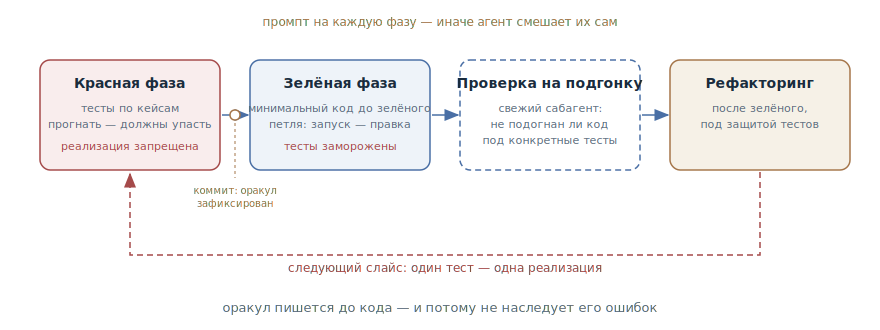

# TDD с агентом

## Назначение

Провести агента через цикл «красное — зелёное» пофазными промптами: сначала
падающие тесты, зафиксированные коммитом, потом минимальная реализация до
зелёного — без права редактировать тесты. Оракул пишется до кода и потому не
наследует его ошибок.

## Также известен как

Test-driven development с агентом, red–green–refactor, test-first.

## Проблема

Попросите агента «сделай фичу и покрой тестами» — и он сделает ровно это, в
этом порядке: сначала реализацию, потом тесты к ней. Такие тесты выглядят как
покрытие, но проверяют немногое:

- **Тесты списаны с кода.** Агент пишет их, глядя на готовую реализацию, — они
  повторяют её структуру и её ошибки. Если в коде перепутано условие, тест
  зафиксирует перепутанное условие как норму.
- **Тавтология вместо проверки.** Ожидаемое значение вычисляется тем же
  способом, что и в коде, — тест проходит по построению и не может с кодом
  не согласиться.
- **Подгонка под оракул.** Если тесты уже есть, агент под давлением «сделай
  зелёным» умеет схитрить: заглушка вместо логики, спрятанный особый случай
  под конкретный тест.

Одной инструкции «используй TDD» мало: без явных фазовых ворот агент
съезжает в привычный порядок — код, потом тесты.

## Решение

Развести красную и зелёную фазы по разным промптам и держать ворота между
ними за разработчиком.

1. **Объявить правила.** Сказать прямо: работаем test-first — чтобы агент не
   создавал реализацию и заглушки заранее.
2. **Красная фаза.** Агент пишет тесты по ожидаемым парам «вход — выход»,
   запускает и убеждается, что они падают. Реализация в этой фазе запрещена
   явно. Тест, который не падал, ничего не доказывает.
3. **Зафиксировать оракул.** Тесты коммитятся. С этого момента они — эталон,
   а не черновик.
4. **Зелёная фаза.** Агент пишет минимальный код до прохождения, запуская
   тесты и итерируя, — это [петля обратной связи](give-agent-a-way-to-verify.md)
   с уже готовым оракулом. Редактировать тесты запрещено: их правка — решение
   разработчика.
5. **Проверка на подгонку.** Свежий сабагент смотрит реализацию: не подогнана
   ли она под конкретные тесты (см.
   [писателя и рецензента](writer-reviewer.md)).
6. **Рефакторинг** — отдельным ходом после зелёного, под защитой тестов, а не
   внутри цикла.

Работайте вертикальными слоями: один тест → одна минимальная реализация →
следующий тест. Все тесты скопом — это проверка воображаемого поведения:
структура тестов фиксируется раньше, чем понята задача. И договаривайтесь о
швах заранее: тесты живут на публичных границах, а не на внутренностях, —
иначе они ломаются от рефакторинга, а не от смены поведения.

## Структура

Фазы идут слева направо, и у каждой свой промпт: красная производит падающий
оракул, коммит замораживает его, зелёная гоняет петлю реализации при
замороженных тестах, дальше свежий взгляд проверяет реализацию на подгонку, и
только после этого наступает рефакторинг под защитой тестов. Петля внизу —
вертикальные слои: цикл повторяется по тесту за раз, каждый следующий слайс
опирается на то, чему научил предыдущий.

## Участники / Компоненты

- **Разработчик** — задаёт кейсы и швы, держит фазовые ворота, единолично
  распоряжается правкой тестов.
- **Агент** — пишет тесты в красной фазе, реализацию в зелёной; фазы не
  смешивает, потому что каждая приходит отдельным промптом.
- **Тесты-оракул** — падающие в красной фазе, замороженные в зелёной;
  спецификация поведения, независимая от реализации.
- **Швы** — согласованные публичные границы, на которых живут тесты.
- **Рецензент** — свежий сабагент, проверяющий реализацию на подгонку.

## Когда применять

- Логика с проверяемыми парами «вход — выход»: парсеры, расчёты, валидация,
  преобразования данных.
- Багфиксы: падающий тест-репродукция до исправления — самая дешёвая страховка
  от возврата бага.
- Код, где цена регрессии высока и тесты останутся жить как спецификация.

Для разметки интерфейса, прототипов и разведки паттерн избыточен: там нечего
зафиксировать парой «вход — выход», и лучше работает
[петля обратной связи](give-agent-a-way-to-verify.md) со скриншотами или
[одноразовый прототип](prototype-to-answer.md).

## Последствия и компромиссы

- ➕ Оракул независим от реализации: тесты не наследуют ошибок кода, потому
  что написаны раньше него.
- ➕ Жульничество видно: при замороженных тестах заглушка не пройдёт, а
  попытка отредактировать тест — явное нарушение, а не тихая правка.
- ➕ Тесты читаются как спецификация и переживают рефакторинги — они
  привязаны к швам, а не к внутренностям.
- ➖ Медленнее прямой просьбы: две фазы, коммиты, проверка на подгонку — на
  тривиальной правке это бюрократия.
- ➖ Дисциплина лежит на разработчике: пропущенные ворота — и агент тихо
  съехал в «код, потом тесты».
- ➖ Качество упирается в швы: тесты на неудачных границах будут хрупкими,
  сколько бы фаз ни было.

## Реализация

1. Начните с объявления: «работаем по TDD: сначала тесты, реализация потом».
2. Красный промпт: «напиши тесты для кейсов X, Y, Z; прогони и покажи, что
   падают; реализацию не пиши». Кейсы задавайте сами — это ваша часть
   спецификации; попросите агента предложить пропущенные граничные случаи.
3. Согласуйте швы до тестов: «какая здесь публичная граница? на каких швах
   тестируем?» — тесты на внутренностях отклоняйте.
4. Закоммитьте красные тесты. Дальше действует правило: тесты меняет только
   разработчик, отдельным решением.
5. Зелёный промпт: «реализуй, чтобы тесты прошли; тесты не редактируй;
   запускай и итерируй». Требуйте доказательств — вывод тестраннера.
6. После зелёного — свежим контекстом: «проверь, что реализация не подогнана
   под тесты: заглушки, особые случаи под конкретные кейсы».
7. Рефакторинг просите отдельно, под защитой зелёных тестов.
8. Повторяйте по слайсу за раз; правила «красное перед зелёным» и «тесты не
   редактировать» закрепите в [памяти проекта](claude-md-memory.md).

В тулкитах цикл уже собран: в [Superpowers](superpowers.md) скил
`test-driven-development` обязателен внутри каждой задачи плана, в
[скилах Мэтта Покока](matt-pocock-skills.md) `/tdd` добавляет швы,
вертикальные слои и выносит рефакторинг в ревью, а в [Kiro](kiro.md)
критерии приёмки из фазы требований превращаются в тестовые кейсы ещё до
реализации.

## Пример

Баг: пользователь с истёкшей сессией не разлогинивается, а видит вечный
спиннер. Разработчик начинает с красной фазы:

> Работаем по TDD. Напиши тест, воспроизводящий баг: сессия истекла — запрос
> к API возвращает 401 — пользователь оказывается на /login. Прогони и
> покажи, что падает. Исправление пока не пиши.

Агент пишет тест на шве «HTTP-клиент → обработчик ответа», прогоняет:
красный — на 401 клиент уходит в бесконечный ретрай. Тест коммитится.

> Теперь чини. Тест не редактируй, запускай и итерируй до зелёного.

Агент находит, что перехватчик ретраит все ошибки без разбора, добавляет
исключение для 401 с редиректом — зелёный, в ответе вывод тестраннера.
Финальный штрих:

> Свежим сабагентом: проверь, что исправление не подогнано под тест — что
> обработка 401 работает для всех запросов, а не только для эндпоинта из
> теста.

Рецензент подтверждает: правка в общем перехватчике. Баг закрыт, и его
возврат теперь ловится тестом, который родился раньше исправления — и потому
проверяет поведение, а не переписывает его с кода.

## Анти-паттерны и частые ошибки

- **Тесты задним числом.** «Сделай фичу и покрой тестами» производит тесты,
  списанные с реализации, — покрытие есть, проверки нет.
- **Пропуск красного.** Тест, который ни разу не падал, может проходить по
  любой причине — включая то, что он ничего не проверяет.
- **Все тесты скопом.** Горизонтальная нарезка фиксирует структуру тестов до
  понимания задачи; работайте вертикальными слоями.
- **Агент правит оракул.** Правка теста в зелёной фазе — это переписывание
  спецификации под ответ. Только разработчик, только отдельным решением.
- **Тесты на внутренностях.** Моки внутренних коллабораторов и проверки
  приватных методов ломаются от рефакторинга, а не от смены поведения, — шов
  выбран неверно.
- **Тавтологический оракул.** Ожидаемое значение, вычисленное так же, как в
  коде, проходит по построению. Эталоны берутся из независимого источника:
  спецификации, разобранного вручную примера, известного ответа.

## Известные применения

- **Claude Code best practices** — канонический пофазный воркфлоу: тесты по
  парам «вход — выход» с явным «мы делаем TDD», подтверждение падения,
  коммит тестов, реализация без права их менять, независимая проверка на
  подгонку.
- **Superpowers** — TDD как обязательный режим: каждый пункт плана
  реализуется сабагентом через red–green–refactor, пропустить цикл нельзя.
- **Скилы Мэтта Покока** — `/tdd`: пред-согласованные швы, вертикальные
  слои-трассеры, запрет тавтологичных тестов, рефакторинг вынесен в ревью.
- **Kent Beck, Test-Driven Development: By Example** — первоисточник самой
  практики; с агентами она обретает второе дыхание: цикл, требовавший
  человеческой дисциплины, теперь можно навязать промптами.

## Связанные паттерны

- [Петля обратной связи](give-agent-a-way-to-verify.md) — общий паттерн, чьей
  дисциплинированной формой является TDD: оракул пишется до кода и по одному
  на шаг.
- [Писатель и рецензент](writer-reviewer.md) — проверка на подгонку в финале
  цикла: реализацию оценивает не тот, кто её писал.
- [Четыре фазы](explore-plan-code-commit.md) — тестовые кейсы естественно
  рождаются на фазе плана: утверждённый план называет, что считается
  «работает».
