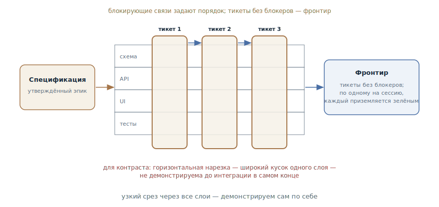

# Трассирующие тикеты

## Назначение

Нарезать план или спецификацию на тикеты-трассеры: узкие вертикальные срезы
сквозь все слои, каждый демонстрируем сам по себе и помещается в одно свежее
контекстное окно, с явными блокирующими связями между тикетами. Агент
получает исполняемые куски, а не эпик.

## Также известен как

Tracer-bullet tickets, вертикальные срезы, трассеры; `/to-tickets` в скилах
Мэтта Покока.

## Проблема

Спецификация утверждена — и она эпик. Отдавать её агенту как есть нельзя, а
привычные способы нарезки подводят:

- Целиком она в окно не помещается: агент, взявший «реализуй спеку»,
  предсказуемо [пытается уан-шотнуть](one-feature-at-a-time.md) и оставляет
  россыпь недоделок.
- Нарезка по слоям — «сначала вся схема, потом весь API, потом весь UI» —
  даёт куски, ни один из которых нельзя продемонстрировать: работает ли
  система, выяснится только на интеграции в конце, в самой дорогой точке.
- Куски без явных связей — ловушка для исполнителя: агент берёт задачу,
  зависящую от ещё не сделанного, и начинает выдумывать недостающие детали.

## Решение

Резать вертикально и объявлять связи. Каждый тикет — **трассер**: как
трассирующая пуля, он прошивает узкую, но полную траекторию через все слои
системы — схему, API, интерфейс, тесты — и показывает, куда летит очередь.

Правила среза:

- **Вертикальный, не горизонтальный**: узкий путь через все слои, а не
  широкий кусок одного слоя.
- **Демонстрируем сам по себе**: завершённый тикет можно показать или
  проверить, не дожидаясь остальных.
- **Размером в одно свежее окно**: агент вытягивает тикет за сессию, с
  запасом на итерации проверки.
- **Префакторинг — первым тикетом**: если изменение стоит сначала сделать
  лёгким, это отдельный срез в начале очереди.

Каждый тикет объявляет **блокирующие связи** — какие тикеты должны
завершиться до его старта. Тикет без блокеров можно брать немедленно;
множество таких тикетов — фронтир, и он виден в трекере.

Нарезка проходит через разработчика: агент предъявляет разбивку списком —
название, блокеры, что тикет делает работающим от начала до конца, — и
итерирует по замечаниям: слишком крупно? связи верны? что слить, что
разбить? Утверждённые тикеты публикуются в трекер с нативными блокировками.

Исключение — **широкие рефакторинги**: одно механическое изменение с
радиусом поражения во всю кодовую базу (переименовать колонку, сменить тип
общего символа) вертикально не режется. Его ведут через **expand–contract**:
сначала добавить новую форму рядом со старой, затем мигрировать вызовы
партиями — каждая партия своим тикетом, заблокированным расширением, — и
финальным тикетом удалить старую форму, когда не осталось ни одного вызова.

## Структура

Слева спецификация-эпик. В центре — её нарезка: каждый тикет прошивает все
слои насквозь узкой полосой, и стрелки блокировок выстраивают тикеты в
частичный порядок. Внизу для контраста — горизонтальная нарезка по слоям:
широкие куски, ни один из которых не демонстрируем до финальной интеграции.
Справа исполнение: фронтир из неблокированных тикетов, по одному на сессию,
каждый приземляется зелёным.

## Участники / Компоненты

- **Спецификация** — источник нарезки: утверждённое «что строим».
- **Тикет-трассер** — вертикальный срез: сквозное поведение, критерии
  приёмки, список блокеров.
- **Блокирующие связи** — явный частичный порядок; фронтир вычисляется из
  них.
- **Разработчик** — утверждает гранулярность и связи; агент предлагает,
  человек решает.
- **Агент-исполнитель** — берёт тикет с фронтира и ведёт его в свежем окне
  до конца.

## Когда применять

- Утверждённая работа больше одной сессии: спецификация, большой план,
  результат [карты исследования](wayfinder.md).
- Хочется параллелизма: фронтир позволяет нескольким сессиям работать
  одновременно, не наступая друг на друга.
- Это конкретная механика шага «задачи» в
  [конвейере SDD](spec-driven-development.md) — когда `tasks.md` нужен не
  чек-листом, а исполняемой очередью.

Не нужен для работы в одну сессию — там хватает плана. И не для разведки:
неясную работу сначала проясняет [карта исследования](wayfinder.md), тикеты
режутся из уже ясной.

## Последствия и компромиссы

- ➕ Каждый тикет приземляется зелёным и демонстрируемым: интеграционного
  взрыва в конце не бывает, потому что интеграция происходит в каждом срезе.
- ➕ Размер в окно означает, что исполнителю всегда хватает контекста — и
  обрыв сессии стоит один тикет.
- ➕ Фронтир даёт дешёвый параллелизм и честную картину прогресса.
- ➖ Нарезка — навык: слишком крупные срезы не влезают в окно, слишком
  мелкие хоронят работу в накладных расходах.
- ➖ Широкие рефакторинги ломают правило вертикальности — им нужен отдельный
  режим expand–contract.
- ➖ Инфраструктура трекера: тикеты, связи, статусы — для маленькой работы
  это бюрократия.

## Реализация

1. Соберите контекст: спецификация или план — в разговоре; кодовую базу
   изучите до нарезки, ищите возможность префакторинга: «сделай изменение
   лёгким, потом сделай лёгкое изменение».
2. Нарежьте вертикально: каждый тикет описывает сквозное поведение с точки
   зрения пользователя — не «сделать таблицу», а «расписание создаётся и
   видно в списке».
3. Объявите блокеры у каждого тикета; без блокеров — кандидат во фронтир.
4. Предъявите разбивку разработчику списком и итерируйте: гранулярность,
   связи, слияния и разбиения.
5. Опубликуйте в трекер в порядке зависимостей, с нативными блокировками и
   критериями приёмки. Путей к файлам и сниппетов в тикетах избегайте — они
   устаревают; исключение — куски из [прототипов](prototype-to-answer.md),
   кодирующие решение точнее прозы.
6. Широкий рефакторинг ведите отдельно: тикет-расширение → партии миграции
   по радиусу поражения → тикет-удаление, заблокированный всеми партиями.
7. Исполняйте фронтир по [одному тикету за проход](one-feature-at-a-time.md),
   очищая контекст между тикетами.

## Пример

Спецификация «экспорт отчётов по расписанию» из
[главы про SDD](spec-driven-development.md) утверждена. Агент предлагает
нарезку:

1. **Расписание создаётся и видно** — миграция, модель, минимальный UI:
   пользователь сохраняет расписание и видит его в списке. Блокеров нет.
2. **Отчёт уходит по расписанию** — воркер, сборка, письмо: в назначенное
   время отчёт приходит на почту. Блокер: 1.
3. **Сбой превращается в уведомление** — ошибка сборки не тишина, а письмо
   о сбое. Блокер: 2.
4. **Удаление отчёта отключает расписания.** Блокер: 1.

Разработчик правит гранулярность: «первый тикет тяжеловат — вынеси UI
списка отдельным срезом» — и утверждает. Тикеты уходят в трекер с
блокировками. Фронтир — тикет 1; после него открываются 2 и 4, и две
параллельные сессии берут их одновременно. Каждый тикет завершается
демонстрируемым поведением: после второго уже можно показать заказчику
письмо с отчётом — задолго до конца всей спецификации.

## Анти-паттерны и частые ошибки

- **Нарезка по слоям.** «Сначала вся схема, потом весь API» — ни один кусок
  не демонстрируем, интеграция взрывается в конце. Резать поперёк слоёв, а
  не вдоль.
- **Тикет-эпик.** Срез, не влезающий в окно, воспроизводит исходную
  проблему в миниатюре: агент снова пытается уан-шотнуть.
- **Связи в голове.** Незаписанные блокировки означают, что агент возьмёт
  тикет, зависящий от несделанного, — и додумает недостающее.
- **Пути и сниппеты в тикетах.** Конкретика реализации устаревает быстрее,
  чем до тикета доходит очередь. Описывайте поведение; код — только
  решениеёмкие куски из прототипов.
- **Широкий рефакторинг трассером.** Переименование через всю базу не
  прошивается вертикально — насильственный срез не соберётся зелёным.
  Expand–contract.

## Известные применения

- **Скилы Мэтта Покока** — `/to-tickets`: первоисточник механики — правила
  вертикального среза, блокирующие связи, квиз с разработчиком, публикация
  в трекер, expand–contract для широких рефакторингов; исполнение —
  `/implement` по тикету за раз.
- **«Прагматичный программист»** — трассирующие пули как метафора:
  сквозной тонкий канал через систему, который показывает, куда летит
  очередь, — и, в отличие от прототипа, остаётся в коде.
- **SDD-тулкиты** — `tasks.md` в [Spec Kit](spec-kit.md) и планы
  [Superpowers](superpowers.md): та же нарезка на исполняемые шаги;
  трассеры добавляют вертикальность и явные блокировки.

## Связанные паттерны

- [Спеко-ориентированная разработка](spec-driven-development.md) —
  трассирующие тикеты — конкретная механика шага «задачи»: спецификация
  превращается в исполняемую очередь.
- [Одна фича за раз](one-feature-at-a-time.md) — правило исполнения
  очереди: тикет за проход, в свежем окне.
- [Карта исследования](wayfinder.md) — предшественник по стадии: карта
  проясняет туман до решений, тикеты режут ясное на исполняемое.
- [Одноразовый прототип](prototype-to-answer.md) — поставщик
  решениеёмких сниппетов для тикетов — и полезный контраст: прототип
  выбрасывается, трассер остаётся и обрастает.
