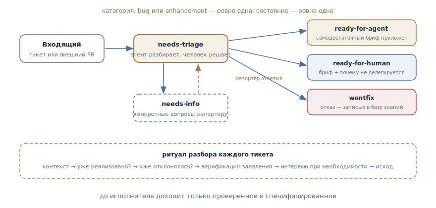

# Триаж задач

## Назначение

Провести входящие задачи через конечный автомат ролей-меток — от «нужен
разбор» до готового брифа для агента или пометки «человеку», — чтобы к
моменту исполнения каждый тикет был категоризирован, проверен и
специфицирован. Разбор ведёт агент, судьбу решает мейнтейнер.

## Также известен как

Triage state machine, конечный автомат триажа; `/triage` в скилах Мэтта
Покока.

## Проблема

Входящие в трекере — сырьё, а не задачи: баг-репорты без шагов
воспроизведения, хотелки, дубликаты уже сделанного, повторные заявки уже
отклонённого, внешние пулл-реквесты неизвестного качества. С этим потоком
плохо справляются оба привычных получателя:

- Отдать сырой тикет агенту — он услужливо додумает недостающее: «починит»
  невоспроизведённый баг, реализует то, что уже есть в кодовой базе под
  другим именем, или заново откроет спор, закрытый полгода назад.
- Разбирать всё мейнтейнеру вручную — значит тратить его время не на
  решения, а на археологию: воспроизведение, поиск дубликатов, выпытывание
  деталей у репортёра.
- Без фиксированных состояний непонятно, где что: какие тикеты уже
  разобраны, какие ждут ответа, какие можно брать в работу.

## Решение

Маленький конечный автомат меток и агент, который ведёт по нему каждый
тикет.

**Роли.** Каждый разобранный тикет несёт ровно одну категорию — `bug` или
`enhancement` — и ровно одно состояние:

- `needs-triage` — ждёт разбора;
- `needs-info` — ждёт ответа репортёра; возвращается в `needs-triage`,
  когда ответ пришёл;
- `ready-for-agent` — полностью специфицирован, к тикету приложен бриф,
  работу может взять автономный агент;
- `ready-for-human` — нужен человек; бриф той же структуры плюс явная
  причина, почему не делегируется: суждение, внешние доступы, ручное
  тестирование;
- `wontfix` — делаться не будет; причина записана.

Внешний пулл-реквест — это тикет с приложенным кодом: те же роли, тот же
автомат.

**Ритуал разбора.** Агент собирает контекст (тело, комментарии, кодовая
база — через [словарь домена](domain-context-file.md) и ADR) и делает две
проверки до всего остального: *не реализовано ли уже* — поиск по доменным
концептам, а не по словам заявки, — и *не отклонялось ли уже* — сверка с
базой отклонённого. Затем рекомендует категорию и состояние — и ждёт решения
мейнтейнера. Дальше — верификация заявления: баг воспроизводится по шагам
репортёра, дифф пулл-реквеста прогоняется тестами. Если запрос требует
доработки — интервью с мейнтейнером вопрос за вопросом. Исход применяется
метками, брифом или закрытием.

**Память отказов.** Отклонённые хотелки записываются в базу знаний в
репозитории (`.out-of-scope/`): следующая похожая заявка отсекается ссылкой,
а не повторной дискуссией.

Всё, что агент постит в публичный трекер, начинается с пометки
«сгенерировано ИИ при триаже» — прозрачность не обсуждается.

## Структура

Входящий тикет попадает в `needs-triage` — единственное состояние, где
происходит работа разбора. Из него четыре выхода: бриф для агента, бриф для
человека с причиной неделегируемости, конкретные вопросы репортёру с
возвратом после ответа — и отказ, оседающий в базе знаний. Внизу — ритуал,
который агент прогоняет для каждого тикета до выбора выхода; решение о
выходе остаётся за мейнтейнером.

## Участники / Компоненты

- **Автомат меток** — категории и состояния; ровно одна категория и одно
  состояние на тикет.
- **Агент-триажёр** — собирает контекст, проверяет, воспроизводит,
  рекомендует, оформляет исход.
- **Мейнтейнер** — арбитр: принимает рекомендации, решает судьбу, может
  напрямую перевести тикет в любое состояние.
- **Репортёр** — источник деталей; получает конкретные вопросы, а не
  «уточните, пожалуйста».
- **Бриф** — артефакт исхода: самодостаточная постановка, по которой агент
  работает без автора тикета.
- **База отклонённого** — записанные отказы с причинами; фильтр повторных
  заявок.

## Когда применять

- Открытый или командный проект с потоком входящих: баги, хотелки, внешние
  пулл-реквесты.
- Автономные агенты подхватывают работу из трекера: `ready-for-agent` — их
  очередь, и качество брифов определяет качество результатов.
- Мейнтейнерское время — узкое место: разбор делегируется агенту, за
  человеком остаются только решения.

Для личного проекта с тремя тикетами в месяц автомат избыточен — хватает
головы и одной метки.

## Последствия и компромиссы

- ➕ До исполнителя доходит только проверенное и специфицированное: агент
  получает бриф, а не догадки.
- ➕ Дубликаты и повторы отсекаются механически: проверка «уже реализовано»
  и база отклонённого работают до дискуссии, а не после.
- ➕ Состояние потока видно меткам: что разобрано, что ждёт, что готово к
  работе — без чтения тикетов.
- ➕ Верификация до брифа: невоспроизводимый баг не доедет до исполнения.
- ➖ Настройка: метки, их маппинг, шаблоны брифов, база отказов — это
  инфраструктура, которую надо завести и поддерживать.
- ➖ Агентские комментарии в публичном трекере — вопрос такта: пометка об
  ИИ обязательна, тон — тоже зона ответственности мейнтейнера.
- ➖ Автомат не принимает решений: без арбитра он вырождается либо в
  бутылочное горлышко, либо в самоуправство агента.

## Реализация

1. Определите роли: две категории, пять состояний, правило «ровно одна +
   ровно одно». Замапьте их на метки вашего трекера.
2. Зафиксируйте переходы: новый тикет → `needs-triage`; оттуда — в один из
   четырёх исходов; `needs-info` возвращается в `needs-triage` после ответа.
3. Задайте ритуал разбора: контекст → «уже реализовано?» → «уже
   отклонялось?» → рекомендация мейнтейнеру → верификация заявления →
   интервью при необходимости → исход.
4. Требуйте верификации до брифа: воспроизведённый баг с код-путём даёт
   брифу твёрдое основание; невоспроизводимый — сильный сигнал
   `needs-info`.
5. Шаблоны исходов: бриф — самодостаточный (репродукция, контекст,
   критерий готовности); triage notes — «что установлено» плюс конкретные
   вопросы; отказ по хотелке — запись в `.out-of-scope/` со ссылкой из
   комментария.
6. Пометку «сгенерировано ИИ при триаже» — в начало каждого агентского
   комментария.
7. Замкните конвейер на исполнение: `ready-for-agent` — очередь для
   автономных сессий, по одному тикету за проход.

## Пример

В трекер прилетает: «поиск не работает». Агент разбирает: дубликатов нет, в
базе отказов ничего похожего; воспроизвести по описанию не удаётся —
деталей нет. Рекомендация: `bug` + `needs-info`. После решения мейнтейнера
на тикете появляется комментарий с пометкой об ИИ: что установлено (поиск
по точному совпадению работает, по подстроке — работает) и два конкретных
вопроса: какая строка запроса и какая локаль.

Репортёр отвечает: турецкая локаль, запрос с заглавной «İ». Тикет
возвращается в `needs-triage`; агент воспроизводит баг — нормализация
юникода в индексаторе — и оформляет `ready-for-agent` с брифом: шаги
репродукции, код-путь, критерий готовности (падающий тест из репродукции
проходит). Ночная автономная сессия забирает тикет по брифу — автор тикета
ей уже не нужен.

Параллельная хотелка «тёмная тема в почтовых уведомлениях» закрывается за
минуту: в `.out-of-scope/` лежит прошлогодний отказ от кастомизации писем с
причинами — `wontfix` со ссылкой, без новой дискуссии.

## Анти-паттерны и частые ошибки

- **Сырой тикет — агенту.** Пропуск триажа означает, что недостающее агент
  додумает: самый дорогой способ узнать, что баг не воспроизводится.
- **Агент решает судьбу.** Автомат без арбитра: категории и состояния —
  рекомендации, решает мейнтейнер. Особенно для `wontfix`.
- **«Уточните, пожалуйста».** Неконкретный `needs-info` — вежливая форма
  «отстаньте»: вопросы должны быть такими, чтобы на них можно было
  ответить.
- **Отказ без записи.** `wontfix` без базы знаний — гарантия, что та же
  заявка вернётся через месяц и дискуссия повторится.
- **Бриф-пустышка.** Метка `ready-for-agent` без самодостаточного брифа —
  та же сырая постановка, только с зелёной этикеткой.
- **Скрытый ИИ.** Агентские комментарии без пометки — подрыв доверия к
  трекеру; прозрачность дешевле разоблачения.

## Известные применения

- **Скилы Мэтта Покока** — `/triage`: первоисточник — роли и автомат,
  порядок «проверь, потом интервьюируй», агент-брифы, база `.out-of-scope/`
  и триаж пулл-реквестов как «тикетов с кодом».
- **Классический bug triage** — доагентная родословная: процессы Mozilla и
  Debian с выделенной ролью триажёра и жизненным циклом статусов; паттерн
  отдаёт рутинную часть этой роли агенту.
- **Триаж-автоматизации GitHub** — боты разметки и автозакрытия как слабая
  форма: категоризация без верификации и брифов.

## Связанные паттерны

- [Карта исследования](wayfinder.md) — сосед по трекеру с другим предметом:
  карта ведёт большую разведку к цели, триаж перемалывает поток мелких
  входящих.
- [Петля обратной связи](give-agent-a-way-to-verify.md) — шаг верификации —
  это она: воспроизведение бага и прогон диффа до того, как заявке
  поверили.
- [Словарь домена](domain-context-file.md) — разбор ищет дубликаты по
  доменным концептам, а не по словам заявки; без канонического языка
  проверка «уже реализовано» слепа.
- [Одна фича за раз](one-feature-at-a-time.md) — правило исполнения
  очереди `ready-for-agent`: один тикет за проход.
