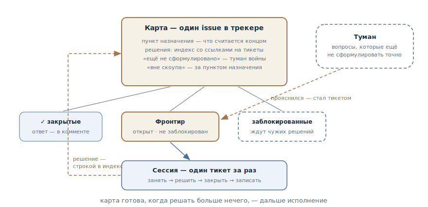

# Карта исследования

## Назначение

Работу, которая больше одной сессии и окутана туманом — идея есть, пути не
видно, — спланировать как общую карту исследовательских тикетов в трекере.
Агент закрывает по одному тикету за сессию, каждый ответ проясняет кусок
тумана — пока путь к цели не станет ясным. Карта производит решения, а не
код: она готова, когда решать больше нечего.

## Также известен как

Wayfinder, вэйфайндинг; скил `/wayfinder` из пака Мэтта Покока.

## Проблема

Прилетела большая рыхлая идея: «переезжаем на новую платёжную платформу»,
«делаем корпоративный тариф». Она заведомо больше одной сессии — и, что
хуже, не видно дороги: неизвестно даже, какие решения предстоит принять.

- Писать спецификацию сразу — преждевременная спецификация в полный рост:
  половина зафиксированных «требований» окажется догадками.
- [Список фич](feature-list-harness.md) не годится: он работает от
  известного конечного состояния, а здесь неизвестно, что именно строить.
- Разбираться в одной длинной переписке — знание умрёт вместе с сессией, и
  второй человек или второй агент не сможет подключиться параллельно.
- Держать вопросы в голове — значит каждый раз заново вспоминать, что уже
  решено, что заблокировано и что вообще осталось.

## Решение

Три хода: назвать цель, начертить карту, идти по тикету за раз.

**Пункт назначения.** Первым делом фиксируется, как выглядит конец пути:
спецификация, готовая к передаче в конвейер; принятое решение; выполненное
изменение. Назначение задаёт скоуп — всё, что лежит за ним, на карту не
попадает.

**Карта.** Один issue в трекере с меткой карты — индекс, а не хранилище:

- *пункт назначения* — одна-две строки, по которым ориентируется каждая
  сессия;
- *решения* — по строке на закрытый тикет со ссылкой: суть на карте, детали
  в тикете;
- *ещё не сформулировано* — туман войны: вопросы, которые чувствуются, но
  которых пока не сформулировать точно;
- *вне скоупа* — то, что осознанно вырезано: за пункт назначения фронтир не
  идёт.

**Тикеты.** Дочерние issue карты, каждый — один вопрос размером в сессию.
У тикета есть тип: *research* — агент читает документацию и приносит
сводку; *prototype* — дешёвый артефакт, о который можно спорить (см.
[одноразовый прототип](prototype-to-answer.md)); *grilling* — разговор с
разработчиком вопрос за вопросом; *task* — ручная работа, без которой
решение не принять (завести sandbox, открыть доступ). Блокировки — нативные
связи трекера: **фронтир** — открытые, не заблокированные и не занятые
тикеты — виден прямо в интерфейсе трекера.

**Работа.** Сессия загружает карту в низком разрешении, берёт первый
фронтирный тикет, занимает его (assign — и параллельные сессии его
пропустят), решает, записывает ответ комментом, закрывает — и добавляет
строку в решения. Ответ обычно проясняет туман: то, что теперь
формулируется точно, выпускается новыми тикетами. Один тикет за сессию —
жёстко.

Правило дисциплины: **решай, не делай**. Тикет производит решение, а не
деливерабл; тяга «да просто сделать уже» — сигнал, что карта закончилась и
пора передавать работу в исполнение.

## Структура

Наверху карта — индекс всего похода: пункт назначения, накопленные решения
со ссылками, туман и вырезанное из скоупа. Под ней тикеты в трёх
состояниях: закрытые с ответами, фронтир — открытые и доступные, и
заблокированные, ждущие чужих решений. Сессия внизу берёт с фронтира ровно
один тикет; её ответ уходит строкой в индекс карты, а прояснившийся туман
справа выпускает новые тикеты на фронтир. Цикл повторяется, пока тикетов не
останется.

## Участники / Компоненты

- **Карта** — issue-индекс: назначение, решения, туман, вне скоупа.
- **Пункт назначения** — определение конца пути; фиксирует скоуп.
- **Тикет** — один вопрос размером в сессию, с типом и блокировками; ответ
  живёт в нём, карта только ссылается.
- **Фронтир** — открытые, не заблокированные, не занятые тикеты: край
  изведанного.
- **Туман** — вопросы, которые пока не сформулировать точно; легализованная
  неполнота карты.
- **Агент и разработчик** — агент ведёт research- и task-тикеты сам,
  grilling и prototype требуют человека; сессии могут идти параллельно.

## Когда применять

- Работа больше сессии *и* путь не виден: рыхлая идея, за которой десяток
  нерешённых вопросов.
- Над разведкой работают несколько человек или несколько параллельных
  сессий — карта и фронтир в трекере синхронизируют всех.
- Решения важно сохранить: каждый закрытый тикет — записанный ответ со
  ссылкой, а не реплика в умершей переписке.

Не нужен, когда путь ясен: если по идее сразу пишется спецификация и
задачи — это [конвейер SDD](spec-driven-development.md) без разведки. И
избыточен, когда вся разведка помещается в одну сессию.

## Последствия и компромиссы

- ➕ Знание живёт в трекере: решения, их причины и связи переживают любую
  сессию и любого участника.
- ➕ Параллелизм даром: фронтир виден в интерфейсе трекера, свободный тикет
  может взять любая сессия.
- ➕ Туман легализован: не нужно притворяться, что видно всё, — неясное
  честно лежит в «ещё не сформулировано» и дозревает.
- ➕ Обрыв дёшев: сессия — это один тикет; умерла — потерян максимум он.
- ➖ Накладные расходы трекера: карта, дочерние тикеты, блокировки — для
  идеи на три вопроса это бюрократия.
- ➖ Дисциплина «решай, не делай» контринтуитивна: карта не производит
  продукт, и нужно уметь вовремя остановиться и передать в исполнение.
- ➖ Качество карты упирается в качество вопросов: размытые тикеты дают
  размытые решения.

## Реализация

1. Чартинг — отдельная сессия. Сначала интервью до пункта назначения: что
   именно ищем — спеку, решение, изменение. Потом второе интервью вширь, а
   не вглубь: развернуть всё пространство вопросов. Если тумана не
   оказалось — карта не нужна, путь и так ясен.
2. Создайте карту и тикеты, которые уже формулируются точно; блокировки
   проставьте вторым проходом. Несформулированное — в туман, не в тикеты:
   тест — «могу ли я задать вопрос точно сейчас», а не «могу ли ответить».
3. Рабочая сессия: загрузить карту, взять первый фронтирный тикет, занять
   его, решить — привлекая скилы по типу тикета, — записать ответ, закрыть,
   добавить строку в решения.
4. После каждого ответа пересматривайте туман: созревшее выпускайте
   тикетами, обесцененное удаляйте, вышедшее за назначение — в «вне скоупа»
   с одной строкой почему.
5. Один тикет за сессию — то же правило, что
   [одна фича за раз](one-feature-at-a-time.md), в мире решений.
6. В текстах для человека называйте тикеты именами, не номерами: стена из
   `#42, #47, #51` нечитаема.
7. Когда тикетов не осталось — путь ясен: передавайте в исполнение, обычно
   в [конвейер SDD](spec-driven-development.md), со ссылкой на карту как на
   журнал решений.

## Пример

Идея: «переводим биллинг на платёжную платформу PayFlow». Чартинг-сессия
интервьюирует разработчика и фиксирует пункт назначения: *утверждённая
спецификация миграции — выбранная модель данных и план перехода без
остановки списаний*. Первые тикеты:

- research: «сравнить API подписок PayFlow и текущего провайдера — что не
  маппится» (агент сам);
- task: «завести sandbox-аккаунт PayFlow» — блокирует research;
- grilling: «что происходит с активными подписками в переходный период»;
- туман: «модель возвратов», «миграция сохранённых карт» — чувствуются, но
  зависят от ответов выше.

Сессии закрывают тикеты по одному. Ответ про переходный период («двойная
запись, шлюз-фасад на месяц») выпускает из тумана два новых тикета —
prototype фасада и research по вебхукам. Попутно всплывший «редизайн
личного кабинета оплат» уходит в «вне скоупа» одной строкой. Через девять
тикетов фронтир пуст: все решения приняты и записаны — спецификация
собирается из индекса карты, и работа передаётся в конвейер.

## Анти-паттерны и частые ошибки

- **Делать вместо решать.** Тикет закончился реализацией фичи — карта
  превратилась в бэклог исполнения. Деливерабл — признак того, что пора
  передавать, а не расширять карту.
- **Тикетировать туман.** Нарезать несформулированное на тикеты «на
  будущее» — получаются вопросы-пустышки, которые придётся переписывать.
  Туман дозревает в своей секции.
- **Несколько тикетов за сессию.** Та же ловушка ширины: три «почти
  решённых» вопроса вместо одного закрытого.
- **Карта-хранилище.** Полные ответы в теле карты вместо ссылок — карта
  разбухает, перестаёт читаться за минуту и расходится с тикетами.
- **Номера вместо имён.** `#42 блокирует #47` — нечитаемо для человека;
  имя с ссылкой внутри читается с одного взгляда.
- **Фронтир без блокировок.** Если связи не проставлены, «доступно» всё
  сразу — и сессии берут вопросы, ответы на которые зависят от ещё не
  принятых решений.

## Известные применения

- **Скилы Мэтта Покока** — `/wayfinder`: первоисточник паттерна — карта с
  меткой в трекере, четыре типа тикетов, туман войны, фронтир через
  нативные блокировки, правило «решай, не делай».
- **Dual-track agile** — доагентная родня: discovery-трек, идущий впереди
  delivery-трека и производящий решения, а не инкременты продукта.
- **Spike-иерархии в XP** — исследовательские задачи, нарезанные из
  большого неизвестного; карта добавляет к ним общий индекс и туман.

## Связанные паттерны

- [Список фич](feature-list-harness.md) — зеркальный сосед: список ведёт к
  известному конечному состоянию, карта ищет путь к ещё не известному;
  карта часто заканчивается там, где список начинается.
- [Одна фича за раз](one-feature-at-a-time.md) — та же дисциплина прохода:
  один тикет за сессию, доведённый до записанного решения.
- [Одноразовый прототип](prototype-to-answer.md) — тип тикета на карте:
  вопрос, на который отвечает артефакт, а не разговор.
- [Спеко-ориентированная разработка](spec-driven-development.md) — приёмник
  результата: когда путь ясен, решения карты сворачиваются в спецификацию и
  уходят в конвейер.
- [Передача сессии](handoff.md) — механика перехода между сессиями карты и
  в исполнение: выжимка под цель вместо хвоста переписки.
