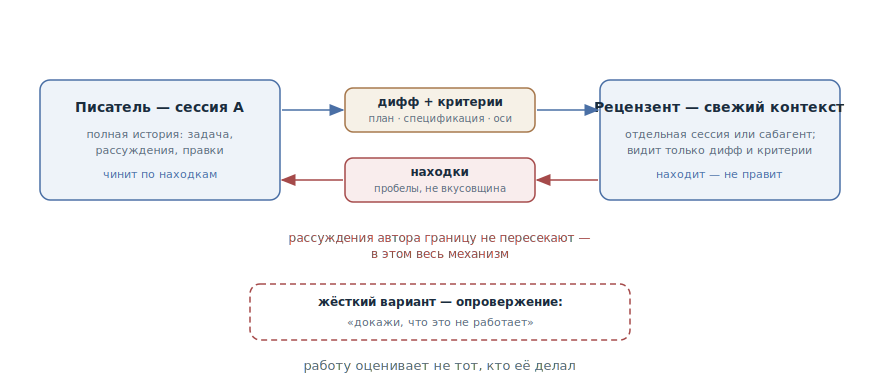

# Писатель и рецензент

## Назначение

Отдать дифф на ревью агенту со свежим контекстом — отдельной сессии или
сабагенту, — чтобы работу оценивал не тот, кто её делал. Рецензент видит
только дифф и критерии, а не рассуждения, которые к диффу привели, — и
потому оценивает результат, а не соглашается с ходом мысли.

## Также известен как

Writer/Reviewer, независимое ревью, «свежие глаза»; жёсткий вариант —
адверсариальное ревью (adversarial review).

## Проблема

Агент предвзят к коду, который только что написал, — по той же причине, что
и человек: в его окне лежит вся цепочка рассуждений, приведшая к решению.
Попросите его проверить собственную работу, и он проверит рассуждение — а
оно, разумеется, сойдётся.

- [Рефлексия](reflection.md) упирается в этот потолок: критик в том же окне
  делит с автором слепые пятна. Упущенный случай она найдёт, ошибку в самом
  подходе — нет.
- Чем дольше агент работал автономно, тем дороже цена: серия правдоподобных
  решений, каждое из которых «проверено» их же автором, доезжает до вас
  целиком.
- Единственный непредвзятый рецензент — человек — становится бутылочным
  горлышком: всё, что агент производит за день, через одно ревью не
  протащить.

## Решение

Развести роли по контекстам. Писатель — сессия, которая делала работу, со
всей её историей. Рецензент — свежий контекст: отдельная сессия или
сабагент, который получает ровно два входа:

- **дифф** — что фактически изменилось;
- **критерии** — против чего проверять: план, спецификация, оси проверки
  («каждое требование реализовано, у граничных случаев есть тесты, ничего
  вне скоупа не тронуто»).

Чего рецензент не получает — историю рассуждений. В этом весь механизм:
не зная, *почему* автор решил именно так, он вынужден оценивать то, что
есть, — как внешний ревьюер, открывший пулл-реквест.

Находки возвращаются писателю, тот правит и отправляет на повторное ревью.
В сабагентном исполнении цикл замыкается без копирования текста между
окнами: находки приходят прямо в сессию автора.

Для критичного кода есть жёсткий вариант — адверсариальный: рецензенту
ставится задача не «оценить», а **опровергнуть** — «докажи, что это не
работает; найди вход, на котором оно ломается». Оценщик, мотивированный
найти контрпример, сильнее оценщика, мотивированного вынести вердикт.

Одна калибровка обязательна: рецензент, которого попросили найти пробелы,
найдёт их всегда — такова постановка. Просите отделять пробелы корректности
и отступления от требований от вкусовых предпочтений — и не чините всё
подряд: погоня за каждой находкой кончается лишними абстракциями и тестами
на невозможные случаи.

## Структура

Два контекста, и между ними — только артефакты. Слева писатель со всей
историей сессии; направо уходят дифф и критерии, обратно возвращаются
находки. Рассуждения автора границу не пересекают — это не ограничение, а
сам механизм паттерна. Внизу жёсткий вариант: рецензенту ставится задача
опровержения, а не оценки.

## Участники / Компоненты

- **Писатель** — сессия, делавшая работу: полная история, рассуждения,
  правки. Чинит по находкам.
- **Рецензент** — свежий контекст: отдельная сессия или сабагент. Только
  находит — не правит.
- **Дифф** — предмет ревью: фактическое изменение, без предыстории.
- **Критерии** — план, спецификация, оси проверки; определяют, что считается
  находкой.
- **Находки** — пробелы корректности и отступления от требований;
  фильтруются разработчиком.

## Когда применять

- Серьёзный дифф перед мержем: несколько модулей, публичный контракт,
  критичная логика.
- После автономной работы: чем дольше агент работал без присмотра, тем
  важнее независимая проверка до того, как считать работу сделанной.
- Как проверка на подгонку после [TDD](tdd-with-agent.md): не подогнана ли
  реализация под конкретные тесты.
- Как сверка с планом: реализовано ли всё, что обещано, и не сделано ли
  лишнего.

Для мелких правок достаточно [рефлексии](reflection.md) — полный цикл с
отдельным контекстом дороже самой правки.

## Последствия и компромиссы

- ➕ Предвзятость автора устранена конструкцией: рецензент физически не
  видит рассуждений, с которыми мог бы согласиться.
- ➕ Проверяется результат против критериев — как на внешнем ревью, но по
  цене вызова агента.
- ➕ Человеческое ревью получает лучший вход: типовые пробелы выловлены до
  того, как дифф открыл человек.
- ➖ Дороже рефлексии: второй контекст, передача артефактов, итерации.
- ➖ Рецензент без истории может не понять намеренных решений — осознанные
  компромиссы должны быть видны из критериев, ADR или комментариев, иначе
  их «починят».
- ➖ Находки будут всегда: без калибровки паттерн превращается в генератор
  переусложнения.

## Реализация

1. Заведите рецензента со свежим контекстом: сабагент («свежим сабагентом
   отревьюй...») или отдельная сессия, куда передаётся только дифф.
2. Соберите вход: дифф, критерии (план, спецификация, оси), и то, что
   объясняет намеренное, — ADR, [словарь домена](domain-context-file.md).
   Историю сессии не передавайте — она и есть источник предвзятости.
3. Сформулируйте, что считается находкой: «пробелы корректности и
   отступления от плана, не стилистические предпочтения».
4. Для критичного кода — опровержение: «найди вход, на котором это
   ломается; докажи, что требование X не выполняется».
5. Верните находки писателю и итерируйте до чистого прогона; правит всегда
   автор — рецензент, который начал править, перестал быть рецензентом.
6. Фильтруйте находки сами: пробелы корректности — чинить, вкусовое — по
   желанию. Не превращайте каждую находку в правку.
7. Повторяющийся цикл упакуйте в команду: готовые — `/code-review` в Claude
   Code, двухосевое ревью в [скилах Мэтта Покока](matt-pocock-skills.md).

## Пример

Сессия A по утверждённому плану реализовала лимитер запросов для публичного
API. Вместо «проверь свою работу» разработчик поднимает рецензента:

> Свежим сабагентом отревьюй дифф лимитера против PLAN.md: каждое
> требование реализовано, у граничных случаев из плана есть тесты, ничего
> вне скоупа задачи не изменено. Докладывай пробелы, не стилистику.

Рецензент, не знающий, как автор пришёл к решению, возвращает три находки:
при одновременном пополнении токенов из двух воркеров возможна гонка —
лимит кратковременно превышается; в плане обещан заголовок `Retry-After`,
теста на него нет; попутно переименован соседний мидлвар — вне скоупа.

Автор чинит гонку и добавляет тест, переименование откатывает. Повторное
ревью — чисто. Заметьте: гонку не нашла бы рефлексия — в рассуждениях
автора пополнение токенов «очевидно атомарно», и критик в том же окне
унаследовал бы эту очевидность.

## Анти-паттерны и частые ошибки

- **«Проверь свой код» в том же окне.** Это [рефлексия](reflection.md) —
  полезный, но другой инструмент: предвзятость автора никуда не делась.
- **Рецензент с историей.** Скормить рецензенту всю сессию «для контекста» —
  вернуть ему рассуждения автора и вместе с ними предвзятость. Контекст
  рецензента — дифф и критерии.
- **Ревью без критериев.** Без плана и осей рецензент выдаёт вкусовщину —
  много слов, мало находок.
- **Слепое доверие находкам.** Чинить всё, что нашлось, — прямой путь к
  переусложнению: рецензент *всегда* что-то найдёт, фильтр — за
  разработчиком.
- **Рецензент правит сам.** Смешение ролей возвращает исходную проблему:
  теперь уже его правки никто независимо не проверил.

## Известные применения

- **Claude Code best practices** — первоисточник: таблица Writer/Reviewer
  из двух сессий, адверсариальный шаг ревью сабагентом («рецензент видит
  только дифф и критерии, не рассуждения») и предупреждение о
  переусложнении из-за находок.
- **Claude Code `/code-review`** — встроенный скил: ревью текущего диффа
  свежим сабагентом с возвратом находок в сессию.
- **Скилы Мэтта Покока** — `/code-review` по двум осям: соответствие
  стандартам кодовой базы и соответствие спецификации; обязательный финал
  `/implement`.
- **Superpowers** — `requesting-code-review`: сверка результата со
  спецификацией как обязательная контрольная точка перед завершением ветки.
- **Вариант «писатель тестов — писатель кода»** — те же роли на другом
  материале: одна сессия пишет тесты, другая — код под них.

## Связанные паттерны

- [Рефлексия](reflection.md) — дешёвая ступень ниже: самокритика в том же
  окне; фильтр перед настоящим ревью, а не его замена.
- [Петля обратной связи](give-agent-a-way-to-verify.md) — писатель-рецензент
  и есть «второе мнение», верхняя ступень лестницы проверок — для того, что
  не сводится к бинарному оракулу.
- [TDD с агентом](tdd-with-agent.md) — поставляет рецензенту готовый
  вопрос: не подогнана ли реализация под замороженные тесты.
- [Спеко-ориентированная разработка](spec-driven-development.md) — даёт
  рецензенту критерии: спецификация и план превращают «посмотри код» в
  проверку против списка.
